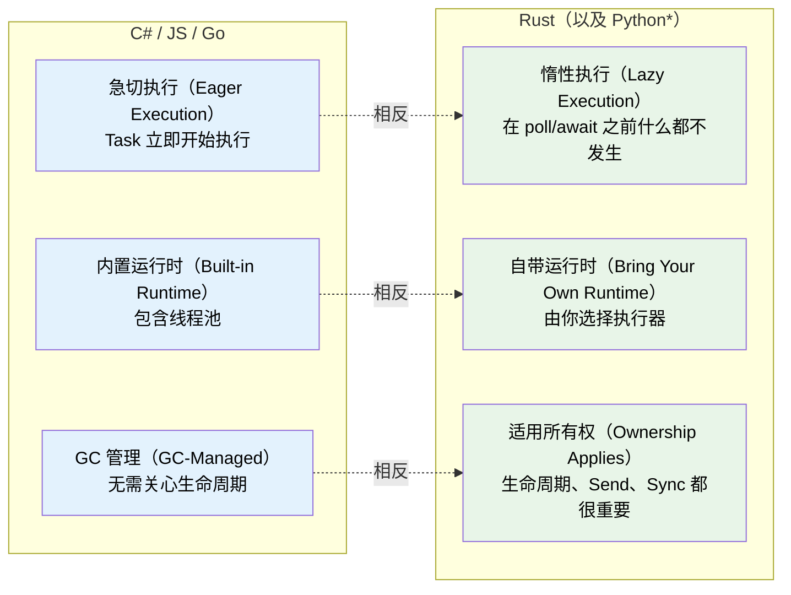
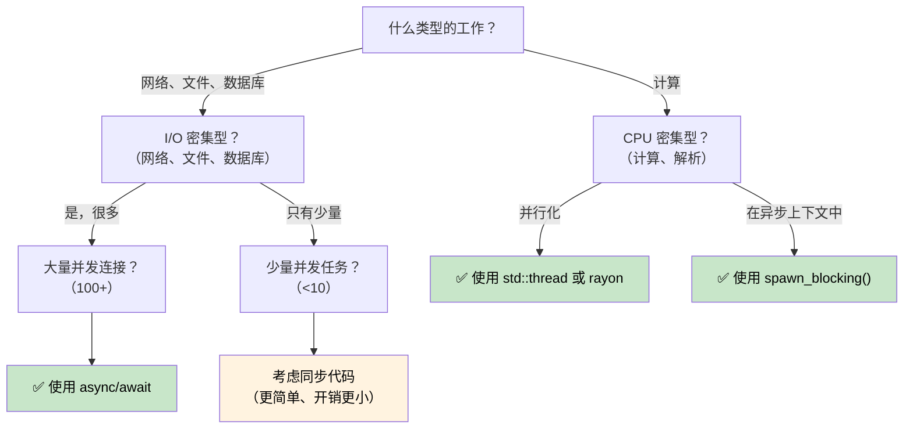

# 1. 为何 Rust 中的异步与众不同 🟢

> **你将学到：**
> - 为何 Rust 没有内置异步运行时（以及这对你的意义）
> - 三个关键特性：惰性执行、无运行时、零成本抽象（zero-cost abstraction）
> - 何时该用异步（以及何时它反而更慢）
> - Rust 的模型与 C#、Go、Python、JavaScript 的对比

## 根本差异

大多数带有 `async/await` 的语言都会把底层机制藏起来。C# 有 CLR 线程池。JavaScript 有事件循环。Go 在运行时中内置了 goroutine 和调度器。Python 有 `asyncio`。

**Rust 什么都没有。**

没有内置运行时、没有线程池、没有事件循环。`async` 关键字是一种零成本编译策略——它把你的函数变换成实现 `Future` Trait（特征）的状态机。必须由其他人（*executor*，执行器）来驱动该状态机向前推进。

### Rust 异步的三个关键特性



> \* Python 协程与 Rust future 一样是惰性的——在 await 或被调度之前不会执行。不过 Python 仍使用 GC，没有所有权/生命周期方面的顾虑。

### 无内置运行时

```rust
// This compiles but does NOTHING:
async fn fetch_data() -> String {
    "hello".to_string()
}

fn main() {
    let future = fetch_data(); // Creates the Future, but doesn't execute it
    // future is just a struct sitting on the stack
    // No output, no side effects, nothing happens
    drop(future); // Silently dropped — work was never started
}
```

与 C# 中 `Task` 会急切启动形成对比：
```csharp
// C# — this immediately starts executing:
async Task<string> FetchData() => "hello";

var task = FetchData(); // Already running!
var result = await task; // Just waits for completion
```

### 惰性 Future 与急切 Task

这是最重要的思维转变：

| | C# / JavaScript | Python | Go | Rust |
|---|---|---|---|---|
| **创建** | `Task` 立即开始执行 | 协程是**惰性的**——返回对象，在 await 或被调度之前不运行 | Goroutine 立即启动 | `Future` 在 poll 之前什么都不做 |
| **丢弃** | 已分离的 task 继续运行 | 未 await 的协程被垃圾回收（并发出警告） | Goroutine 运行到返回 | 丢弃 Future 会取消它 |
| **运行时** | 内置于语言/VM | `asyncio` 事件循环（必须显式启动） | 内置于二进制（M:N 调度器） | 由你选择（tokio、smol 等） |
| **调度** | 自动（线程池） | 事件循环 + `await` 或 `create_task()` | 自动（GMP 调度器） | 显式（`spawn`、`block_on`） |
| **取消** | `CancellationToken`（协作式） | `Task.cancel()`（协作式，抛出 `CancelledError`） | `context.Context`（协作式） | 丢弃 future（立即生效） |

```rust
// To actually RUN a future, you need an executor:
#[tokio::main]
async fn main() {
    let result = fetch_data().await; // NOW it executes
    println!("{result}");
}
```

### 何时使用异步（以及何时不用）



**经验法则**：异步用于 I/O 并发（在等待时同时处理多件事），而非 CPU 并行（让一件事更快）。若有 10,000 个网络连接，异步表现优异。若在做数值计算，请用 `rayon` 或 OS 线程。

### 异步何时会*更慢*

异步并非免费。对于低并发工作负载，同步代码可能优于异步：

| 成本 | 原因 |
|------|-----|
| **状态机开销** | 每个 `.await` 增加一个枚举变体；深度嵌套的 future 会产生庞大、复杂的状态机 |
| **动态分发** | `Box<dyn Future>` 增加间接层并破坏内联 |
| **上下文切换** | 协作式调度仍有成本——执行器必须管理任务队列、waker 和 I/O 注册 |
| **编译时间** | 异步代码生成更复杂的类型，拖慢编译 |
| **可调试性** | 穿过状态机的栈跟踪更难阅读（见第 12 章） |

**基准测试建议**：若并发 I/O 操作少于约 10 个，在决定采用异步之前先做性能分析。在现代 Linux 上，每个连接简单 `std::thread::spawn` 也能轻松扩展到数百个线程。

### 练习：你会在何时使用异步？

<details>
<summary>🏋️ 练习（点击展开）</summary>

针对每个场景，判断是否适合使用异步并说明原因：

1. 处理 10,000 个并发 WebSocket 连接的 Web 服务器
2. 压缩单个大文件的 CLI 工具
3. 查询 5 个不同数据库并合并结果的服务
4. 以 60 FPS 运行物理模拟的游戏引擎

<details>
<summary>🔑 解答</summary>

1. **异步**——I/O 密集型且并发量巨大。每个连接大部分时间都在等待数据。用线程需要 10K 个栈。
2. **同步/线程**——CPU 密集型、单任务。异步只会增加开销而无收益。并行压缩请用 `rayon`。
3. **异步**——五个并发的 I/O 等待。`tokio::join!` 可同时运行全部五个查询。
4. **同步/线程**——CPU 密集型、对延迟敏感。异步的协作式调度可能引入帧抖动。

</details>
</details>

> **要点回顾 — 为何异步与众不同**
> - Rust future 是**惰性的**——在执行器 poll 之前什么都不做
> - **没有内置运行时**——由你选择（或构建）自己的运行时
> - 异步是一种**零成本编译策略**，生成状态机
> - 异步在 **I/O 密集型并发** 上表现突出；CPU 密集型工作请用线程或 rayon

> **另见：** [第 2 章 — Future Trait](ch02-the-future-trait.md) 了解让这一切运转的 trait，[第 7 章 — 执行器与运行时](ch07-executors-and-runtimes.md) 了解如何选择运行时

***


