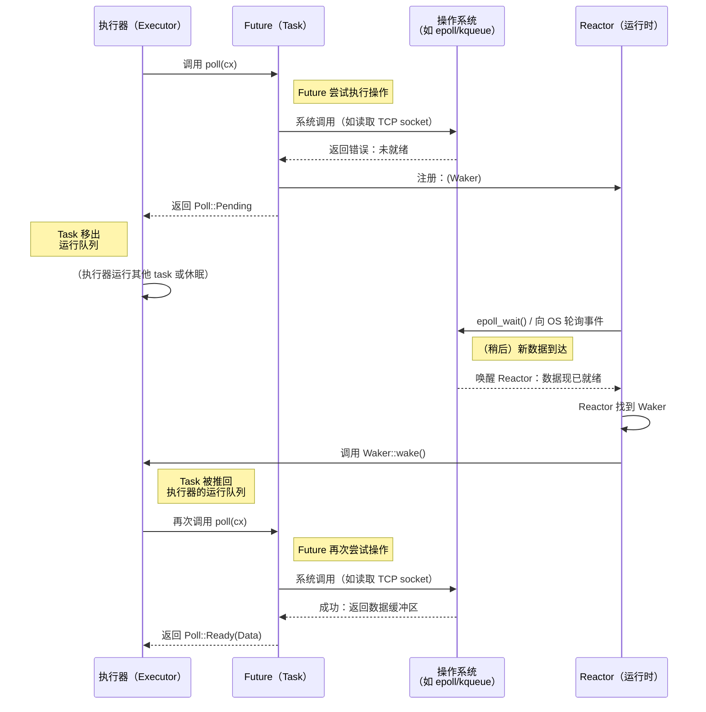

# 2. Future Trait 🟡

> **你将学到：**
> - `Future` Trait（特征）：`Output`、`poll()`、`Context`、`Waker`
> - waker 如何告诉执行器「请再次 poll 我」
> - 契约：从不调用 `wake()` = 程序会静默挂起
> - 手写实现一个真正的 future（`Delay`）

## Future 的解剖结构

异步 Rust 中的一切最终都实现这个 trait：

```rust
pub trait Future {
    type Output;

    fn poll(self: Pin<&mut Self>, cx: &mut Context<'_>) -> Poll<Self::Output>;
}

pub enum Poll<T> {
    Ready(T),   // The future has completed with value T
    Pending,    // The future is not ready yet — call me back later
}
```

就这些。`Future` 是任何可以被 *poll*（轮询）的东西——被问「完成了吗？」——并回答「是的，这是结果」或「还没好，准备好时我会唤醒你」。

### Output、poll()、Context、Waker



逐项拆解：

```rust
use std::future::Future;
use std::pin::Pin;
use std::task::{Context, Poll};

// A future that returns 42 immediately
struct Ready42;

impl Future for Ready42 {
    type Output = i32; // What the future eventually produces

    fn poll(self: Pin<&mut Self>, _cx: &mut Context<'_>) -> Poll<i32> {
        Poll::Ready(42) // Always ready — no waiting
    }
}
```

**各组成部分**：
- **`Output`** — future 完成时产生的值类型
- **`poll()`** — 由执行器调用以检查进度；返回 `Ready(value)` 或 `Pending`
- **`Pin<&mut Self>`** — 确保 future 在内存中不会被移动（原因见第 4 章）
- **`Context`** — 携带 `Waker`，以便 future 在可以推进时通知执行器

### Waker 契约

`Waker` 是回调机制。当 future 返回 `Pending` 时，它*必须*安排稍后调用 `waker.wake()`——否则执行器永远不会再次 poll 它，程序就会挂起。

```rust
use std::task::{Context, Poll, Waker};
use std::pin::Pin;
use std::future::Future;
use std::sync::{Arc, Mutex};
use std::thread;
use std::time::Duration;

/// A future that completes after a delay (toy implementation)
struct Delay {
    completed: Arc<Mutex<bool>>,
    waker_stored: Arc<Mutex<Option<Waker>>>,
    duration: Duration,
    started: bool,
}

impl Delay {
    fn new(duration: Duration) -> Self {
        Delay {
            completed: Arc::new(Mutex::new(false)),
            waker_stored: Arc::new(Mutex::new(None)),
            duration,
            started: false,
        }
    }
}

impl Future for Delay {
    type Output = ();

    fn poll(mut self: Pin<&mut Self>, cx: &mut Context<'_>) -> Poll<()> {
        // Check if already completed before storing waker
        if *self.completed.lock().unwrap() {
            return Poll::Ready(());
        }

        // Store the waker - executor may pass a new one on each poll
        *self.waker_stored.lock().unwrap() = Some(cx.waker().clone());

        // Start the background timer on first poll
        if !self.started {
            self.started = true;
            let completed = Arc::clone(&self.completed);
            let waker = Arc::clone(&self.waker_stored);
            let duration = self.duration;

            thread::spawn(move || {
                thread::sleep(duration);
                *completed.lock().unwrap() = true;

                // CRITICAL: wake the executor so it polls us again
                if let Some(w) = waker.lock().unwrap().take() {
                    w.wake(); // "Hey executor, I'm ready — poll me again!"
                }
            });
        }

        // Double-check completion after storing waker (handles race condition)
        if *self.completed.lock().unwrap() {
            return Poll::Ready(());
        }

        Poll::Pending // Not done yet
    }
}
```

> **关键洞见**：在 C# 中，TaskScheduler 会自动处理唤醒。
> 在 Rust 中，**你**（或你使用的 I/O 库）负责调用
> `waker.wake()`。忘了这一步，程序就会静默挂起。

### 练习：实现 CountdownFuture

<details>
<summary>🏋️ 练习（点击展开）</summary>

**挑战**：实现一个 `CountdownFuture`，从 N 倒数到 0，每次被 poll 时打印当前计数。到达 0 时，以 `Ready("Liftoff!")` 完成。

*提示*：future 需要存储当前计数，并在每次 poll 时递减。记得始终重新注册 waker！

<details>
<summary>🔑 解答</summary>

```rust
use std::future::Future;
use std::pin::Pin;
use std::task::{Context, Poll};

struct CountdownFuture {
    count: u32,
}

impl CountdownFuture {
    fn new(start: u32) -> Self {
        CountdownFuture { count: start }
    }
}

impl Future for CountdownFuture {
    type Output = &'static str;

    fn poll(mut self: Pin<&mut Self>, cx: &mut Context<'_>) -> Poll<Self::Output> {
        if self.count == 0 {
            println!("Liftoff!");
            Poll::Ready("Liftoff!")
        } else {
            println!("{}...", self.count);
            self.count -= 1;
            cx.waker().wake_by_ref(); // Schedule re-poll immediately
            Poll::Pending
        }
    }
}
```

**要点**：该 future 每个计数被 poll 一次。每次返回 `Pending` 时，它立即唤醒自身以便再次 poll。在生产环境中，你会用定时器代替忙轮询。

</details>
</details>

> **要点回顾 — Future Trait**
> - `Future::poll()` 返回 `Poll::Ready(value)` 或 `Poll::Pending`
> - future 在返回 `Pending` 之前必须注册 `Waker`——执行器用它来判断何时重新 poll
> - `Pin<&mut Self>` 保证 future 在内存中不会被移动（自引用状态机需要——见第 4 章）
> - 异步 Rust 中的一切——`async fn`、`.await`、组合子——都建立在这一个 trait 之上

> **另见：** [第 3 章 — Poll 如何工作](ch03-how-poll-works.md) 了解执行器循环，[第 6 章 — 手写 Future](ch06-building-futures-by-hand.md) 了解更复杂的实现

***


