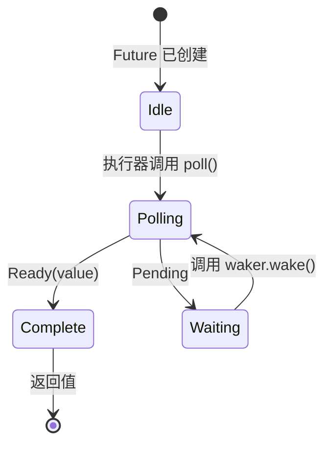

# 3. Poll 如何工作 🟡

> **你将学到：**
> - 执行器的 poll 循环：poll → pending → wake → 再次 poll
> - 如何从零构建最小执行器
> - 虚假唤醒（spurious wake）规则及其重要性
> - 实用函数：`poll_fn()` 和 `yield_now()`

## 轮询状态机

执行器运行一个循环：poll future，若为 `Pending` 则停放它直到 waker 触发，然后再次 poll。这与 OS 线程根本不同——后者由内核负责调度。



> **重要：** 在 *Waiting* 状态下，future **必须**已向 I/O 源注册了
> waker。未注册 = 永远挂起。

### 最小执行器

为揭开执行器的面纱，我们来构建最简单的一个：

```rust
use std::future::Future;
use std::task::{Context, Poll, RawWaker, RawWakerVTable, Waker};
use std::pin::Pin;

/// The simplest possible executor: busy-loop poll until Ready
fn block_on<F: Future>(mut future: F) -> F::Output {
    // Pin the future on the stack
    // SAFETY: `future` is never moved after this point — we only
    // access it through the pinned reference until it completes.
    let mut future = unsafe { Pin::new_unchecked(&mut future) };

    // Create a no-op waker (just keeps polling — inefficient but simple)
    fn noop_raw_waker() -> RawWaker {
        fn no_op(_: *const ()) {}
        fn clone(_: *const ()) -> RawWaker { noop_raw_waker() }
        let vtable = &RawWakerVTable::new(clone, no_op, no_op, no_op);
        RawWaker::new(std::ptr::null(), vtable)
    }

    // SAFETY: noop_raw_waker() returns a valid RawWaker with a correct vtable.
    let waker = unsafe { Waker::from_raw(noop_raw_waker()) };
    let mut cx = Context::from_waker(&waker);

    // Busy-loop until the future completes
    loop {
        match future.as_mut().poll(&mut cx) {
            Poll::Ready(value) => return value,
            Poll::Pending => {
                // A real executor would park the thread here
                // and wait for waker.wake() — we just spin
                std::thread::yield_now();
            }
        }
    }
}

// Usage:
fn main() {
    let result = block_on(async {
        println!("Hello from our mini executor!");
        42
    });
    println!("Got: {result}");
}
```

> **不要在生产环境使用！** 它会忙循环，浪费 CPU。真正的执行器
> （tokio、smol）使用 `epoll`/`kqueue`/`io_uring` 休眠直到 I/O 就绪。
> 但这展示了核心思想：执行器就是一个调用 `poll()` 的循环。

### 唤醒通知

真正的执行器是事件驱动的。当所有 future 都是 `Pending` 时，执行器休眠。waker 是一种中断机制：

```rust
// Conceptual model of a real executor's main loop:
fn executor_loop(tasks: &mut TaskQueue) {
    loop {
        // 1. Poll all tasks that have been woken
        while let Some(task) = tasks.get_woken_task() {
            match task.poll() {
                Poll::Ready(result) => task.complete(result),
                Poll::Pending => { /* task stays in queue, waiting for wake */ }
            }
        }

        // 2. Sleep until something wakes us up (epoll_wait, kevent, etc.)
        //    This is where mio/polling does the heavy lifting
        tasks.wait_for_events(); // blocks until an I/O event or waker fires
    }
}
```

### 虚假唤醒

future 可能在其 I/O 尚未就绪时就被 poll。这称为*虚假唤醒*（spurious wake）。future 必须正确处理这种情况：

```rust
impl Future for MyFuture {
    type Output = Data;

    fn poll(self: Pin<&mut Self>, cx: &mut Context<'_>) -> Poll<Data> {
        // ✅ CORRECT: Always re-check the actual condition
        if let Some(data) = self.try_read_data() {
            Poll::Ready(data)
        } else {
            // Re-register the waker (it might have changed!)
            self.register_waker(cx.waker());
            Poll::Pending
        }

        // ❌ WRONG: Assuming poll means data is ready
        // let data = self.read_data(); // might block or panic
        // Poll::Ready(data)
    }
}
```

**实现 `poll()` 的规则**：
1. **绝不阻塞** — 若未就绪，立即返回 `Pending`
2. **始终重新注册 waker** — 两次 poll 之间它可能已改变
3. **处理虚假唤醒** — 检查实际条件，不要假设已就绪
4. **不要在 `Ready` 之后 poll** — 行为是**未定义的**（可能 panic、返回 `Pending` 或重复 `Ready`）。只有 `FusedFuture` 保证完成后 poll 是安全的

<details>
<summary><strong>🏋️ 练习：可应对虚假唤醒的 Flag Future</strong>（点击展开）</summary>

**挑战**：实现一个 `FlagFuture`，包装共享的 `Arc<AtomicBool>` 标志。被 poll 时，检查标志是否为 `true`。若是，以 `Ready(())` 完成。若否，存储 waker 并返回 `Pending`。难点：future 必须正确处理**虚假唤醒**——每次 poll 都要重新检查标志，绝不能仅因被唤醒就假设标志已设置。

*提示*：你需要 `Arc<Mutex<Option<Waker>>>`（或类似结构），以便外部线程可以设置标志并唤醒 future。也可用 `poll_fn` 写出更简洁的替代方案。

<details>
<summary>🔑 解答</summary>

```rust
use std::future::Future;
use std::pin::Pin;
use std::sync::{Arc, Mutex};
use std::sync::atomic::{AtomicBool, Ordering};
use std::task::{Context, Poll, Waker};

struct FlagFuture {
    flag: Arc<AtomicBool>,
    waker_slot: Arc<Mutex<Option<Waker>>>,
}

impl FlagFuture {
    fn new(flag: Arc<AtomicBool>, waker_slot: Arc<Mutex<Option<Waker>>>) -> Self {
        FlagFuture { flag, waker_slot }
    }
}

impl Future for FlagFuture {
    type Output = ();

    fn poll(self: Pin<&mut Self>, cx: &mut Context<'_>) -> Poll<Self::Output> {
        // Always re-check the actual condition — never trust the wake alone
        if self.flag.load(Ordering::Acquire) {
            return Poll::Ready(());
        }

        // Store/update the waker so we get notified
        let mut slot = self.waker_slot.lock().unwrap();
        *slot = Some(cx.waker().clone());

        // Re-check after storing the waker to avoid a race:
        // the flag could have been set between our first check
        // and storing the waker
        if self.flag.load(Ordering::Acquire) {
            Poll::Ready(())
        } else {
            Poll::Pending
        }
    }
}

// The setter side (e.g., another thread or task):
fn set_flag(flag: &AtomicBool, waker_slot: &Mutex<Option<Waker>>) {
    flag.store(true, Ordering::Release);
    if let Some(waker) = waker_slot.lock().unwrap().take() {
        waker.wake();
    }
}

// Equivalent using poll_fn:
// async fn wait_for_flag(flag: Arc<AtomicBool>, waker_slot: Arc<Mutex<Option<Waker>>>) {
//     std::future::poll_fn(|cx| {
//         if flag.load(Ordering::Acquire) {
//             return Poll::Ready(());
//         }
//         *waker_slot.lock().unwrap() = Some(cx.waker().clone());
//         if flag.load(Ordering::Acquire) { Poll::Ready(()) } else { Poll::Pending }
//     }).await
// }
```

**要点**：双重检查模式（检查 → 存储 waker → 再次检查）对于避免条件变化与 waker 注册之间的竞态至关重要。这是所有 I/O future 内部使用的真实模式，也说明了为何处理虚假唤醒很重要。

</details>
</details>

### 实用工具：`poll_fn` 和 `yield_now`

标准库和 tokio 提供的两个工具，可避免编写完整的 `Future` 实现：

```rust
use std::future::poll_fn;
use std::task::Poll;

// poll_fn: create a one-off future from a closure
let value = poll_fn(|cx| {
    // Do something with cx.waker(), return Ready or Pending
    Poll::Ready(42)
}).await;

// Real-world use: bridge a callback-based API into async
async fn read_when_ready(source: &MySource) -> Data {
    poll_fn(|cx| source.poll_read(cx)).await
}
```

```rust
// yield_now: voluntarily yield control to the executor
// Useful in CPU-heavy async loops to avoid starving other tasks
async fn cpu_heavy_work(items: &[Item]) {
    for (i, item) in items.iter().enumerate() {
        process(item); // CPU work

        // Every 100 items, yield to let other tasks run
        if i % 100 == 0 {
            tokio::task::yield_now().await;
        }
    }
}
```

> **何时使用 `yield_now()`**：若你的异步函数在循环中做 CPU 工作且没有任何 `.await` 点，它会独占执行器线程。定期插入
> `yield_now().await` 以实现协作式多任务。

> **要点回顾 — Poll 如何工作**
> - 执行器反复对已唤醒的 future 调用 `poll()`
> - future 必须处理**虚假唤醒**——始终重新检查实际条件
> - `poll_fn()` 让你用闭包创建临时 future
> - `yield_now()` 是 CPU 密集型异步代码的协作式调度逃生口

> **另见：** [第 2 章 — Future Trait](ch02-the-future-trait.md) 了解 trait 定义，[第 5 章 — 状态机揭秘](ch05-the-state-machine-reveal.md) 了解编译器生成了什么

***


