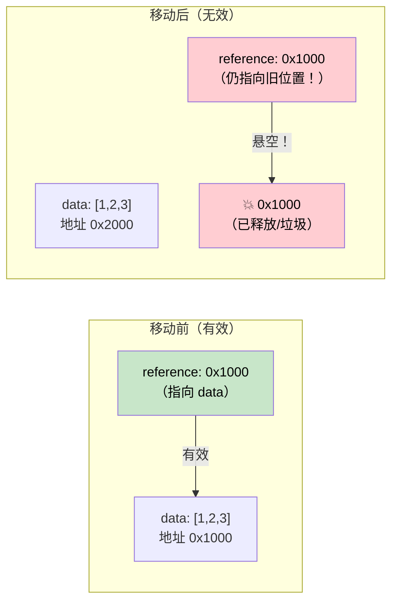

# 4. Pin 与 Unpin 🔴

> **你将学到：**
> - 为何自引用结构体在内存中移动时会失效
> - `Pin<P>` 保证什么以及它如何防止移动
> - 三种实用固定模式：`Box::pin()`、`tokio::pin!()`、`Pin::new()`
> - 何时 `Unpin` 提供逃生口

## Pin 为何存在

这是异步 Rust 中最令人困惑的概念。我们一步步建立直觉。

### 问题：自引用结构体

当编译器把 `async fn` 变换为状态机时，该状态机可能包含对自身字段的引用。这就形成了*自引用结构体*（self-referential struct）——在内存中移动它会使其内部引用失效。

```rust
// What the compiler generates (simplified) for:
// async fn example() {
//     let data = vec![1, 2, 3];
//     let reference = &data;       // Points to data above
//     use_ref(reference).await;
// }

// Becomes something like:
enum ExampleStateMachine {
    State0 {
        data: Vec<i32>,
        // reference: &Vec<i32>,  // PROBLEM: points to `data` above
        //                        // If this struct moves, the pointer is dangling!
    },
    State1 {
        data: Vec<i32>,
        reference: *const Vec<i32>, // Internal pointer to data field
    },
    Complete,
}
```



### 自引用结构体

这不是学术问题。每个在 `.await` 点之间持有引用的 `async fn` 都会创建自引用状态机：

```rust
async fn problematic() {
    let data = String::from("hello");
    let slice = &data[..]; // slice borrows data
    
    some_io().await; // <-- .await point: state machine stores both data AND slice
    
    println!("{slice}"); // uses the reference after await
}
// The generated state machine has `data: String` and `slice: &str`
// where slice points INTO data. Moving the state machine = dangling pointer.
```

### Pin 实践

`Pin<P>` 是一个包装器，防止指针背后的值被移动：

```rust
use std::pin::Pin;

let mut data = String::from("hello");

// Pin it — now it can't be moved
let pinned: Pin<&mut String> = Pin::new(&mut data);

// Can still use it:
println!("{}", pinned.as_ref().get_ref()); // "hello"

// But we can't get &mut String back (which would allow mem::swap):
// let mutable: &mut String = Pin::into_inner(pinned); // Only if String: Unpin
// String IS Unpin, so this actually works for String.
// But for self-referential state machines (which are !Unpin), it's blocked.
```

在实际代码中，你主要在三个地方遇到 Pin：

```rust
// 1. poll() signature — all futures are polled through Pin
fn poll(self: Pin<&mut Self>, cx: &mut Context<'_>) -> Poll<Output>;

// 2. Box::pin() — heap-allocate and pin a future
let future: Pin<Box<dyn Future<Output = i32>>> = Box::pin(async { 42 });

// 3. tokio::pin!() — pin a future on the stack
tokio::pin!(my_future);
// Now my_future: Pin<&mut impl Future>
```

### Unpin 逃生口

Rust 中大多数类型都是 `Unpin`——它们不包含自引用，因此固定是空操作。只有编译器生成的状态机（来自 `async fn`）是 `!Unpin`。

```rust
// These are all Unpin — pinning them does nothing special:
// i32, String, Vec<T>, HashMap<K,V>, Box<T>, &T, &mut T

// These are !Unpin — they MUST be pinned before polling:
// The state machines generated by `async fn` and `async {}`

// Practical implication:
// If you write a Future by hand and it has NO self-references,
// implement Unpin to make it easier to work with:
impl Unpin for MySimpleFuture {} // "I'm safe to move, trust me"
```

### 快速参考

| 场景 | 时机 | 方法 |
|------|------|-----|
| 在堆上固定 future | 存入集合、从函数返回 | `Box::pin(future)` |
| 在栈上固定 future | 在 `select!` 或手动 poll 中本地使用 | `std::pin::pin!(future)` 或 `tokio::pin!(future)` |
| 在函数签名中固定 | 接受已固定的 future | `future: Pin<&mut F>` |
| 要求 Unpin | 需要在创建后移动 future | `F: Future + Unpin` |

<details>
<summary><strong>🏋️ 练习：Pin 与移动</strong>（点击展开）</summary>

**挑战**：以下哪些代码片段能编译？对于不能编译的，说明原因并修复。

```rust
// Snippet A
let fut = async { 42 };
let pinned = Box::pin(fut);
let moved = pinned; // Move the Box
let result = moved.await;

// Snippet B
let fut = async { 42 };
tokio::pin!(fut);
let moved = fut; // Move the pinned future
let result = moved.await;

// Snippet C
use std::pin::Pin;
let mut fut = async { 42 };
let pinned = Pin::new(&mut fut);
```

<details>
<summary>🔑 解答</summary>

**片段 A**：✅ **能编译。** `Box::pin()` 把 future 放在堆上。移动 `Box` 移动的是*指针*，而非 future 本身。future 仍固定在其堆位置。

**片段 B**：✅ **能编译。** `tokio::pin!` 把 future 固定在栈上，并将 `fut` 重新绑定为 `Pin<&mut ...>`。`let moved = fut` 移动的是 **`Pin` 包装器**（一个指针），而非底层 future——future 仍固定在栈上。这与 `Box::pin` 类似：移动 `Box` 不会移动堆分配。不过 `fut` 被移动消耗，之后不能再使用 `fut`——只能用 `moved`：
```rust
let fut = async { 42 };
tokio::pin!(fut);
let moved = fut;        // Moves the Pin<&mut> wrapper — OK
// fut.await;           // ❌ Error: fut was moved
let result = moved.await; // ✅ Use moved instead
```

**片段 C**：❌ **不能编译。** `Pin::new()` 要求 `T: Unpin`。async 块生成 `!Unpin` 类型。**修复**：使用 `Box::pin()` 或 `unsafe Pin::new_unchecked()`：
```rust
let fut = async { 42 };
let pinned = Box::pin(fut); // Heap-pin — works with !Unpin
```

**要点**：`Box::pin()` 是固定 `!Unpin` future 的安全、简便方式。`tokio::pin!()` 在栈上固定——你可以移动 `Pin<&mut>` 包装器（它只是指针），但底层 future 保持不动。`Pin::new()` 仅适用于 `Unpin` 类型。

</details>
</details>

> **要点回顾 — Pin 与 Unpin**
> - `Pin<P>` 是一个包装器，**防止被指向的值被移动**——自引用状态机所必需
> - `Box::pin()` 是在堆上固定 future 的安全、简便默认方式
> - `tokio::pin!()` 在栈上固定——你可以移动 `Pin<&mut>` 包装器，但底层 future 保持不动
> - `Unpin` 是自动 trait 的退出机制：实现 `Unpin` 的类型即使被固定也可以移动（大多数类型是 `Unpin`；async 块不是）

> **另见：** [第 2 章 — Future Trait](ch02-the-future-trait.md) 了解 poll 中的 `Pin<&mut Self>`，[第 5 章 — 状态机揭秘](ch05-the-state-machine-reveal.md) 了解为何异步状态机是自引用的

***


