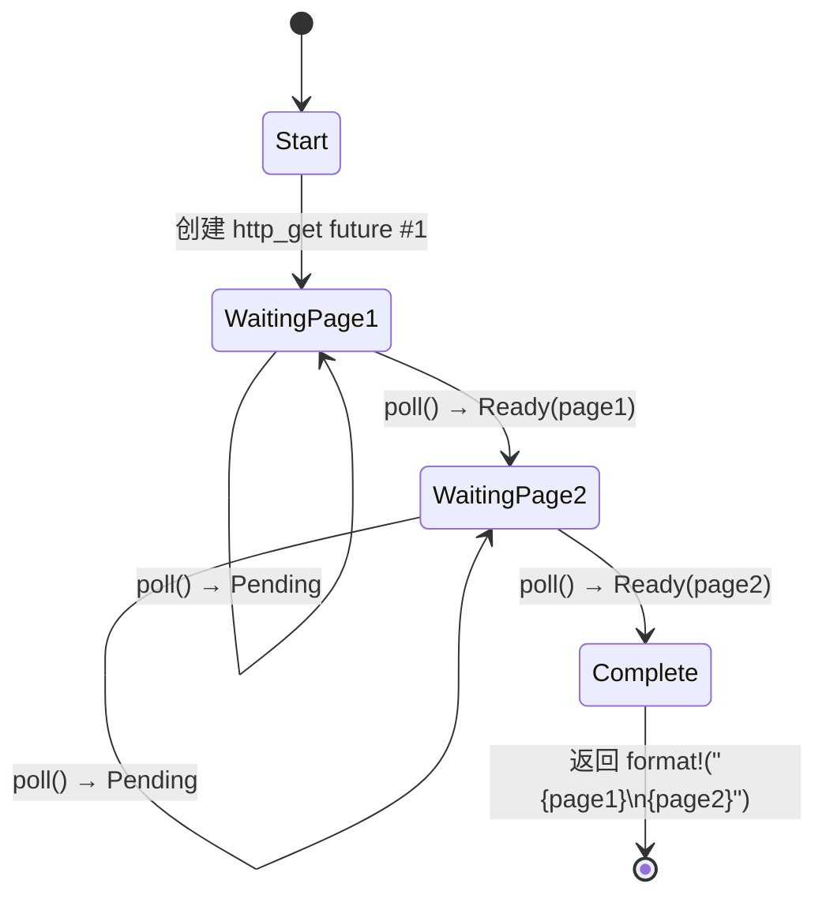

# 5. 状态机揭秘 🟢

> **你将学到：**
> - 编译器如何将 `async fn` 变换为枚举状态机
> - 并排对比：源代码 vs 生成的状态
> - 为何 `async fn` 中的大型栈分配会撑大 future 尺寸
> - drop 优化：值在不再需要时立即释放

## 编译器实际生成了什么

当你写 `async fn` 时，编译器把你的顺序式代码变换为基于枚举的状态机。理解这一变换是理解异步 Rust 性能特征及其诸多怪异行为的关键。

### 并排对比：async fn 与状态机

```rust
// What you write:
async fn fetch_two_pages() -> String {
    let page1 = http_get("https://example.com/a").await;
    let page2 = http_get("https://example.com/b").await;
    format!("{page1}\n{page2}")
}
```

编译器在概念上生成类似下面的代码：

```rust
enum FetchTwoPagesStateMachine {
    // State 0: About to call http_get for page1
    Start,

    // State 1: Waiting for page1, holding the future
    WaitingPage1 {
        fut1: HttpGetFuture,
    },

    // State 2: Got page1, waiting for page2
    WaitingPage2 {
        page1: String,
        fut2: HttpGetFuture,
    },

    // Terminal state
    Complete,
}

impl Future for FetchTwoPagesStateMachine {
    type Output = String;

    fn poll(mut self: Pin<&mut Self>, cx: &mut Context<'_>) -> Poll<String> {
        loop {
            match self.as_mut().get_mut() {
                Self::Start => {
                    let fut1 = http_get("https://example.com/a");
                    *self.as_mut().get_mut() = Self::WaitingPage1 { fut1 };
                }
                Self::WaitingPage1 { fut1 } => {
                    let page1 = match Pin::new(fut1).poll(cx) {
                        Poll::Ready(v) => v,
                        Poll::Pending => return Poll::Pending,
                    };
                    let fut2 = http_get("https://example.com/b");
                    *self.as_mut().get_mut() = Self::WaitingPage2 { page1, fut2 };
                }
                Self::WaitingPage2 { page1, fut2 } => {
                    let page2 = match Pin::new(fut2).poll(cx) {
                        Poll::Ready(v) => v,
                        Poll::Pending => return Poll::Pending,
                    };
                    let result = format!("{page1}\n{page2}");
                    *self.as_mut().get_mut() = Self::Complete;
                    return Poll::Ready(result);
                }
                Self::Complete => panic!("polled after completion"),
            }
        }
    }
}
```

> **注意**：这种脱糖（desugaring）是*概念性的*。真实编译器输出使用
> `unsafe` pin 投影——此处展示的 `get_mut()` 调用需要
> `Unpin`，但异步状态机是 `!Unpin`。目的是说明
> 状态转换，而非产出可编译代码。



> **各状态内容：**
> - **WaitingPage1** — 存储 `fut1: HttpGetFuture`（page2 尚未分配）
> - **WaitingPage2** — 存储 `page1: String`、`fut2: HttpGetFuture`（fut1 已被 drop）

### 为何这对性能很重要

**零成本**：状态机是栈分配的枚举。每个 future 无需堆分配、无垃圾回收器、无装箱——除非你显式使用 `Box::pin()`。

**尺寸**：枚举的大小是其所有变体中的最大值。每个 `.await` 点创建一个新变体。这意味着：

```rust
async fn small() {
    let a: u8 = 0;
    yield_now().await;
    let b: u8 = 0;
    yield_now().await;
}
// Size ≈ max(size_of(u8), size_of(u8)) + discriminant + future sizes
//      ≈ small!

async fn big() {
    let buf: [u8; 1_000_000] = [0; 1_000_000]; // 1MB on the stack!
    some_io().await;
    process(&buf);
}
// Size ≈ 1MB + inner future sizes
// ⚠️ Don't stack-allocate huge buffers in async functions!
// Use Vec<u8> or Box<[u8]> instead.
```

**drop 优化**：状态机转换时，会 drop 不再需要的值。在上例中，从 `WaitingPage1` 转换到 `WaitingPage2` 时 `fut1` 被 drop——编译器会自动插入 drop。

> **实用规则**：`async fn` 中的大型栈分配会撑大 future 的
> 尺寸。若在异步代码中出现栈溢出，检查是否有大型数组或
> 深度嵌套的 future。必要时用 `Box::pin()` 在堆上分配子 future。

### 练习：预测状态机

<details>
<summary>🏋️ 练习（点击展开）</summary>

**挑战**：给定以下异步函数，勾勒编译器生成的状态机。有多少个状态（枚举变体）？每个状态存储什么值？

```rust
async fn pipeline(url: &str) -> Result<usize, Error> {
    let response = fetch(url).await?;
    let body = response.text().await?;
    let parsed = parse(body).await?;
    Ok(parsed.len())
}
```

<details>
<summary>🔑 解答</summary>

五个状态：

1. **Start** — 存储 `url`
2. **WaitingFetch** — 存储 `url`、`fetch` future
3. **WaitingText** — 存储 `response`、`text()` future
4. **WaitingParse** — 存储 `body`、`parse` future
5. **Done** — 返回 `Ok(parsed.len())`

每个 `.await` 创建一个让出点 = 一个新的枚举变体。`?` 增加提前退出路径但不增加额外状态——它只是在 `Poll::Ready` 值上做 `match`。

</details>
</details>

> **要点回顾 — 状态机揭秘**
> - `async fn` 编译为枚举，每个 `.await` 点对应一个变体
> - future 的**尺寸** = 所有变体尺寸的最大值——大型栈值会撑大它
> - 编译器在状态转换时自动插入 **drop**
> - future 尺寸成为问题时，使用 `Box::pin()` 或堆分配

> **另见：** [第 4 章 — Pin 与 Unpin](ch04-pin-and-unpin.md) 了解生成的枚举为何需要固定，[第 6 章 — 手写 Future](ch06-building-futures-by-hand.md) 了解如何自己构建这些状态机

***


