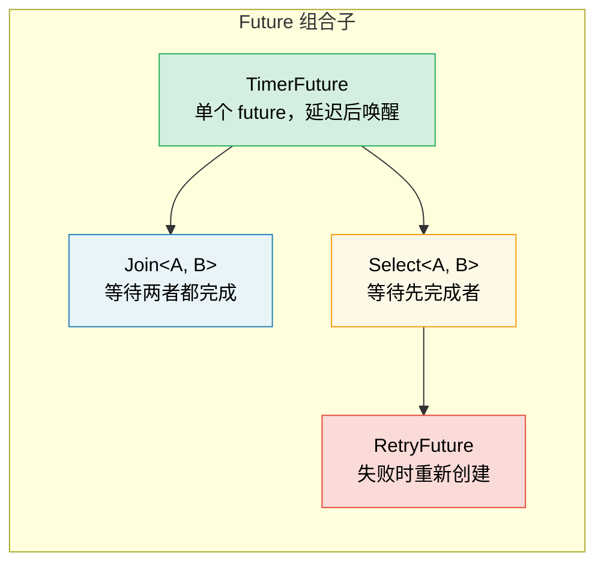

# 6. 手动构建 Future 🟡

> **你将学到：**
> - 用基于线程的唤醒实现 `TimerFuture`
> - 构建 `Join` 组合子：并发运行两个 future
> - 构建 `Select` 组合子：让两个 future 竞速
> - 组合子如何组合——层层嵌套的 future

## 一个简单的 Timer Future

现在让我们从零开始构建真正有用的 future。这能巩固第 2–5 章的理论。

### TimerFuture：完整示例

```rust
use std::future::Future;
use std::pin::Pin;
use std::sync::{Arc, Mutex};
use std::task::{Context, Poll, Waker};
use std::thread;
use std::time::{Duration, Instant};

pub struct TimerFuture {
    shared_state: Arc<Mutex<SharedState>>,
}

struct SharedState {
    completed: bool,
    waker: Option<Waker>,
}

impl TimerFuture {
    pub fn new(duration: Duration) -> Self {
        let shared_state = Arc::new(Mutex::new(SharedState {
            completed: false,
            waker: None,
        }));

        // Spawn a thread that sets completed=true after the duration
        let thread_shared_state = Arc::clone(&shared_state);
        thread::spawn(move || {
            thread::sleep(duration);
            let mut state = thread_shared_state.lock().unwrap();
            state.completed = true;
            if let Some(waker) = state.waker.take() {
                waker.wake(); // Notify the executor
            }
        });

        TimerFuture { shared_state }
    }
}

impl Future for TimerFuture {
    type Output = ();

    fn poll(self: Pin<&mut Self>, cx: &mut Context<'_>) -> Poll<()> {
        let mut state = self.shared_state.lock().unwrap();
        if state.completed {
            Poll::Ready(())
        } else {
            // Store the waker so the timer thread can wake us
            // IMPORTANT: Always update the waker — the executor may
            // have changed it between polls
            state.waker = Some(cx.waker().clone());
            Poll::Pending
        }
    }
}

// Usage:
// async fn example() {
//     println!("Starting timer...");
//     TimerFuture::new(Duration::from_secs(2)).await;
//     println!("Timer done!");
// }
//
// ⚠️ This spawns an OS thread per timer — fine for learning, but in
// production use `tokio::time::sleep` which is backed by a shared
// timer wheel and requires zero extra threads.
```

### Join：并发运行两个 Future

`Join` 会轮询两个 future，并在*两者都*完成时结束。这就是 `tokio::join!` 的内部实现方式：

```rust
use std::future::Future;
use std::pin::Pin;
use std::task::{Context, Poll};

/// Polls two futures concurrently, returns both results as a tuple
pub struct Join<A, B>
where
    A: Future,
    B: Future,
{
    a: MaybeDone<A>,
    b: MaybeDone<B>,
}

enum MaybeDone<F: Future> {
    Pending(F),
    Done(F::Output),
    Taken, // Output has been taken
}

// MaybeDone<F> stores F::Output, which the compiler can't prove
// is Unpin even when F: Unpin. Since we only use Join with Unpin
// futures and never pin-project into fields, implementing Unpin
// by hand is safe and lets us call self.get_mut() in poll().
impl<A: Future + Unpin, B: Future + Unpin> Unpin for Join<A, B> {}

impl<A, B> Join<A, B>
where
    A: Future,
    B: Future,
{
    pub fn new(a: A, b: B) -> Self {
        Join {
            a: MaybeDone::Pending(a),
            b: MaybeDone::Pending(b),
        }
    }
}

impl<A, B> Future for Join<A, B>
where
    A: Future + Unpin,
    B: Future + Unpin,
{
    type Output = (A::Output, B::Output);

    fn poll(self: Pin<&mut Self>, cx: &mut Context<'_>) -> Poll<Self::Output> {
        let this = self.get_mut();

        // Poll A if not done
        if let MaybeDone::Pending(ref mut fut) = this.a {
            if let Poll::Ready(val) = Pin::new(fut).poll(cx) {
                this.a = MaybeDone::Done(val);
            }
        }

        // Poll B if not done
        if let MaybeDone::Pending(ref mut fut) = this.b {
            if let Poll::Ready(val) = Pin::new(fut).poll(cx) {
                this.b = MaybeDone::Done(val);
            }
        }

        // Both done?
        match (&this.a, &this.b) {
            (MaybeDone::Done(_), MaybeDone::Done(_)) => {
                // Take both outputs
                let a_val = match std::mem::replace(&mut this.a, MaybeDone::Taken) {
                    MaybeDone::Done(v) => v,
                    _ => unreachable!(),
                };
                let b_val = match std::mem::replace(&mut this.b, MaybeDone::Taken) {
                    MaybeDone::Done(v) => v,
                    _ => unreachable!(),
                };
                Poll::Ready((a_val, b_val))
            }
            _ => Poll::Pending, // At least one is still pending
        }
    }
}

// Usage (async blocks are !Unpin, so wrap them with Box::pin):
// let (page1, page2) = Join::new(
//     Box::pin(http_get("https://example.com/a")),
//     Box::pin(http_get("https://example.com/b")),
// ).await;
// Both requests run concurrently!
```

> **关键洞见**：此处的「并发」指*在同一线程上交错执行*。
> `Join` 不会创建线程——它在同一次 `poll()` 调用中轮询两个 future。
> 这是协作式并发（cooperative concurrency），而非并行（parallelism）。



### Select：让两个 Future 竞速

`Select` 在*任一* future 先完成时结束（另一个会被丢弃）：

```rust
use std::future::Future;
use std::pin::Pin;
use std::task::{Context, Poll};

pub enum Either<A, B> {
    Left(A),
    Right(B),
}

/// Returns whichever future completes first; drops the other
pub struct Select<A, B> {
    a: A,
    b: B,
}

impl<A, B> Select<A, B>
where
    A: Future + Unpin,
    B: Future + Unpin,
{
    pub fn new(a: A, b: B) -> Self {
        Select { a, b }
    }
}

impl<A, B> Future for Select<A, B>
where
    A: Future + Unpin,
    B: Future + Unpin,
{
    type Output = Either<A::Output, B::Output>;

    fn poll(mut self: Pin<&mut Self>, cx: &mut Context<'_>) -> Poll<Self::Output> {
        // Poll A first
        if let Poll::Ready(val) = Pin::new(&mut self.a).poll(cx) {
            return Poll::Ready(Either::Left(val));
        }

        // Then poll B
        if let Poll::Ready(val) = Pin::new(&mut self.b).poll(cx) {
            return Poll::Ready(Either::Right(val));
        }

        Poll::Pending
    }
}

// Usage with timeout:
// match Select::new(http_get(url), TimerFuture::new(timeout)).await {
//     Either::Left(response) => println!("Got response: {}", response),
//     Either::Right(()) => println!("Request timed out!"),
// }
```

> **公平性说明**：我们的 `Select` 总是先轮询 A——若两者都已就绪，A 总是获胜。Tokio 的 `select!` 宏会随机化轮询顺序以保证公平性。

<details>
<summary><strong>🏋️ 练习：构建 RetryFuture</strong>（点击展开）</summary>

**挑战**：构建一个 `RetryFuture<F, Fut>`，它接受闭包 `F: Fn() -> Fut`，若内部 future 返回 `Err` 则最多重试 N 次。应返回第一个 `Ok` 结果，或最后一次 `Err`。

*提示*：你需要「正在执行尝试」和「所有尝试已耗尽」等状态。

<details>
<summary>🔑 解答</summary>

```rust
use std::future::Future;
use std::pin::Pin;
use std::task::{Context, Poll};

pub struct RetryFuture<F, Fut, T, E>
where
    F: Fn() -> Fut,
    Fut: Future<Output = Result<T, E>>,
{
    factory: F,
    current: Option<Pin<Box<Fut>>>,
    remaining: usize,
    last_error: Option<E>,
}

impl<F, Fut, T, E> RetryFuture<F, Fut, T, E>
where
    F: Fn() -> Fut,
    Fut: Future<Output = Result<T, E>>,
{
    pub fn new(max_attempts: usize, factory: F) -> Self {
        let current = Some(Box::pin((factory)()));
        RetryFuture {
            factory,
            current,
            remaining: max_attempts.saturating_sub(1),
            last_error: None,
        }
    }
}

impl<F, Fut, T, E> Future for RetryFuture<F, Fut, T, E>
where
    F: Fn() -> Fut + Unpin,
    Fut: Future<Output = Result<T, E>>,
    E: Unpin,
{
    type Output = Result<T, E>;

    fn poll(mut self: Pin<&mut Self>, cx: &mut Context<'_>) -> Poll<Self::Output> {
        // Pin<Box<Fut>> is always Unpin, so the struct is Unpin when F and E are.
        // This lets us safely use get_mut() without any unsafe code.
        loop {
            if let Some(ref mut fut) = self.current {
                match fut.as_mut().poll(cx) {
                    Poll::Ready(Ok(val)) => return Poll::Ready(Ok(val)),
                    Poll::Ready(Err(e)) => {
                        self.last_error = Some(e);
                        if self.remaining > 0 {
                            self.remaining -= 1;
                            self.current = Some(Box::pin((self.factory)()));
                            // Loop to poll the new future immediately
                        } else {
                            return Poll::Ready(Err(self.last_error.take().unwrap()));
                        }
                    }
                    Poll::Pending => return Poll::Pending,
                }
            } else {
                return Poll::Ready(Err(self.last_error.take().unwrap()));
            }
        }
    }
}

// Usage:
// let result = RetryFuture::new(3, || async {
//     http_get("https://flaky-server.com/api").await
// }).await;
```

**要点**：重试 future 本身也是状态机：它持有当前尝试，失败时创建新的内部 future。将内部 future 包在 `Pin<Box<Fut>>` 中可去掉 `Fut: Unpin` 约束——因为 `Pin<Box<T>>` 始终是 `Unpin`，结构体仍易于使用，同时支持任意 future 类型。组合子就是这样组合的——层层嵌套的 future。

</details>
</details>

> **要点回顾 — 手动构建 Future**
> - 一个 future 需要三样东西：状态、`poll()` 实现，以及 waker 注册
> - `Join` 轮询两个子 future；`Select` 返回先完成的那一个
> - 组合子本身也是包装其他 future 的 future——层层嵌套
> - 手动构建 future 能加深理解，但生产环境请用 `tokio::join!`/`select!`

> **另见：** [第 2 章 — Future Trait](ch02-the-future-trait.md) 了解 Trait 定义，[第 8 章 — Tokio 深入](ch08-tokio-deep-dive.md) 了解生产级等价实现

***

