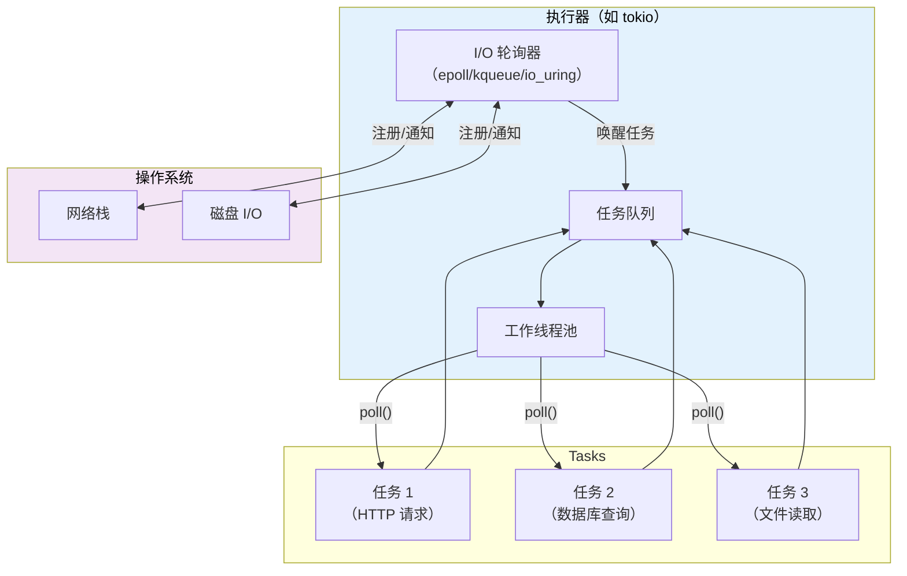
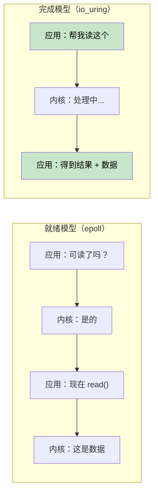
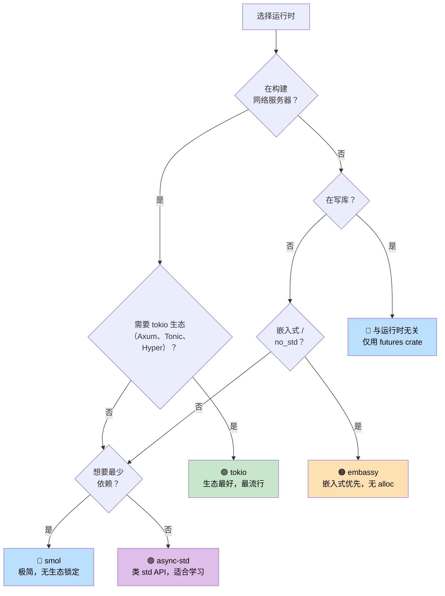

# 7. 执行器与运行时 🟡

> **你将学到：**
> - 执行器（executor）做什么：高效地 poll 与休眠
> - 六大主要运行时：mio、io_uring、tokio、async-std、smol、embassy
> - 选择合适运行时的决策树
> - 为何与运行时无关（runtime-agnostic）的库设计很重要

## 执行器做什么

执行器有两项职责：
1. 在 future 可以推进时**轮询 future**
2. 当没有 future 就绪时**高效休眠**（使用操作系统 I/O 通知 API）



### mio：基础层

[mio](https://github.com/tokio-rs/mio)（Metal I/O）不是执行器——它是最底层的跨平台 I/O 通知库。它封装了 `epoll`（Linux）、`kqueue`（macOS/BSD）和 IOCP（Windows）。

```rust
// Conceptual mio usage (simplified):
use mio::{Events, Interest, Poll, Token};
use mio::net::TcpListener;

let mut poll = Poll::new()?;
let mut events = Events::with_capacity(128);

let mut server = TcpListener::bind("0.0.0.0:8080")?;
poll.registry().register(&mut server, Token(0), Interest::READABLE)?;

// Event loop — blocks until something happens
loop {
    poll.poll(&mut events, None)?; // Sleeps until I/O event
    for event in events.iter() {
        match event.token() {
            Token(0) => { /* server has a new connection */ }
            _ => { /* other I/O ready */ }
        }
    }
}
```

大多数开发者不会直接碰 mio——tokio 和 smol 都构建在它之上。

### io_uring：基于完成通知的未来

Linux 的 `io_uring`（内核 5.1+）代表了与 mio/epoll 所用的就绪式（readiness-based）I/O 模型的根本转变：

```text
Readiness-based (epoll / mio / tokio):
  1. Ask: "Is this socket readable?"     → epoll_wait()
  2. Kernel: "Yes, it's ready"           → EPOLLIN event
  3. App:   read(fd, buf)                → might still block briefly!

Completion-based (io_uring):
  1. Submit: "Read from this socket into this buffer"  → SQE
  2. Kernel: does the read asynchronously
  3. App:   gets completed result with data            → CQE
```



**所有权挑战**：io_uring 要求内核在操作完成前拥有缓冲区。这与 Rust 标准 `AsyncRead` Trait 借用缓冲区的方式冲突。因此 `tokio-uring` 使用不同的 I/O Trait：

```rust
// Standard tokio (readiness-based) — borrows the buffer:
let n = stream.read(&mut buf).await?;  // buf is borrowed

// tokio-uring (completion-based) — takes ownership of the buffer:
let (result, buf) = stream.read(buf).await;  // buf is moved in, returned back
let n = result?;
```

```rust
// Cargo.toml: tokio-uring = "0.5"
// NOTE: Linux-only, requires kernel 5.1+

fn main() {
    tokio_uring::start(async {
        let file = tokio_uring::fs::File::open("data.bin").await.unwrap();
        let buf = vec![0u8; 4096];
        let (result, buf) = file.read_at(buf, 0).await;
        let bytes_read = result.unwrap();
        println!("Read {} bytes: {:?}", bytes_read, &buf[..bytes_read]);
    });
}
```

| 方面 | epoll（tokio） | io_uring（tokio-uring） |
|--------|--------------|----------------------|
| **模型** | 就绪通知 | 完成通知 |
| **系统调用** | epoll_wait + read/write | 批量 SQE/CQE 环 |
| **缓冲区所有权** | 应用保留（`&mut buf`） | 所有权转移（move buf） |
| **平台** | Linux、macOS（kqueue）、Windows（IOCP） | 仅 Linux 5.1+ |
| **零拷贝** | 否（用户态拷贝） | 是（注册缓冲区） |
| **成熟度** | 生产可用 | 实验性 |

> **何时使用 io_uring**：高吞吐文件 I/O 或网络，且系统调用开销是瓶颈时（数据库、存储引擎、服务 10 万+ 连接的代理）。对大多数应用，带 epoll 的标准 tokio 是正确选择。

### tokio：开箱即用的运行时

Rust 生态中占主导地位的异步运行时。Axum、Hyper、Tonic 及大多数生产级 Rust 服务器都在使用它。

```rust
// Cargo.toml:
// [dependencies]
// tokio = { version = "1", features = ["full"] }

#[tokio::main]
async fn main() {
    // Spawns a multi-threaded runtime with work-stealing scheduler
    let handle = tokio::spawn(async {
        tokio::time::sleep(std::time::Duration::from_secs(1)).await;
        "done"
    });

    let result = handle.await.unwrap();
    println!("{result}");
}
```

**tokio 功能**：定时器、I/O、TCP/UDP、Unix socket、信号处理、同步原语（Mutex、RwLock、Semaphore、channel）、fs、进程、tracing 集成。

### async-std：标准库镜像

用异步版本镜像 `std` API。不如 tokio 流行，但对初学者更简单。

```rust
// Cargo.toml:
// [dependencies]
// async-std = { version = "1", features = ["attributes"] }

#[async_std::main]
async fn main() {
    use async_std::fs;
    let content = fs::read_to_string("hello.txt").await.unwrap();
    println!("{content}");
}
```

### smol：极简运行时

小巧、零依赖的异步运行时。适合希望支持异步又不想拉入 tokio 的库。

```rust
// Cargo.toml:
// [dependencies]
// smol = "2"

fn main() {
    smol::block_on(async {
        let result = smol::unblock(|| {
            // Runs blocking code on a thread pool
            std::fs::read_to_string("hello.txt")
        }).await.unwrap();
        println!("{result}");
    });
}
```

### embassy：嵌入式异步（no_std）

面向嵌入式系统的异步运行时。无需堆分配，不要求 `std`。

```rust
// Runs on microcontrollers (e.g., STM32, nRF52, RP2040)
#[embassy_executor::main]
async fn main(spawner: embassy_executor::Spawner) {
    // Blink an LED with async/await — no RTOS needed!
    let mut led = Output::new(p.PA5, Level::Low, Speed::Low);
    loop {
        led.set_high();
        Timer::after(Duration::from_millis(500)).await;
        led.set_low();
        Timer::after(Duration::from_millis(500)).await;
    }
}
```

### 运行时决策树



### 运行时对比表

| 特性 | tokio | async-std | smol | embassy |
|---------|-------|-----------|------|---------|
| **生态** | 主导 | 较小 | 极简 | 嵌入式 |
| **多线程** | ✅ 工作窃取 | ✅ | ✅ | ❌（单核） |
| **no_std** | ❌ | ❌ | ❌ | ✅ |
| **定时器** | ✅ 内置 | ✅ 内置 | 通过 `async-io` | ✅ 基于 HAL |
| **I/O** | ✅ 自有抽象 | ✅ std 镜像 | ✅ 通过 `async-io` | ✅ HAL 驱动 |
| **Channel** | ✅ 丰富 | ✅ | 通过 `async-channel` | ✅ |
| **学习曲线** | 中等 | 低 | 低 | 高（硬件） |
| **二进制体积** | 大 | 中 | 小 | 极小 |

<details>
<summary><strong>🏋️ 练习：运行时对比</strong>（点击展开）</summary>

**挑战**：用三种不同运行时（tokio、smol、async-std）写同一个程序。程序应：
1. 获取 URL（用 sleep 模拟）
2. 读取文件（用 sleep 模拟）
3. 打印两个结果

本练习说明 async/await 代码可以相同——只有运行时设置不同。

<details>
<summary>🔑 解答</summary>

```rust
// ----- tokio version -----
// Cargo.toml: tokio = { version = "1", features = ["full"] }
#[tokio::main]
async fn main() {
    let (url_result, file_result) = tokio::join!(
        async {
            tokio::time::sleep(std::time::Duration::from_millis(100)).await;
            "Response from URL"
        },
        async {
            tokio::time::sleep(std::time::Duration::from_millis(50)).await;
            "Contents of file"
        },
    );
    println!("URL: {url_result}, File: {file_result}");
}

// ----- smol version -----
// Cargo.toml: smol = "2", futures-lite = "2"
fn main() {
    smol::block_on(async {
        let (url_result, file_result) = futures_lite::future::zip(
            async {
                smol::Timer::after(std::time::Duration::from_millis(100)).await;
                "Response from URL"
            },
            async {
                smol::Timer::after(std::time::Duration::from_millis(50)).await;
                "Contents of file"
            },
        ).await;
        println!("URL: {url_result}, File: {file_result}");
    });
}

// ----- async-std version -----
// Cargo.toml: async-std = { version = "1", features = ["attributes"] }
#[async_std::main]
async fn main() {
    let (url_result, file_result) = futures::future::join(
        async {
            async_std::task::sleep(std::time::Duration::from_millis(100)).await;
            "Response from URL"
        },
        async {
            async_std::task::sleep(std::time::Duration::from_millis(50)).await;
            "Contents of file"
        },
    ).await;
    println!("URL: {url_result}, File: {file_result}");
}
```

**要点**：异步业务逻辑在各运行时上完全相同。只有入口点和定时器/I/O API 不同。这就是为什么编写与运行时无关的库（仅使用 `std::future::Future`）很有价值。

</details>
</details>

> **要点回顾 — 执行器与运行时**
> - 执行器的职责：在 waker 唤醒时 poll future，并用 OS I/O API 高效休眠
> - **tokio** 是服务器默认选择；**smol** 适合最小体积；**embassy** 面向嵌入式
> - 业务逻辑应依赖 `std::future::Future`，而非特定运行时
> - io_uring（Linux 5.1+）是高性能 I/O 的未来，但生态仍在成熟中

> **另见：** [第 8 章 — Tokio 深入](ch08-tokio-deep-dive.md) 了解 tokio 细节，[第 9 章 — 何时不该用 Tokio](ch09-when-tokio-isnt-the-right-fit.md) 了解替代方案

***

