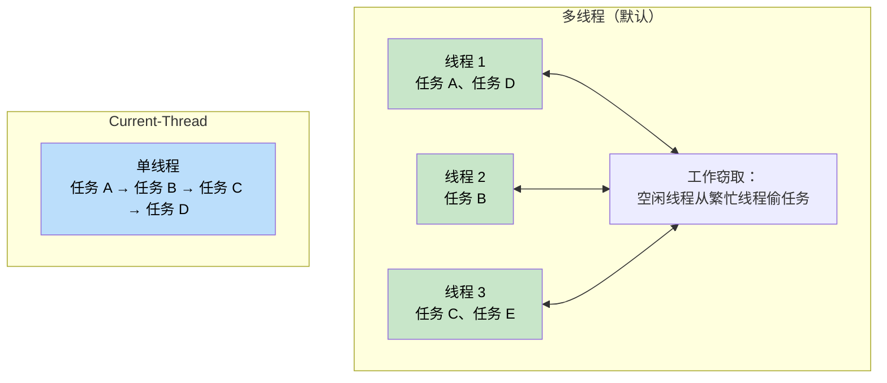
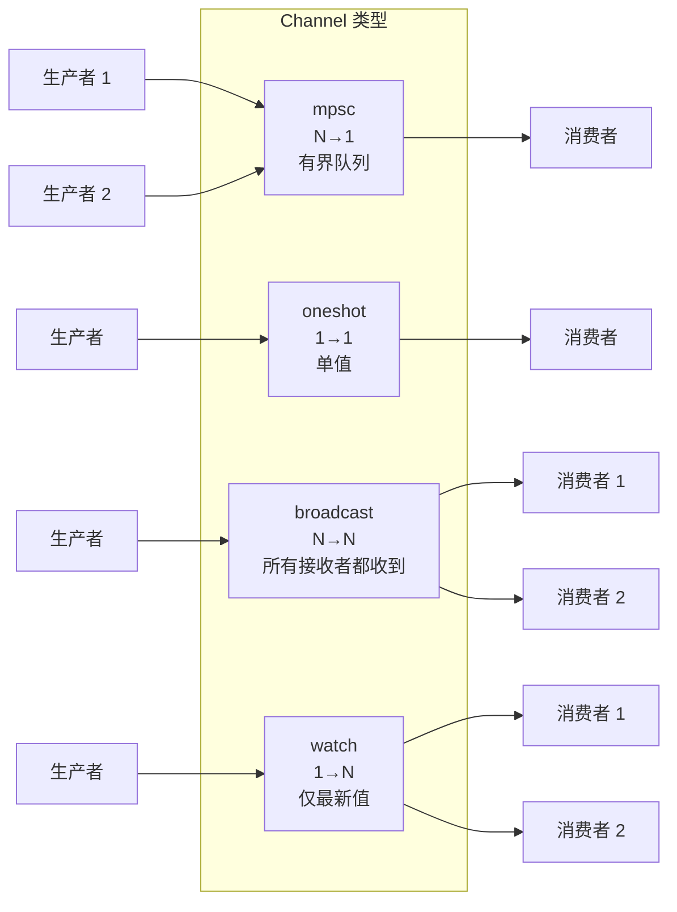
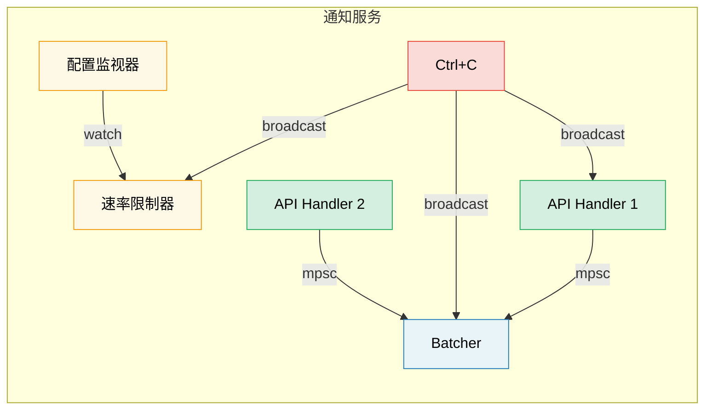

# 8. Tokio 深入 🟡

> **你将学到：**
> - 运行时风格：multi-thread 与 current-thread，以及各自适用场景
> - `tokio::spawn`、`'static` 要求与 `JoinHandle`
> - 任务取消语义（drop 即取消）
> - 同步原语：Mutex、RwLock、Semaphore，以及四种 channel 类型

## 运行时风格：Multi-Thread 与 Current-Thread

Tokio 提供两种运行时配置：

```rust
// Multi-threaded (default with #[tokio::main])
// Uses a work-stealing thread pool — tasks can move between threads
#[tokio::main]
async fn main() {
    // N worker threads (default = number of CPU cores)
    // Tasks are Send + 'static
}

// Current-thread — everything runs on one thread
#[tokio::main(flavor = "current_thread")]
async fn main() {
    // Single-threaded — tasks don't need to be Send
    // Lighter weight, good for simple tools or WASM
}

// Manual runtime construction:
let rt = tokio::runtime::Builder::new_multi_thread()
    .worker_threads(4)
    .enable_all()
    .build()
    .unwrap();

rt.block_on(async {
    println!("Running on custom runtime");
});
```



### tokio::spawn 与 'static 要求

`tokio::spawn` 将 future 放入运行时的任务队列。因为它可能在*任意*工作线程、*任意*时刻运行，future 必须是 `Send + 'static`：

```rust
use tokio::task;

async fn example() {
    let data = String::from("hello");

    // ✅ Works: move ownership into the task
    let handle = task::spawn(async move {
        println!("{data}");
        data.len()
    });

    let len = handle.await.unwrap();
    println!("Length: {len}");
}

async fn problem() {
    let data = String::from("hello");

    // ❌ FAILS: data is borrowed, not 'static
    // task::spawn(async {
    //     println!("{data}"); // borrows `data` — not 'static
    // });

    // ❌ FAILS: Rc is not Send
    // let rc = std::rc::Rc::new(42);
    // task::spawn(async move {
    //     println!("{rc}"); // Rc is !Send — can't cross thread boundary
    // });
}
```

**为何需要 `'static`？** 被 spawn 的任务独立运行——它可能比创建它的作用域活得更久。编译器无法证明引用仍然有效，因此要求拥有数据。

**为何需要 `Send`？** 任务可能在挂起时与恢复时处于不同线程。跨越 `.await` 点持有的所有数据必须可在线程间安全传递。

```rust
// Common pattern: clone shared data into the task
let shared = Arc::new(config);

for i in 0..10 {
    let shared = Arc::clone(&shared); // Clone the Arc, not the data
    tokio::spawn(async move {
        process_item(i, &shared).await;
    });
}
```

### JoinHandle 与任务取消

```rust
use tokio::task::JoinHandle;
use tokio::time::{sleep, Duration};

async fn cancellation_example() {
    let handle: JoinHandle<String> = tokio::spawn(async {
        sleep(Duration::from_secs(10)).await;
        "completed".to_string()
    });

    // Cancel the task by dropping the handle? NO — task keeps running!
    // drop(handle); // Task continues in the background

    // To actually cancel, call abort():
    handle.abort();

    // Awaiting an aborted task returns JoinError
    match handle.await {
        Ok(val) => println!("Got: {val}"),
        Err(e) if e.is_cancelled() => println!("Task was cancelled"),
        Err(e) => println!("Task panicked: {e}"),
    }
}
```

> **重要**：在 tokio 中，drop `JoinHandle` **不会**取消任务。
> 任务会变成*分离*状态并继续运行。必须显式调用
> `.abort()` 才能取消。这与直接 drop `Future` 不同——
> 后者会取消/丢弃底层计算。

### Tokio 同步原语

Tokio 提供异步感知的同步原语。核心原则：**不要在 `.await` 点之间使用 `std::sync::Mutex`**。

```rust
use tokio::sync::{Mutex, RwLock, Semaphore, mpsc, oneshot, broadcast, watch};

// --- Mutex ---
// Async mutex: the lock() method is async and won't block the thread
let data = Arc::new(Mutex::new(vec![1, 2, 3]));
{
    let mut guard = data.lock().await; // Non-blocking lock
    guard.push(4);
} // Guard dropped here — lock released

// --- Channels ---
// mpsc: Multiple producer, single consumer
let (tx, mut rx) = mpsc::channel::<String>(100); // Bounded buffer

tokio::spawn(async move {
    tx.send("hello".into()).await.unwrap();
});

let msg = rx.recv().await.unwrap();

// oneshot: Single value, single consumer
let (tx, rx) = oneshot::channel::<i32>();
tx.send(42).unwrap(); // No await needed — either sends or fails
let val = rx.await.unwrap();

// broadcast: Multiple producers, multiple consumers (all get every message)
let (tx, _) = broadcast::channel::<String>(100);
let mut rx1 = tx.subscribe();
let mut rx2 = tx.subscribe();

// watch: Single value, multiple consumers (only latest value)
let (tx, rx) = watch::channel(0u64);
tx.send(42).unwrap();
println!("Latest: {}", *rx.borrow());
```

> **说明：** 以下 channel 示例为简洁起见使用 `.unwrap()`。
> 生产环境应妥善处理发送/接收错误——`.send()` 失败表示
> 接收端已 drop，`.recv()` 失败表示 channel 已关闭。



## 案例研究：为通知服务选择正确的 Channel

你在构建通知服务，需求如下：
- 多个 API handler 产生事件
- 单个后台任务批量发送
- 配置监视器在运行时更新速率限制
- 关闭信号必须到达所有组件

**各场景用哪种 channel？**

| 需求 | Channel | 原因 |
|-------------|---------|-----|
| API handler → Batcher | `mpsc`（有界） | N 个生产者、1 个消费者。有界实现背压——若 batcher 落后，API handler 会放慢而非 OOM |
| 配置监视器 → 速率限制器 | `watch` | 只需最新配置。多个读者（各 worker）看到当前值 |
| 关闭信号 → 所有组件 | `broadcast` | 每个组件必须独立收到关闭通知 |
| 单次健康检查响应 | `oneshot` | 请求/响应模式——一个值，然后结束 |



<details>
<summary><strong>🏋️ 练习：构建任务池</strong>（点击展开）</summary>

**挑战**：构建函数 `run_with_limit`，接受异步闭包列表和并发上限，最多同时执行 N 个任务。使用 `tokio::sync::Semaphore`。

<details>
<summary>🔑 解答</summary>

```rust
use std::future::Future;
use std::sync::Arc;
use tokio::sync::Semaphore;

async fn run_with_limit<F, Fut, T>(tasks: Vec<F>, limit: usize) -> Vec<T>
where
    F: FnOnce() -> Fut + Send + 'static,
    Fut: Future<Output = T> + Send + 'static,
    T: Send + 'static,
{
    let semaphore = Arc::new(Semaphore::new(limit));
    let mut handles = Vec::new();

    for task in tasks {
        let permit = Arc::clone(&semaphore);
        let handle = tokio::spawn(async move {
            let _permit = permit.acquire().await.unwrap();
            // Permit is held while task runs, then dropped
            task().await
        });
        handles.push(handle);
    }

    let mut results = Vec::new();
    for handle in handles {
        results.push(handle.await.unwrap());
    }
    results
}

// Usage:
// let tasks: Vec<_> = urls.into_iter().map(|url| {
//     move || async move { fetch(url).await }
// }).collect();
// let results = run_with_limit(tasks, 10).await; // Max 10 concurrent
```

**要点**：`Semaphore` 是 tokio 中限制并发的标准方式。每个任务在开始工作前获取 permit。当 semaphore 已满时，新任务会异步等待（非阻塞）直到有空位。

</details>
</details>

> **要点回顾 — Tokio 深入**
> - 服务器用 `multi_thread`（默认）；CLI 工具、测试或 `!Send` 类型用 `current_thread`
> - `tokio::spawn` 要求 `'static` future——用 `Arc` 或 channel 共享数据
> - drop `JoinHandle` **不会**取消任务——需显式调用 `.abort()`
> - 按需求选同步原语：共享状态用 `Mutex`，并发上限用 `Semaphore`，通信用 `mpsc`/`oneshot`/`broadcast`/`watch`

> **另见：** [第 9 章 — 何时不该用 Tokio](ch09-when-tokio-isnt-the-right-fit.md) 了解 spawn 的替代方案，[第 12 章 — 常见陷阱](ch12-common-pitfalls.md) 了解跨 await 持有 MutexGuard 的 bug

***

