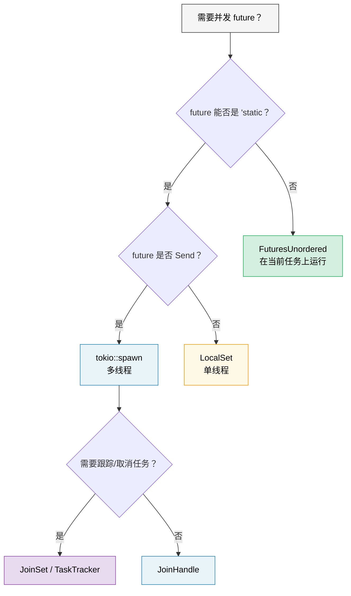

# 9. 何时不该用 Tokio 🟡

> **你将学到：**
> - `'static` 问题：`tokio::spawn` 如何迫使你到处使用 `Arc`
> - 面向 `!Send` future 的 `LocalSet`
> - 便于借用的并发：`FuturesUnordered`（无需 spawn）
> - 可管理的任务组：`JoinSet`
> - 编写与运行时无关的库



## 'static Future 问题

Tokio 的 `spawn` 要求 `'static` future。这意味着你不能在 spawn 的任务里借用局部数据：

```rust
async fn process_items(items: &[String]) {
    // ❌ Can't do this — items is borrowed, not 'static
    // for item in items {
    //     tokio::spawn(async {
    //         process(item).await;
    //     });
    // }

    // 😐 Workaround 1: Clone everything
    for item in items {
        let item = item.clone();
        tokio::spawn(async move {
            process(&item).await;
        });
    }

    // 😐 Workaround 2: Use Arc
    let items = Arc::new(items.to_vec());
    for i in 0..items.len() {
        let items = Arc::clone(&items);
        tokio::spawn(async move {
            process(&items[i]).await;
        });
    }
}
```

这很烦人！在 Go 里你可以 `go func() { use(item) }` 用闭包就行。在 Rust 里，所有权系统迫使你思考谁拥有什么、能活多久。

### `tokio::spawn` 的替代方案

并非每个问题都需要 `spawn`。下面三个工具各自解决*不同*约束：

```rust
// 1. FuturesUnordered — avoids 'static entirely (no spawn!)
use futures::stream::{FuturesUnordered, StreamExt};

async fn process_items(items: &[String]) {
    let futures: FuturesUnordered<_> = items
        .iter()
        .map(|item| async move {
            // ✅ Can borrow item — no spawn, no 'static needed!
            process(item).await
        })
        .collect();

    // Drive all futures to completion
    futures.for_each(|result| async move {
        println!("Result: {result:?}");
    }).await;
}

// 2. tokio::task::LocalSet — run !Send futures on current thread
//    ⚠️  Still requires 'static — solves Send, not 'static
use tokio::task::LocalSet;

let local_set = LocalSet::new();
local_set.run_until(async {
    tokio::task::spawn_local(async {
        // Can use Rc, Cell, and other !Send types here
        let rc = std::rc::Rc::new(42);
        println!("{rc}");
    }).await.unwrap();
}).await;

// 3. tokio JoinSet (tokio 1.21+) — managed set of spawned tasks
//    ⚠️  Still requires 'static + Send — solves task *management*,
//    not the 'static problem. Useful for tracking, aborting, and
//    joining a dynamic group of tasks.
use tokio::task::JoinSet;

async fn with_joinset() {
    let mut set = JoinSet::new();

    for i in 0..10 {
        // i is Copy and moved into the closure — already 'static.
        // You'd still need Arc or clone for borrowed data.
        set.spawn(async move {
            tokio::time::sleep(Duration::from_millis(100)).await;
            i * 2
        });
    }

    while let Some(result) = set.join_next().await {
        println!("Task completed: {:?}", result.unwrap());
    }
}
```

> **哪种工具解决哪种问题？**
>
> | 遇到的约束 | 工具 | 避免 `'static`？ | 避免 `Send`？ |
> |---|---|---|---|
> | 无法让 future 成为 `'static` | `FuturesUnordered` | ✅ 是 | ✅ 是 |
> | future 是 `'static` 但 `!Send` | `LocalSet` | ❌ 否 | ✅ 是 |
> | 需要跟踪 / 取消 spawn 的任务 | `JoinSet` | ❌ 否 | ❌ 否 |

### 库的轻量运行时

如果你在写库——不要把用户绑死在 tokio 上：

```rust
// ❌ BAD: Library forces tokio on users
pub async fn my_lib_function() {
    tokio::time::sleep(Duration::from_secs(1)).await;
    // Now your users MUST use tokio
}

// ✅ GOOD: Library is runtime-agnostic
pub async fn my_lib_function() {
    // Use only types from std::future and futures crate
    do_computation().await;
}

// ✅ GOOD: Accept a generic future for I/O operations
pub async fn fetch_with_retry<F, Fut, T, E>(
    operation: F,
    max_retries: usize,
) -> Result<T, E>
where
    F: Fn() -> Fut,
    Fut: Future<Output = Result<T, E>>,
{
    for attempt in 0..max_retries {
        match operation().await {
            Ok(val) => return Ok(val),
            Err(e) if attempt == max_retries - 1 => return Err(e),
            Err(_) => continue,
        }
    }
    unreachable!()
}
```

> **经验法则**：库应依赖 `futures` crate，而非 `tokio`。
> 应用应依赖 `tokio`（或所选运行时）。
> 这样生态才能可组合。

<details>
<summary><strong>🏋️ 练习：FuturesUnordered 与 Spawn</strong>（点击展开）</summary>

**挑战**：用两种方式写同一函数——一次用 `tokio::spawn`（需要 `'static`），一次用 `FuturesUnordered`（可借用数据）。函数接收 `&[String]`，在模拟异步查找后返回每个字符串的长度。

对比：哪种方式需要 `.clone()`？哪种可以借用输入切片？

<details>
<summary>🔑 解答</summary>

```rust
use futures::stream::{FuturesUnordered, StreamExt};
use tokio::time::{sleep, Duration};

// Version 1: tokio::spawn — requires 'static, must clone
async fn lengths_with_spawn(items: &[String]) -> Vec<usize> {
    let mut handles = Vec::new();
    for item in items {
        let owned = item.clone(); // Must clone — spawn requires 'static
        handles.push(tokio::spawn(async move {
            sleep(Duration::from_millis(10)).await;
            owned.len()
        }));
    }

    let mut results = Vec::new();
    for handle in handles {
        results.push(handle.await.unwrap());
    }
    results
}

// Version 2: FuturesUnordered — borrows data, no clone needed
async fn lengths_without_spawn(items: &[String]) -> Vec<usize> {
    let futures: FuturesUnordered<_> = items
        .iter()
        .map(|item| async move {
            sleep(Duration::from_millis(10)).await;
            item.len() // ✅ Borrows item — no clone!
        })
        .collect();

    futures.collect().await
}

#[tokio::test]
async fn test_both_versions() {
    let items = vec!["hello".into(), "world".into(), "rust".into()];

    let v1 = lengths_with_spawn(&items).await;
    // Note: v1 preserves insertion order (sequential join)

    let mut v2 = lengths_without_spawn(&items).await;
    v2.sort(); // FuturesUnordered returns in completion order

    assert_eq!(v1, vec![5, 5, 4]);
    assert_eq!(v2, vec![4, 5, 5]);
}
```

**要点**：`FuturesUnordered` 通过在当前任务上运行所有 future（无线程迁移）避免 `'static` 要求。代价：所有 future 共享一个任务——若一个阻塞，其他也会停滞。CPU 密集型、应在独立线程运行的工作请用 `spawn`。

</details>
</details>

> **要点回顾 — 何时不该用 Tokio**
> - `FuturesUnordered` 在当前任务上并发运行 future——无 `'static` 要求
> - `LocalSet` 让 `!Send` future 在单线程执行器上运行
> - `JoinSet`（tokio 1.21+）提供可管理任务组与自动清理
> - 库：仅依赖 `std::future::Future` + `futures` crate，不要直接依赖 tokio

> **另见：** [第 8 章 — Tokio 深入](ch08-tokio-deep-dive.md) 了解何时 spawn 合适，[第 11 章 — Stream](ch11-streams-and-asynciterator.md) 了解 `buffer_unordered()` 作为另一种并发限制手段

***

