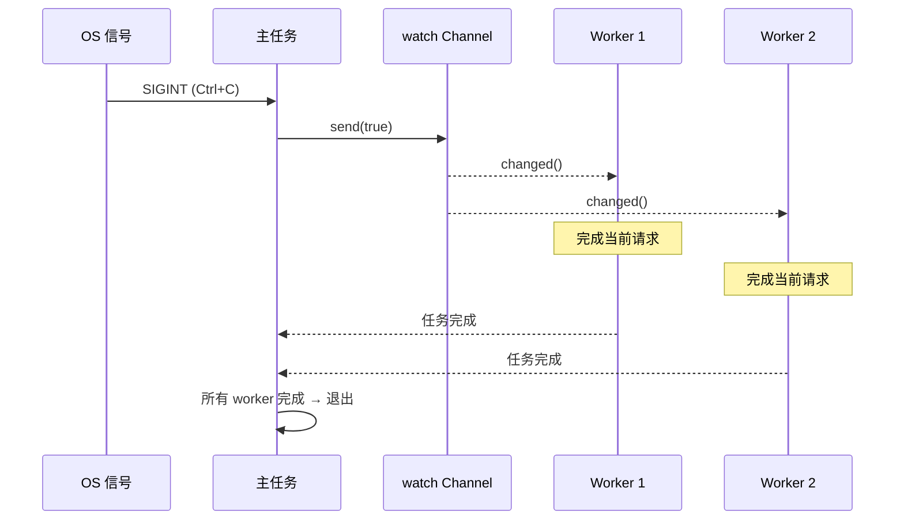

# 13. 生产模式 🔴

> **你将学到：**
> - 使用 `watch` channel 和 `select!` 实现优雅关闭
> - 背压（backpressure）：有界 channel 防止 OOM
> - 结构化并发（structured concurrency）：`JoinSet` 与 `TaskTracker`
> - 超时、重试与指数退避
> - 错误处理：`thiserror` 与 `anyhow`、双重 `?` 模式
> - Tower：axum、tonic、hyper 使用的中间件模式

## 优雅关闭

生产服务器必须干净关闭——完成进行中的请求、刷新缓冲区、关闭连接：

```rust
use tokio::signal;
use tokio::sync::watch;

async fn main_server() {
    // Create a shutdown signal channel
    let (shutdown_tx, shutdown_rx) = watch::channel(false);

    // Spawn the server
    let server_handle = tokio::spawn(run_server(shutdown_rx.clone()));

    // Wait for Ctrl+C
    signal::ctrl_c().await.expect("Failed to listen for Ctrl+C");
    println!("Shutdown signal received, finishing in-flight requests...");

    // Notify all tasks to shut down
    // NOTE: .unwrap() is used for brevity. Production code should handle
    // the case where all receivers have been dropped.
    shutdown_tx.send(true).unwrap();

    // Wait for server to finish (with timeout)
    match tokio::time::timeout(
        std::time::Duration::from_secs(30),
        server_handle,
    ).await {
        Ok(Ok(())) => println!("Server shut down gracefully"),
        Ok(Err(e)) => eprintln!("Server error: {e}"),
        Err(_) => eprintln!("Server shutdown timed out — forcing exit"),
    }
}

async fn run_server(mut shutdown: watch::Receiver<bool>) {
    loop {
        tokio::select! {
            // Accept new connections
            conn = accept_connection() => {
                let shutdown = shutdown.clone();
                tokio::spawn(handle_connection(conn, shutdown));
            }
            // Shutdown signal
            _ = shutdown.changed() => {
                if *shutdown.borrow() {
                    println!("Stopping accepting new connections");
                    break;
                }
            }
        }
    }
    // In-flight connections will finish on their own
    // because they have their own shutdown_rx clone
}

async fn handle_connection(conn: Connection, mut shutdown: watch::Receiver<bool>) {
    loop {
        tokio::select! {
            request = conn.next_request() => {
                // Process the request fully — don't abandon mid-request
                process_request(request).await;
            }
            _ = shutdown.changed() => {
                if *shutdown.borrow() {
                    // Finish current request, then exit
                    break;
                }
            }
        }
    }
}
```



### 有界 Channel 的背压

无界 channel 在生产者快于消费者时可能导致 OOM。生产环境应始终使用有界 channel：

```rust
use tokio::sync::mpsc;

async fn backpressure_example() {
    // Bounded channel: max 100 items buffered
    let (tx, mut rx) = mpsc::channel::<WorkItem>(100);

    // Producer: slows down naturally when buffer is full
    let producer = tokio::spawn(async move {
        for i in 0..1_000_000 {
            // send() is async — waits if buffer is full
            // This creates natural backpressure!
            tx.send(WorkItem { id: i }).await.unwrap();
        }
    });

    // Consumer: processes items at its own pace
    let consumer = tokio::spawn(async move {
        while let Some(item) = rx.recv().await {
            process(item).await; // Slow processing is OK — producer waits
        }
    });

    let _ = tokio::join!(producer, consumer);
}

// Compare with unbounded — DANGEROUS:
// let (tx, rx) = mpsc::unbounded_channel(); // No backpressure!
// Producer can fill memory indefinitely
```

### 结构化并发：JoinSet 与 TaskTracker

`JoinSet` 将相关任务分组，并确保它们全部完成：

```rust
use tokio::task::JoinSet;
use tokio::time::{sleep, Duration};

async fn structured_concurrency() {
    let mut set = JoinSet::new();

    // Spawn a batch of tasks
    for url in get_urls() {
        set.spawn(async move {
            fetch_and_process(url).await
        });
    }

    // Collect all results (order not guaranteed)
    let mut results = Vec::new();
    while let Some(result) = set.join_next().await {
        match result {
            Ok(Ok(data)) => results.push(data),
            Ok(Err(e)) => eprintln!("Task error: {e}"),
            Err(e) => eprintln!("Task panicked: {e}"),
        }
    }

    // ALL tasks are done here — no dangling background work
    println!("Processed {} items", results.len());
}

// TaskTracker (tokio-util 0.7.9+) — wait for all spawned tasks
use tokio_util::task::TaskTracker;

async fn with_tracker() {
    let tracker = TaskTracker::new();

    for i in 0..10 {
        tracker.spawn(async move {
            sleep(Duration::from_millis(100 * i)).await;
            println!("Task {i} done");
        });
    }

    tracker.close(); // No more tasks will be added
    tracker.wait().await; // Wait for ALL tracked tasks
    println!("All tasks finished");
}
```

### 超时与重试

```rust
use tokio::time::{timeout, sleep, Duration};

// Simple timeout
async fn with_timeout() -> Result<Response, Error> {
    match timeout(Duration::from_secs(5), fetch_data()).await {
        Ok(Ok(response)) => Ok(response),
        Ok(Err(e)) => Err(Error::Fetch(e)),
        Err(_) => Err(Error::Timeout),
    }
}

// Exponential backoff retry
async fn retry_with_backoff<F, Fut, T, E>(
    max_attempts: u32,
    base_delay_ms: u64,
    operation: F,
) -> Result<T, E>
where
    F: Fn() -> Fut,
    Fut: std::future::Future<Output = Result<T, E>>,
    E: std::fmt::Display,
{
    let mut delay = Duration::from_millis(base_delay_ms);

    for attempt in 1..=max_attempts {
        match operation().await {
            Ok(result) => return Ok(result),
            Err(e) => {
                if attempt == max_attempts {
                    eprintln!("Final attempt {attempt} failed: {e}");
                    return Err(e);
                }
                eprintln!("Attempt {attempt} failed: {e}, retrying in {delay:?}");
                sleep(delay).await;
                delay *= 2; // Exponential backoff
            }
        }
    }
    unreachable!()
}

// Usage:
// let result = retry_with_backoff(3, 100, || async {
//     reqwest::get("https://api.example.com/data").await
// }).await?;
```

> **生产提示 — 添加抖动（jitter）**：上述函数使用纯指数退避，但生产中大量客户端同时失败会在相同间隔重试（惊群效应，thundering herd）。添加随机 *抖动*——例如 `sleep(delay + rand_jitter)`，其中 `rand_jitter` 为 `0..delay/4`——使重试在时间上分散。

### 异步代码中的错误处理

异步带来独特的错误传播挑战——spawn 的任务形成错误边界，超时错误包装内部错误，`?` 在 Future 跨越任务边界时行为不同。

**`thiserror` 与 `anyhow`**——选择合适工具：

```rust
// thiserror: Define typed errors for libraries and public APIs
// Every variant is explicit — callers can match on specific errors
use thiserror::Error;

#[derive(Error, Debug)]
enum DiagError {
    #[error("IPMI command failed: {0}")]
    Ipmi(#[from] IpmiError),

    #[error("Sensor {sensor} out of range: {value}°C (max {max}°C)")]
    OverTemp { sensor: String, value: f64, max: f64 },

    #[error("Operation timed out after {0:?}")]
    Timeout(std::time::Duration),

    #[error("Task panicked: {0}")]
    TaskPanic(#[from] tokio::task::JoinError),
}

// anyhow: Quick error handling for applications and prototypes
// Wraps any error — no need to define types for every case
use anyhow::{Context, Result};

async fn run_diagnostics() -> Result<()> {
    let config = load_config()
        .await
        .context("Failed to load diagnostic config")?;  // Adds context

    let result = run_gpu_test(&config)
        .await
        .context("GPU diagnostic failed")?;              // Chains context

    Ok(())
}
// anyhow prints: "GPU diagnostic failed: IPMI command failed: timeout"
```

| Crate | 适用场景 | 错误类型 | 模式匹配 |
|-------|----------|-----------|----------|
| `thiserror` | 库代码、公开 API | `enum MyError { ... }` | `match err { MyError::Timeout => ... }` |
| `anyhow` | 应用、CLI 工具、脚本 | `anyhow::Error`（类型擦除） | `err.downcast_ref::<MyError>()` |
| 两者结合 | 库暴露 `thiserror`，应用用 `anyhow` 包装 | 两全其美 | 库错误有类型，应用不关心 |

**与 `tokio::spawn` 的双重 `?` 模式**：

```rust
use thiserror::Error;
use tokio::task::JoinError;

#[derive(Error, Debug)]
enum AppError {
    #[error("HTTP error: {0}")]
    Http(#[from] reqwest::Error),

    #[error("Task panicked: {0}")]
    TaskPanic(#[from] JoinError),
}

async fn spawn_with_errors() -> Result<String, AppError> {
    let handle = tokio::spawn(async {
        let resp = reqwest::get("https://example.com").await?;
        Ok::<_, reqwest::Error>(resp.text().await?)
    });

    // Double ?: First ? unwraps JoinError (task panic), second ? unwraps inner Result
    let result = handle.await??;
    Ok(result)
}
```

**错误边界问题**——`tokio::spawn` 擦除上下文：

```rust
// ❌ Error context is lost across spawn boundaries:
async fn bad_error_handling() -> Result<()> {
    let handle = tokio::spawn(async {
        some_fallible_work().await  // Returns Result<T, SomeError>
    });

    // handle.await returns Result<Result<T, SomeError>, JoinError>
    // The inner error has no context about what task failed
    let result = handle.await??;
    Ok(())
}

// ✅ Add context at the spawn boundary:
async fn good_error_handling() -> Result<()> {
    let handle = tokio::spawn(async {
        some_fallible_work()
            .await
            .context("worker task failed")  // Context before crossing boundary
    });

    let result = handle.await
        .context("worker task panicked")??;  // Context for JoinError too
    Ok(())
}
```

**超时错误**——包装 vs 替换：

```rust
use tokio::time::{timeout, Duration};

async fn with_timeout_context() -> Result<String, DiagError> {
    let dur = Duration::from_secs(30);
    match timeout(dur, fetch_sensor_data()).await {
        Ok(Ok(data)) => Ok(data),
        Ok(Err(e)) => Err(e),                      // Inner error preserved
        Err(_) => Err(DiagError::Timeout(dur)),     // Timeout → typed error
    }
}
```

### Tower：中间件模式

[Tower](https://docs.rs/tower) crate 定义了可组合的 `Service` Trait——Rust 异步中间件的骨干（被 `axum`、`tonic`、`hyper` 使用）：

```rust
// Tower's core trait (simplified):
pub trait Service<Request> {
    type Response;
    type Error;
    type Future: Future<Output = Result<Self::Response, Self::Error>>;

    fn poll_ready(&mut self, cx: &mut Context<'_>) -> Poll<Result<(), Self::Error>>;
    fn call(&mut self, req: Request) -> Self::Future;
}
```

中间件包装 `Service` 以添加横切行为——日志、超时、限流——而无需修改内部逻辑：

```rust
use tower::{ServiceBuilder, timeout::TimeoutLayer, limit::RateLimitLayer};
use std::time::Duration;

let service = ServiceBuilder::new()
    .layer(TimeoutLayer::new(Duration::from_secs(10)))       // Outermost: timeout
    .layer(RateLimitLayer::new(100, Duration::from_secs(1))) // Then: rate limit
    .service(my_handler);                                     // Innermost: your code
```

**为何重要**：若你用过 ASP.NET 中间件或 Express.js 中间件，Tower 就是 Rust 等价物。生产 Rust 服务借此添加横切关注点而无需重复代码。

### 练习：带 Worker 池的优雅关闭

<details>
<summary>🏋️ 练习（点击展开）</summary>

**挑战**：构建基于 channel 工作队列的任务处理器，含 N 个 worker 任务，并在 Ctrl+C 时优雅关闭。Worker 应在退出前完成进行中的工作。

<details>
<summary>🔑 解答</summary>

```rust
use tokio::sync::{mpsc, watch};
use tokio::time::{sleep, Duration};

struct WorkItem { id: u64, payload: String }

#[tokio::main]
async fn main() {
    let (work_tx, work_rx) = mpsc::channel::<WorkItem>(100);
    let (shutdown_tx, shutdown_rx) = watch::channel(false);
    let work_rx = std::sync::Arc::new(tokio::sync::Mutex::new(work_rx));

    let mut handles = Vec::new();
    for id in 0..4 {
        let rx = work_rx.clone();
        let mut shutdown = shutdown_rx.clone();
        handles.push(tokio::spawn(async move {
            loop {
                let item = {
                    let mut rx = rx.lock().await;
                    tokio::select! {
                        item = rx.recv() => item,
                        _ = shutdown.changed() => {
                            if *shutdown.borrow() { None } else { continue }
                        }
                    }
                };
                match item {
                    Some(work) => {
                        println!("Worker {id}: processing {}", work.id);
                        sleep(Duration::from_millis(200)).await;
                    }
                    None => break,
                }
            }
        }));
    }

    // Submit work
    for i in 0..20 {
        let _ = work_tx.send(WorkItem { id: i, payload: format!("task-{i}") }).await;
        sleep(Duration::from_millis(50)).await;
    }

    // On Ctrl+C: signal shutdown, wait for workers
    // NOTE: .unwrap() is used for brevity — handle errors in production.
    tokio::signal::ctrl_c().await.unwrap();
    shutdown_tx.send(true).unwrap();
    for h in handles { let _ = h.await; }
    println!("Shut down cleanly.");
}
```

</details>
</details>

> **要点回顾 — 生产模式**
> - 使用 `watch` channel + `select!` 实现协调的优雅关闭
> - 有界 channel（`mpsc::channel(N)`）提供 **背压**——缓冲区满时发送方阻塞
> - `JoinSet` 与 `TaskTracker` 提供 **结构化并发**：跟踪、中止并等待任务组
> - 网络操作始终加超时——`tokio::time::timeout(dur, fut)`
> - Tower 的 `Service` Trait 是生产 Rust 服务的标准中间件模式

> **另见：** [第 8 章 — Tokio 深入](ch08-tokio-deep-dive.md) 了解 channel 与同步原语，[第 12 章 — 常见陷阱](ch12-common-pitfalls.md) 了解关闭期间的取消风险

***

