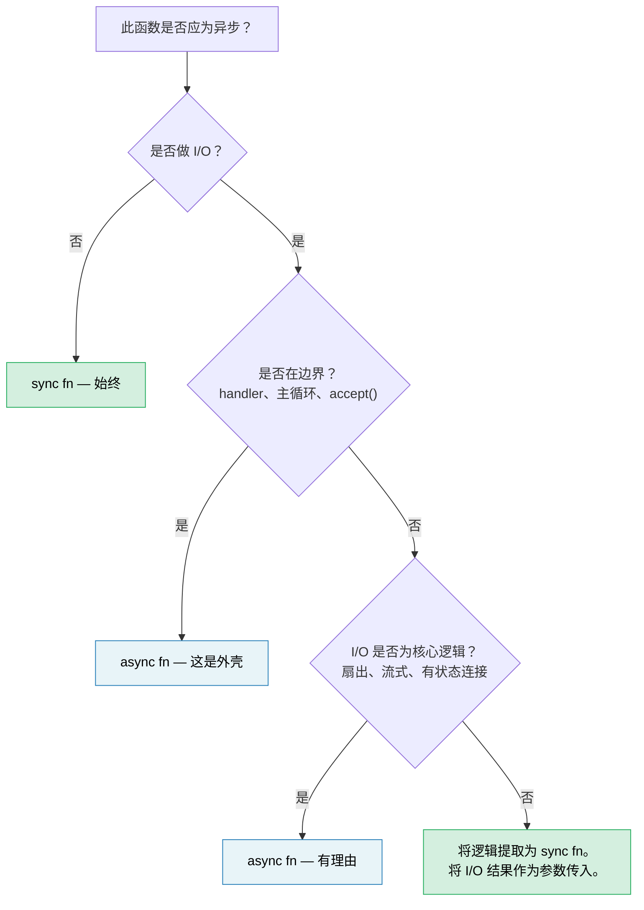

# 14. 异步是优化，而非架构 🔴

> **你将学到：**
> - 为何异步往往会污染整个代码库——以及为何这是设计缺陷而非特性
> - 「同步核心、异步外壳」模式，使大部分代码可测试、可调试
> - 如何处理困难情况：逻辑 *同时* 需要 I/O
> - 何时 `spawn_blocking` 是修复 vs 是症状
> - 何时异步确实应属于核心逻辑
> - 为何同步优先的库比异步优先的库更可组合

你已花 13 章学习异步 Rust。本书尚未告诉你的最重要一点：**你的大部分代码不应该是异步的。**

## 函数着色问题（Function Coloring Problem）

Bob Nystrom 的 ["What Color is Your Function?"](https://journal.stuffwithstuff.com/2015/02/01/what-color-is-your-function/) 指出了核心问题：异步函数可以调用同步函数，但同步函数不能调用异步函数。一旦某个函数变成异步，调用链上它之上的所有函数都必须跟随。

在 Rust 中这比 C# 或 JavaScript **更严重**，因为异步不仅感染函数签名——还感染类型：

| 同步代码 | 异步等价物 | 为何不同 |
|---|---|---|
| `fn process(&self)` | `async fn process(&self)` | 调用者也必须是异步的 |
| `&mut T` | `Arc<Mutex<T>>` | spawn 的任务需要 `'static + Send` |
| `std::sync::Mutex` | `tokio::sync::Mutex` | 若在 `.await` 期间持有，类型不同 |
| `impl Trait` 返回 | `impl Future<Output = T> + Send` | 自 RPITIT（Rust 1.75，第 10 章）起更简单，但仍被着色 |
| `#[test]` | `#[tokio::test]` | 测试需要运行时 |
| 堆栈跟踪：5 帧 | 堆栈跟踪：25 帧 | 一半是运行时内部 |

每一行都是某人必须做出、做对并维护的决策——且都与业务逻辑无关。行业正在 *远离* 这种模式：Java 的 Project Loom（虚拟线程）和 Go 的 goroutine 都让你编写看似同步的代码，由运行时廉价地多路复用。Rust 选择显式异步以获得零成本控制，但这种控制有复杂度成本，应有意识地支付，而非默认承担。

## 「但线程很贵」

条件反射式的反驳：「我们需要异步因为线程很贵。」在大多数团队运作的规模上，这大体是错的。

- **栈内存：** 每个 OS 线程保留 8MB 虚拟地址空间（Linux 默认），但 OS 仅在触碰时提交页——大多空闲的线程仅使用 20–80KB 物理内存。
- **上下文切换：** 现代硬件上约 1–5µs。50 个并发请求时这是噪声。每秒 10 万次切换时可测量。
- **创建成本：** Linux 上每线程约 10–30µs。线程池（rayon、`std::thread::scope`）将其摊销为零。

异步真正值得其复杂度的诚实阈值大约是 **1K–10K 个大多空闲的并发连接**——epoll/io_uring 的甜蜜点，每连接栈成为真实成本。低于此，线程池更简单、更易调试、且足够快。高于此，异步胜出。大多数服务低于此阈值。

## 困难示例：逻辑也需要 I/O

一个平凡的纯函数——`fn add(a: i32, b: i32) -> i32`——显然不需要异步。这不是有趣的教训。有趣的情况是业务逻辑 *似乎* 需要在中间做 I/O：验证库存、定价查询汇率、订单流水线查找客户。

考虑订单处理服务。处处异步的版本看起来很自然：

### 版本 A：核心全程异步

```rust
// orders.rs — async all the way down

pub async fn process_order(order: Order) -> Result<Receipt, OrderError> {
    // Step 1: Validate — pure business rules, no I/O
    validate_items(&order)?;
    validate_quantities(&order)?;

    // Step 2: Check inventory — needs a database call
    let stock = inventory_client.check(&order.items).await?;
    if !stock.all_available() {
        return Err(OrderError::OutOfStock(stock.missing()));
    }

    // Step 3: Calculate pricing — pure math, but async because we're already here
    let pricing = calculate_pricing(&order, &stock);

    // Step 4: Apply discount — needs an external service call
    let discount = discount_service.lookup(order.customer_id).await?;
    let final_price = pricing.apply_discount(discount);

    // Step 5: Format receipt — pure
    Ok(Receipt::new(order, final_price))
}
```

这是 *合理* 的异步代码。没有滥用 `Arc<Mutex>`——只是顺序 await。大多数开发者会这样写然后继续。但看看发生了什么：`validate_items`、`validate_quantities`、`calculate_pricing` 和 `Receipt::new` 都是纯函数，却因第 2、4 步需要 I/O 被拖入异步上下文。整个函数必须是异步的，测试需要运行时，调用链上每个调用者都被着色。

### 版本 B：同步核心、异步外壳

替代方案：分离 *要决定什么* 与 *如何获取*：

```rust
// core.rs — pure business logic, zero async, zero tokio dependency

pub fn validate_order(order: &Order) -> Result<ValidatedOrder, OrderError> {
    validate_items(order)?;
    validate_quantities(order)?;
    Ok(ValidatedOrder::from(order))
}

pub fn check_stock(
    order: &ValidatedOrder,
    stock: &StockResult,
) -> Result<StockedOrder, OrderError> {
    if !stock.all_available() {
        return Err(OrderError::OutOfStock(stock.missing()));
    }
    Ok(StockedOrder::from(order, stock))
}

pub fn finalize(
    order: &StockedOrder,
    discount: Discount,
) -> Receipt {
    let pricing = calculate_pricing(order);
    let final_price = pricing.apply_discount(discount);
    Receipt::new(order, final_price)
}
```

```rust
// shell.rs — thin async orchestrator
//
// Note: the `?` on network calls requires `impl From<reqwest::Error> for OrderError`
// (or a unified error enum). See ch12 for async error handling patterns.

use crate::core;

pub async fn process_order(order: Order) -> Result<Receipt, OrderError> {
    // Sync: validate
    let validated = core::validate_order(&order)?;

    // Async: fetch inventory (this is the shell's job)
    let stock = inventory_client.check(&validated.items).await?;

    // Sync: apply business rule to fetched data
    let stocked = core::check_stock(&validated, &stock)?;

    // Async: fetch discount
    let discount = discount_service.lookup(order.customer_id).await?;

    // Sync: finalize
    Ok(core::finalize(&stocked, discount))
}
```

异步外壳是 **获取 → 决策 → 获取 → 决策** 的流水线。每个「决策」步骤是同步函数，将 I/O 结果作为输入，而非主动向外请求。

### 测试差异

同步核心无需运行时或 mock 即可测试每条业务规则：

```rust
#[test]
fn out_of_stock_rejects_order() {
    let order = validated_order(vec![item("widget", 10)]);
    let stock = stock_result(vec![("widget", 3)]); // only 3 available

    let result = core::check_stock(&order, &stock);
    assert_eq!(result.unwrap_err(), OrderError::OutOfStock(vec!["widget"]));
}

#[test]
fn discount_applied_correctly() {
    let order = stocked_order(100_00); // price in cents
    let receipt = core::finalize(&order, Discount::Percent(15));
    assert_eq!(receipt.final_price, 85_00);
}
```

异步外壳得到更薄的 *集成* 测试，验证接线而非逻辑：

```rust
#[tokio::test]
async fn process_order_integration() {
    let mock_inventory = mock_service(/* returns stock */);
    let mock_discounts = mock_service(/* returns 10% */);
    let receipt = process_order(sample_order()).await.unwrap();
    assert!(receipt.final_price > 0);
    // Logic correctness is already proven by core tests above
}
```

### 为何重要

| 关注点 | 核心全程异步 | 同步核心 + 异步外壳 |
|---|---|---|
| 业务规则无需运行时即可测试 | 否 | **是** |
| 需要 `#[tokio::test]` 的单元测试数量 | 全部 | **仅集成测试** |
| I/O 失败与逻辑错误纠缠 | 是——一种 `Result` 类型兼顾两者 | **否**——同步返回逻辑错误，外壳处理 I/O 错误 |
| `validate_order` 可在 CLI / WASM / 批处理中复用 | 否——传递依赖 tokio | **是**——纯 `fn` |
| 业务逻辑堆栈跟踪 | 与运行时帧交错 | **清晰** |
| 日后将 HTTP 客户端换为 gRPC | 需改核心函数 | **仅改外壳** |

关键洞见：**第 2、4 步的 I/O 调用不必 *位于* 业务逻辑内部。它们是逻辑的输入。** 同步核心将 `StockResult` 和 `Discount` 作为参数。这些值来自 HTTP、gRPC、测试 fixture 还是缓存——是外壳的事。

## `spawn_blocking` 的异味

第 12 章将 `spawn_blocking` 作为意外阻塞执行器的修复。对于一次性阻塞调用——`std::fs::read`、压缩库、遗留 FFI 函数——这是正确修复。

但若你发现自己在用 `spawn_blocking` 包装大段代码：

```rust
async fn handler(req: Request) -> Response {
    // If this is your codebase, the boundary is in the wrong place
    tokio::task::spawn_blocking(move || {
        let validated = validate(&req);       // sync
        let enriched = enrich(validated);      // sync
        let result = process(enriched);        // sync
        let output = format_response(result);  // sync
        output
    }).await.unwrap()
}
```

……代码库在告诉你：**这些逻辑本就不是异步的。** 你不需要 `spawn_blocking`——你需要一个同步模块，由异步 handler 直接调用：

```rust
async fn handler(req: Request) -> Response {
    // validate → enrich → process → format are all sync.
    // No spawn_blocking needed — they're fast and CPU-light.
    let response = my_core::handle(req);
    response
}
```

将 `spawn_blocking` 保留给真正重的 CPU 工作（解析大负载、图像处理、压缩），时间成本会实际饿死执行器。对于微秒级运行的普通业务逻辑，直接同步调用更简单且正确。

## 库：同步优先，异步包装可选

边界问题对库作者更为关键。同步库可被同步和异步调用方使用：

```rust
// A sync library — usable everywhere
let report = my_lib::analyze(&data);

// Caller A: sync CLI
fn main() {
    let report = my_lib::analyze(&data);
    println!("{report}");
}

// Caller B: async handler, works fine
async fn handler() -> Json<Report> {
    let report = my_lib::analyze(&data); // sync call in async context — fine
    Json(report)
}

// Caller C: heavy analysis — caller decides to offload
async fn handler_heavy() -> Json<Report> {
    let data = data.clone();
    let report = tokio::task::spawn_blocking(move || {
        my_lib::analyze(&data) // caller controls the async boundary
    }).await.unwrap();
    Json(report)
}
```

异步库迫使 *所有* 调用方进入运行时：

```rust
// An async library — only usable from async contexts
let report = my_lib::analyze(&data).await; // caller MUST be async

// Sync caller? Now you need block_on — and hope there's no nested runtime
let report = tokio::runtime::Runtime::new().unwrap().block_on(
    my_lib::analyze(&data)
); // fragile, panic-prone if already inside a runtime
```

**默认使用同步 API。** 若库做纯计算、数据转换或解析，没有理由异步。若做 I/O，考虑提供同步核心，并在 feature flag 后提供可选异步便利层——让调用方拥有边界决策。

## 何时异步属于核心

并非一切都能干净分离。以下情况异步应属于核心逻辑：

- **扇出/扇入就是逻辑。** 若业务规则是「并发查询 5 个定价服务并返回最便宜」，并发 *就是* 逻辑，而非管道。强行用同步 + 线程是在发明更差的异步。

- **流式处理就是逻辑。** 处理带背压的连续事件流——流管理是非平凡的业务逻辑，不只是 I/O 包装。

- **长生命周期有状态连接。** WebSocket handler、gRPC 双向流和协议状态机，状态转换与 I/O 事件固有绑定。[第 17 章](ch17-capstone-project.md) 的毕业项目——异步聊天服务器——正是此例：并发连接、基于房间扇出和优雅关闭本质上是异步工作。

**检验：** 若从函数中移除 `async` 需要用线程、channel 或手动 poll 替代，则异步物有所值。若移除 `async` 只需删掉关键字而无其他变化，则它本不需要异步。

## 决策规则



> **经验法则：** 从同步开始。仅在最外层 I/O 边界添加异步。仅当你能阐明 *哪些并发 I/O 操作* 值得复杂度代价时，才向内推进。

---

<details>
<summary><strong>🏋️ 练习：提取同步核心</strong>（点击展开）</summary>

以下 axum handler 存在异步污染——业务逻辑与 I/O 混杂。将其重构为同步核心模块和薄异步外壳。

```rust
use axum::{Json, extract::Path};

async fn get_device_report(Path(device_id): Path<String>) -> Result<Json<Report>, AppError> {
    // Fetch raw telemetry from the device over HTTP
    let raw = reqwest::get(format!("http://bmc-{device_id}/telemetry"))
        .await?
        .json::<RawTelemetry>()
        .await?;

    // Business logic: convert raw sensor readings to calibrated values
    let mut readings = Vec::new();
    for sensor in &raw.sensors {
        let calibrated = (sensor.raw_value as f64) * sensor.scale + sensor.offset;
        if calibrated < sensor.min_valid || calibrated > sensor.max_valid {
            return Err(AppError::SensorOutOfRange {
                name: sensor.name.clone(),
                value: calibrated,
            });
        }
        readings.push(CalibratedReading {
            name: sensor.name.clone(),
            value: calibrated,
            unit: sensor.unit.clone(),
        });
    }

    // Business logic: classify device health
    let critical_count = readings.iter()
        .filter(|r| r.value > 90.0)
        .count();
    let health = if critical_count > 2 { Health::Critical }
                 else if critical_count > 0 { Health::Warning }
                 else { Health::Ok };

    // Fetch device metadata from inventory service
    let meta = reqwest::get(format!("http://inventory/devices/{device_id}"))
        .await?
        .json::<DeviceMetadata>()
        .await?;

    Ok(Json(Report {
        device_id,
        device_name: meta.name,
        health,
        readings,
        timestamp: chrono::Utc::now(),
    }))
}
```

**你的目标：**

1. 创建 `core.rs`，含同步函数：`calibrate_sensors`、`classify_health`、`build_report`
2. 创建 `shell.rs`，含薄异步 handler：先抓取，再调用同步核心
3. 编写 `#[test]`（非 `#[tokio::test]`）测试：传感器超范围、健康分类阈值、正常报告

**提示：**
- 同步核心应接受 `RawTelemetry` 和 `DeviceMetadata` 作为输入——它不应知道这些来自 HTTP。
- 你需要定义小型测试辅助函数（如 `raw_telemetry()`、`sensor()`、`reading()`、`device_meta()`）构造测试 fixture。其签名应从用法中显而易见。

<details>
<summary>🔑 解答</summary>

```rust
// core.rs — zero async dependency

pub fn calibrate_sensors(raw: &RawTelemetry) -> Result<Vec<CalibratedReading>, AppError> {
    raw.sensors.iter().map(|sensor| {
        let calibrated = (sensor.raw_value as f64) * sensor.scale + sensor.offset;
        if calibrated < sensor.min_valid || calibrated > sensor.max_valid {
            return Err(AppError::SensorOutOfRange {
                name: sensor.name.clone(),
                value: calibrated,
            });
        }
        Ok(CalibratedReading {
            name: sensor.name.clone(),
            value: calibrated,
            unit: sensor.unit.clone(),
        })
    }).collect()
}

pub fn classify_health(readings: &[CalibratedReading]) -> Health {
    let critical_count = readings.iter()
        .filter(|r| r.value > 90.0)
        .count();
    if critical_count > 2 { Health::Critical }
    else if critical_count > 0 { Health::Warning }
    else { Health::Ok }
}

pub fn build_report(
    device_id: String,
    readings: Vec<CalibratedReading>,
    meta: &DeviceMetadata,
) -> Report {
    Report {
        device_id,
        device_name: meta.name.clone(),
        health: classify_health(&readings),
        readings,
        timestamp: chrono::Utc::now(),
    }
}
```

```rust
// shell.rs — async boundary only

pub async fn get_device_report(
    Path(device_id): Path<String>,
) -> Result<Json<Report>, AppError> {
    let raw = reqwest::get(format!("http://bmc-{device_id}/telemetry"))
        .await?
        .json::<RawTelemetry>()
        .await?;

    let readings = core::calibrate_sensors(&raw)?;

    let meta = reqwest::get(format!("http://inventory/devices/{device_id}"))
        .await?
        .json::<DeviceMetadata>()
        .await?;

    Ok(Json(core::build_report(device_id, readings, &meta)))
}
```

```rust
// core_tests.rs — no runtime needed

// Test fixture helpers — construct data without any I/O
fn sensor(name: &str, raw_value: f64, valid_range: std::ops::Range<f64>) -> RawSensor {
    RawSensor {
        name: name.into(),
        raw_value,
        scale: 1.0,
        offset: 0.0,
        min_valid: valid_range.start,
        max_valid: valid_range.end,
        unit: "unit".into(),
    }
}

fn raw_telemetry(sensors: Vec<RawSensor>) -> RawTelemetry {
    RawTelemetry { sensors }
}

fn reading(name: &str, value: f64) -> CalibratedReading {
    CalibratedReading { name: name.into(), value, unit: "unit".into() }
}

fn device_meta(name: &str) -> DeviceMetadata {
    DeviceMetadata { name: name.into() }
}

#[test]
fn sensor_out_of_range_rejected() {
    let raw = raw_telemetry(vec![sensor("gpu_temp", 105.0, 0.0..100.0)]);
    let result = core::calibrate_sensors(&raw);
    assert!(matches!(result, Err(AppError::SensorOutOfRange { .. })));
}

#[test]
fn health_classification() {
    let readings = vec![
        reading("a", 50.0),  // ok
        reading("b", 95.0),  // critical
        reading("c", 91.0),  // critical
        reading("d", 92.0),  // critical
    ];
    assert_eq!(core::classify_health(&readings), Health::Critical);
}

#[test]
fn normal_report() {
    let raw = raw_telemetry(vec![sensor("fan_rpm", 3000.0, 0.0..10000.0)]);
    let readings = core::calibrate_sensors(&raw).unwrap();
    let meta = device_meta("gpu-node-42");
    let report = core::build_report("dev-1".into(), readings, &meta);
    assert_eq!(report.health, Health::Ok);
    assert_eq!(report.readings.len(), 1);
}
```

**变化：** 异步 handler 从 30 行逻辑与 I/O 混杂，变为 8 行纯编排。业务规则（校准数学、范围验证、健康阈值）现可用 `#[test]` 测试，毫秒级运行，零依赖 tokio、reqwest 或任何 HTTP mock 服务器。

</details>
</details>

---

> **要点回顾：**
>
> 1. 异步是 **I/O 多路复用优化**，而非应用架构。大多数业务逻辑是同步的。
> 2. **同步核心、异步外壳：** 将业务规则放在纯同步函数中，以 I/O 结果作为参数。异步外壳编排抓取并调用核心。
> 3. 若用大段 `spawn_blocking` 包装，**边界放错了**——将逻辑重构为同步模块。
> 4. **库应默认同步 API。** 异步库迫使所有调用方进入运行时；同步库让调用方拥有异步边界。
> 5. 异步在 **扇出/扇入、流式处理和有状态连接** 上物有所值——并发 *就是* 业务逻辑的情况。
>
> **另见：** [第 12 章 — 常见陷阱](ch12-common-pitfalls.md)（`spawn_blocking` 作为战术修复）· [第 13 章 — 生产模式](ch13-production-patterns.md)（背压、结构化并发）· [第 17 章 — 毕业项目：异步聊天服务器](ch17-capstone-project.md)（异步是正确架构的案例）
