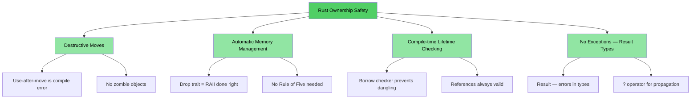
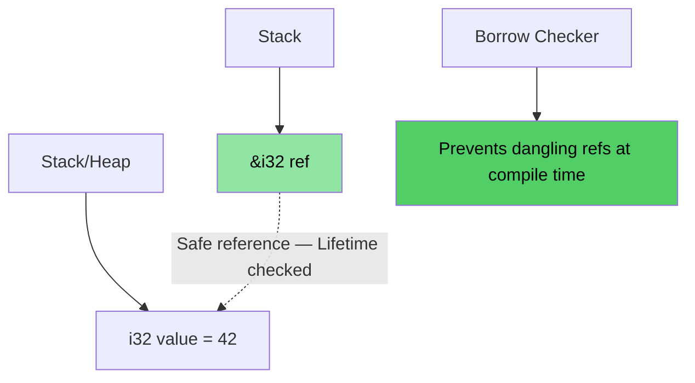
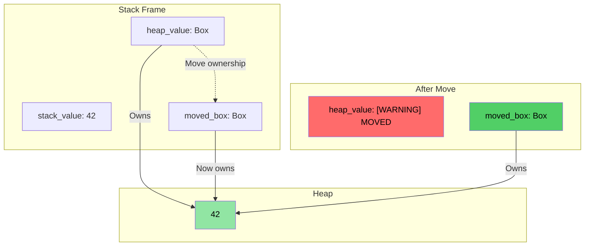
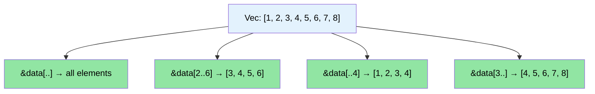

# 讲师介绍与总体方法 {#speaker-intro-and-general-approach}

> **你将学到：** 课程结构、互动形式，以及熟悉的 C/C++ 概念如何映射到 Rust 等价物。本章设定预期，并为全书提供路线图。

- 讲师介绍
    - Microsoft SCHIE（Silicon and Cloud Hardware Infrastructure Engineering，硅与云硬件基础设施工程）团队首席固件架构师
    - 行业资深专家，专长于安全、系统编程（固件、操作系统、虚拟机监控程序）、CPU 与平台架构，以及 C++ 系统开发
    - 2017 年起在 Rust 中编程（@AWS EC2），此后一直热爱这门语言
- 本课程尽可能保持互动
    - 前提：你熟悉 C、C++，或两者皆会
    - 示例刻意设计为将熟悉概念映射到 Rust 等价物
    - **请随时提出澄清问题**
- 讲师期待与团队持续交流

# 选择 Rust 的理由 {#the-case-for-rust}
> **想直接看代码？** 跳转到 [给我看代码](ch02-getting-started.md#enough-talk-already-show-me-some-code)

无论你来自 C 还是 C++，核心痛点相同：能干净编译却在运行时崩溃、损坏或泄漏的内存安全 bug。

- 超过 **70% 的 CVE** 由内存安全问题引起——缓冲区溢出、悬垂指针、释放后使用
- C++ 的 `shared_ptr`、`unique_ptr`、RAII 和移动语义是正确方向，但只是**创可贴，不是根治**——移动后使用、引用循环、迭代器失效和异常安全漏洞依然敞开
- Rust 提供你依赖的 C/C++ 级性能，同时带来**编译期安全保证**

> **📖 深入阅读：** 请参阅 [为什么 C/C++ 开发者需要 Rust](ch01-1-why-c-cpp-developers-need-rust.md)，了解具体漏洞示例、Rust 消除问题的完整清单，以及 C++ 智能指针为何不够

----

# Rust 如何解决这些问题？ {#how-does-rust-address-these-issues}

## 缓冲区溢出与边界违规
- 所有 Rust 数组、切片和字符串都关联显式边界。编译器插入检查，确保任何边界违规导致**运行时崩溃**（Rust 术语中为 panic）——绝不会是未定义行为

## 悬垂指针与引用
- Rust 引入生命周期和借用检查，在**编译期**消除悬垂引用
- 没有悬垂指针，没有释放后使用——编译器不会让你写出这类代码

## 移动后使用
- Rust 的所有权系统使移动具有**破坏性**——一旦移动值，编译器**拒绝**让你再使用原值。没有僵尸对象，没有"有效但未指定状态"

## 资源管理
- Rust 的 `Drop` Trait 是正确实现的 RAII——编译器在变量离开作用域时自动释放资源，并**防止移动后使用**——这是 C++ RAII 做不到的
- 无需 Rule of Five（无需定义拷贝构造、移动构造、拷贝赋值、移动赋值、析构函数）

## 错误处理
- Rust 没有异常。所有错误都是值（`Result<T, E>`），使错误处理显式且体现在类型签名中

## 迭代器失效
- Rust 的借用检查器**禁止在迭代集合时修改它**。你无法写出困扰 C++ 代码库的那类 bug：
```rust
// Rust equivalent of erase-during-iteration: retain()
pending_faults.retain(|f| f.id != fault_to_remove.id);

// Or: collect into a new Vec (functional style)
let remaining: Vec<_> = pending_faults
    .into_iter()
    .filter(|f| f.id != fault_to_remove.id)
    .collect();
```

## 数据竞争
- 类型系统通过 `Send` 和 `Sync` Trait 在**编译期**防止数据竞争

## 内存安全可视化

### Rust 所有权——设计上安全

```rust
fn safe_rust_ownership() {
    // Move is destructive: original is gone
    let data = vec![1, 2, 3];
    let data2 = data;           // Move happens
    // data.len();              // Compile error: value used after move
    
    // Borrowing: safe shared access
    let owned = String::from("Hello, World!");
    let slice: &str = &owned;  // Borrow — no allocation
    println!("{}", slice);     // Always safe
    
    // No dangling references possible
    /*
    let dangling_ref;
    {
        let temp = String::from("temporary");
        dangling_ref = &temp;  // Compile error: temp doesn't live long enough
    }
    */
}
```



## 内存布局：Rust 引用



### `Box<T>` 堆分配可视化

```rust
fn box_allocation_example() {
    // Stack allocation
    let stack_value = 42;
    
    // Heap allocation with Box
    let heap_value = Box::new(42);
    
    // Moving ownership
    let moved_box = heap_value;
    // heap_value is no longer accessible
}
```



## 切片操作可视化

```rust
fn slice_operations() {
    let data = vec![1, 2, 3, 4, 5, 6, 7, 8];
    
    let full_slice = &data[..];        // [1,2,3,4,5,6,7,8]
    let partial_slice = &data[2..6];   // [3,4,5,6]
    let from_start = &data[..4];       // [1,2,3,4]
    let to_end = &data[3..];           // [4,5,6,7,8]
}
```



# Rust 的其他独特卖点与特性 {#other-rust-usps-and-features}
- 线程间无数据竞争（编译期 `Send`/`Sync` 检查）
- 无移动后使用（不同于 C++ `std::move` 留下僵尸对象）
- 无未初始化变量
    - 所有变量使用前必须初始化
- 无琐碎内存泄漏
    - `Drop` Trait = 正确实现的 RAII，无需 Rule of Five
    - 编译器在变量离开作用域时自动释放内存
- 不会忘记解锁互斥锁
    - 锁守卫是访问数据的*唯一*方式（`Mutex<T>` 包装数据，而非访问本身）
- 无异常处理复杂性
    - 错误是值（`Result<T, E>`），体现在函数签名中，用 `?` 传播
- 出色的类型推断、枚举、模式匹配、零成本抽象支持
- 内置依赖管理、构建、测试、格式化、lint 支持
    - `cargo` 替代 make/CMake + lint + 测试框架

# 快速参考：Rust vs C/C++ {#quick-reference-rust-vs-cc}

| **概念** | **C** | **C++** | **Rust** | **关键差异** |
|-------------|-------|---------|----------|-------------------|
| 内存管理 | `malloc()/free()` | `unique_ptr`, `shared_ptr` | `Box<T>`, `Rc<T>`, `Arc<T>` | 自动管理，无循环 |
| 数组 | `int arr[10]` | `std::vector<T>`, `std::array<T>` | `Vec<T>`, `[T; N]` | 默认边界检查 |
| 字符串 | `char*` 带 `\0` | `std::string`, `string_view` | `String`, `&str` | 保证 UTF-8，生命周期检查 |
| 引用 | `int* ptr` | `T&`, `T&&`（移动） | `&T`, `&mut T` | 借用检查、生命周期 |
| 多态 | 函数指针 | 虚函数、继承 | Trait、trait 对象 | 组合优于继承 |
| 泛型编程 | 宏（`void*`） | 模板 | 泛型 + Trait 约束 | 更清晰的错误信息 |
| 错误处理 | 返回码、`errno` | 异常、`std::optional` | `Result<T, E>`, `Option<T>` | 无隐藏控制流 |
| NULL/空值安全 | `ptr == NULL` | `nullptr`, `std::optional<T>` | `Option<T>` | 强制空值检查 |
| 线程安全 | 手动（pthreads） | 手动同步 | 编译期保证 | 数据竞争不可能发生 |
| 构建系统 | Make、CMake | CMake、Make 等 | Cargo | 集成工具链 |
| 未定义行为 | 运行时崩溃 | 隐蔽 UB（有符号溢出、别名） | 编译期错误 | 安全有保证 |
