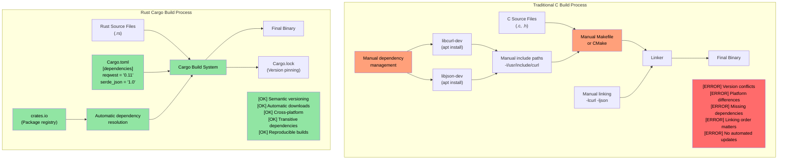
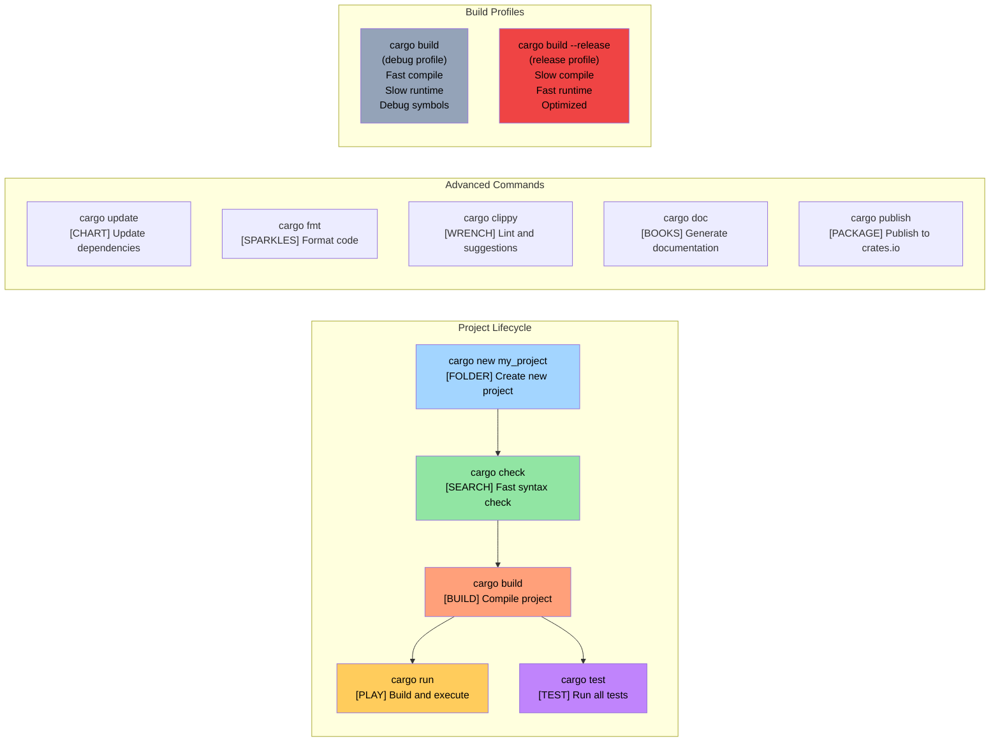

# 少说多做：给我看代码 {#enough-talk-already-show-me-some-code}

> **你将学到：** 你的第一个 Rust 程序——`fn main()`、`println!()`，以及 Rust 宏与 C/C++ 预处理器宏的根本差异。学完后你将能编写、编译并运行简单的 Rust 程序。

```rust
fn main() {
    println!("Hello world from Rust");
}
```
- 上述语法对熟悉 C 风格语言的人应该很亲切
    - Rust 中所有函数以 ```fn``` 关键字开头
    - 可执行文件的默认入口点是 ```main()```
    - ```println!``` 看起来像函数，实际上是**宏**。Rust 宏与 C/C++ 预处理器宏截然不同——它们是卫生的、类型安全的，操作语法树而非文本替换
- 两种快速尝试 Rust 片段的方式：
    - **在线**：[Rust Playground](https://play.rust-lang.org/)——粘贴代码、点击 Run、分享结果。无需安装
    - **本地 REPL**：安装 [`evcxr_repl`](https://github.com/evcxr/evcxr) 获得交互式 Rust REPL（类似 Python REPL，但用于 Rust）：
```bash
cargo install --locked evcxr_repl
evcxr   # Start the REPL, type Rust expressions interactively
```

### Rust 本地安装 {#rust-local-installation}
- 可通过以下方式本地安装 Rust
    - Windows：https://static.rust-lang.org/rustup/dist/x86_64-pc-windows-msvc/rustup-init.exe
    - Linux / WSL：```curl --proto '=https' --tlsv1.2 -sSf https://sh.rustup.rs | sh```
- Rust 生态由以下组件构成
    - ```rustc``` 是独立编译器，但很少直接使用
    - 首选工具 ```cargo``` 是瑞士军刀，用于依赖管理、构建、测试、格式化、lint 等
    - Rust 工具链有 ```stable```、```beta``` 和 ```nightly```（实验性）通道，我们使用 ```stable```。用 ```rustup update``` 升级每六周发布的 ```stable``` 安装
- 我们还会安装 VSCode 的 ```rust-analyzer``` 插件

# Rust 包（crate） {#rust-packages-crates}
- Rust 二进制文件通过包（下文称 crate）创建
    - crate 可独立存在，也可依赖其他 crate。依赖 crate 可以是本地或远程。第三方 crate 通常从名为 ```crates.io``` 的中央仓库下载。
    - ```cargo``` 工具自动处理 crate 及其依赖的下载。概念上等同于链接 C 库
    - crate 依赖在名为 ```Cargo.toml``` 的文件中声明。它还定义 crate 的目标类型：独立可执行文件、静态库、动态库（较少见）
    - 参考：https://doc.rust-lang.org/cargo/reference/cargo-targets.html

## Cargo 与传统 C 构建系统对比

### 依赖管理对比



### Cargo 项目结构

```text
my_project/
|-- Cargo.toml          # Project configuration (like package.json)
|-- Cargo.lock          # Exact dependency versions (auto-generated)
|-- src/
|   |-- main.rs         # Main entry point for binary
|   |-- lib.rs          # Library root (if creating a library)
|   `-- bin/            # Additional binary targets
|-- tests/              # Integration tests
|-- examples/           # Example code
|-- benches/            # Benchmarks
`-- target/             # Build artifacts (like C's build/ or obj/)
    |-- debug/          # Debug builds (fast compile, slow runtime)
    `-- release/        # Release builds (slow compile, fast runtime)
```

### 常用 Cargo 命令



# 示例：cargo 与 crate {#example-cargo-and-crates}
- 本示例是一个无其他依赖的独立可执行 crate
- 使用以下命令创建名为 ```helloworld``` 的新 crate
```bash
cargo new helloworld
cd helloworld
cat Cargo.toml
```
- 默认 ```cargo run``` 会编译并运行 crate 的 ```debug```（未优化）版本。要运行 ```release``` 版本，使用 ```cargo run --release```
- 实际二进制文件位于 ```target``` 文件夹下的 ```debug``` 或 ```release``` 子目录
- 你可能还注意到源码同目录下有 ```Cargo.lock``` 文件。它自动生成，不应手动修改
    - 我们稍后会再讨论 ```Cargo.lock``` 的具体用途

