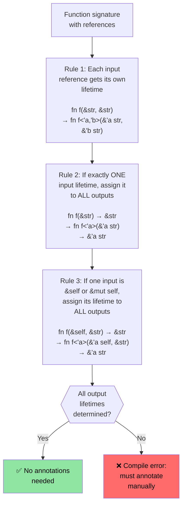

# Rust 生命周期与借用 {#rust-lifetime-and-borrowing}

> **你将学到：** Rust 生命周期系统如何确保引用永不悬垂——从隐式生命周期、显式标注到三条省略规则（使多数代码无需标注）。理解生命周期后再进入下一节的智能指针。

- Rust 强制单一可变引用与任意数量不可变引用
    - 任何引用的生命周期至少与原拥有者生命周期一样长。这些是隐式生命周期，由编译器推断（见 https://doc.rust-lang.org/nomicon/lifetime-elision.html）
```rust
fn borrow_mut(x: &mut u32) {
    *x = 43;
}
fn main() {
    let mut x = 42;
    let y = &mut x;
    borrow_mut(y);
    let _z = &x; // Permitted because the compiler knows y isn't subsequently used
    //println!("{y}"); // Will not compile if this is uncommented
    borrow_mut(&mut x); // Permitted because _z isn't used 
    let z = &x; // Ok -- mutable borrow of x ended after borrow_mut() returned
    println!("{z}");
}
```

# Rust 生命周期标注 {#rust-lifetime-annotations}
- 处理多个生命周期时需要显式生命周期标注
    - 生命周期用 `'` 表示，可为任意标识符（`'a`、`'b`、`'static` 等）
    - 编译器无法推断引用应存活多久时需要帮助
- **常见场景**：函数返回引用，但来自哪个输入？
```rust
#[derive(Debug)]
struct Point {x: u32, y: u32}

// Without lifetime annotation, this won't compile:
// fn left_or_right(pick_left: bool, left: &Point, right: &Point) -> &Point

// With lifetime annotation - all references share the same lifetime 'a
fn left_or_right<'a>(pick_left: bool, left: &'a Point, right: &'a Point) -> &'a Point {
    if pick_left { left } else { right }
}

// More complex: different lifetimes for inputs
fn get_x_coordinate<'a, 'b>(p1: &'a Point, _p2: &'b Point) -> &'a u32 {
    &p1.x  // Return value lifetime tied to p1, not p2
}

fn main() {
    let p1 = Point {x: 20, y: 30};
    let result;
    {
        let p2 = Point {x: 42, y: 50};
        result = left_or_right(true, &p1, &p2);
        // This works because we use result before p2 goes out of scope
        println!("Selected: {result:?}");
    }
    // This would NOT work - result references p2 which is now gone:
    // println!("After scope: {result:?}");
}
```

# Rust 生命周期标注
- 数据结构中的引用也需要生命周期标注
```rust
use std::collections::HashMap;
#[derive(Debug)]
struct Point {x: u32, y: u32}
struct Lookup<'a> {
    map: HashMap<u32, &'a Point>,
}
fn main() {
    let p = Point{x: 42, y: 42};
    let p1 = Point{x: 50, y: 60};
    let mut m = Lookup {map : HashMap::new()};
    m.map.insert(0, &p);
    m.map.insert(1, &p1);
    {
        let p3 = Point{x: 60, y:70};
        //m.map.insert(3, &p3); // Will not compile
        // p3 is dropped here, but m will outlive
    }
    for (k, v) in m.map {
        println!("{v:?}");
    }
    // m is dropped here
    // p1 and p are dropped here in that order
} 
```

# 练习：带生命周期的 first word

🟢 **入门** — 实践生命周期省略

编写函数 `fn first_word(s: &str) -> &str`，返回字符串中第一个空白分隔的单词。思考为何无需显式生命周期标注即可编译（提示：省略规则 #1 与 #2）。

<details><summary>Solution (click to expand)</summary>

```rust
fn first_word(s: &str) -> &str {
    // The compiler applies elision rules:
    // Rule 1: input &str gets lifetime 'a → fn first_word(s: &'a str) -> &str
    // Rule 2: single input lifetime → output gets same → fn first_word(s: &'a str) -> &'a str
    match s.find(' ') {
        Some(pos) => &s[..pos],
        None => s,
    }
}

fn main() {
    let text = "hello world foo";
    let word = first_word(text);
    println!("First word: {word}");  // "hello"
    
    let single = "onlyone";
    println!("First word: {}", first_word(single));  // "onlyone"
}
```

</details>

# 练习：带生命周期的切片存储 {#exercise-slice-storage-with-lifetimes}

🟡 **中级** — 首次接触生命周期标注
- 创建存储 ```&str``` 切片引用的结构体
    - 创建长 ```&str```，在结构体中存储其切片引用
    - 编写接受该结构体并返回所含切片的函数
```rust
// TODO: Create a structure to store a reference to a slice
struct SliceStore {

}
fn main() {
    let s = "This is long string";
    let s1 = &s[0..];
    let s2 = &s[1..2];
    // let slice = struct SliceStore {...};
    // let slice2 = struct SliceStore {...};
}
```

<details><summary>Solution (click to expand)</summary>

```rust
struct SliceStore<'a> {
    slice: &'a str,
}

impl<'a> SliceStore<'a> {
    fn new(slice: &'a str) -> Self {
        SliceStore { slice }
    }

    fn get_slice(&self) -> &'a str {
        self.slice
    }
}

fn main() {
    let s = "This is a long string";
    let store1 = SliceStore::new(&s[0..4]);   // "This"
    let store2 = SliceStore::new(&s[5..7]);   // "is"
    println!("store1: {}", store1.get_slice());
    println!("store2: {}", store2.get_slice());
}
// Output:
// store1: This
// store2: is
```

</details>

---

## 生命周期省略规则深入 {#lifetime-elision-rules-deep-dive}

C 程序员常问：「生命周期这么重要，为何多数 Rust 函数没有 `'a` 标注？」答案是**生命周期省略**——编译器用三条确定性规则自动推断生命周期。

### 三条省略规则

Rust 编译器**按顺序**将这些规则应用于函数签名。应用后若所有输出生命周期均已确定，则无需标注。



### 逐条规则示例

**规则 1** — 每个输入引用获得独立生命周期参数：
```rust
// What you write:
fn first_word(s: &str) -> &str { ... }

// What the compiler sees after Rule 1:
fn first_word<'a>(s: &'a str) -> &str { ... }
// Only one input lifetime → Rule 2 applies
```

**规则 2** — 单一输入生命周期传播到所有输出：
```rust
// After Rule 2:
fn first_word<'a>(s: &'a str) -> &'a str { ... }
// ✅ All output lifetimes determined — no annotation needed!
```

**规则 3** — `&self` 的生命周期传播到输出：
```rust
// What you write:
impl SliceStore<'_> {
    fn get_slice(&self) -> &str { self.slice }
}

// What the compiler sees after Rules 1 + 3:
impl SliceStore<'_> {
    fn get_slice<'a>(&'a self) -> &'a str { self.slice }
}
// ✅ No annotation needed — &self lifetime used for output
```

**省略失败时** — 必须标注：
```rust
// Two input references, no &self → Rules 2 and 3 don't apply
// fn longest(a: &str, b: &str) -> &str  ← WON'T COMPILE

// Fix: tell the compiler which input the output borrows from
fn longest<'a>(a: &'a str, b: &'a str) -> &'a str {
    if a.len() >= b.len() { a } else { b }
}
```

### C 程序员心智模型

在 C 中，每个指针独立——程序员在脑中跟踪每个指针指向哪块分配，编译器完全信任你。在 Rust 中，生命周期使这种跟踪**显式且由编译器验证**：

| C | Rust | 发生什么 |
|---|------|-------------|
| `char* get_name(struct User* u)` | `fn get_name(&self) -> &str` | 规则 3 省略：输出从 `self` 借用 |
| `char* concat(char* a, char* b)` | `fn concat<'a>(a: &'a str, b: &'a str) -> &'a str` | 必须标注——两个输入 |
| `void process(char* in, char* out)` | `fn process(input: &str, output: &mut String)` | 无输出引用——无需生命周期 |
| `char* buf; /* who owns this? */` | 生命周期错误则编译失败 | 编译器捕获悬垂指针 |

### `'static` 生命周期

`'static` 表示引用在**整个程序运行期间**有效。相当于 C 的全局变量或字符串字面量：

```rust
// String literals are always 'static — they live in the binary's read-only section
let s: &'static str = "hello";  // Same as: static const char* s = "hello"; in C

// Constants are also 'static
static GREETING: &str = "hello";

// Common in trait bounds for thread spawning:
fn spawn<F: FnOnce() + Send + 'static>(f: F) { /* ... */ }
// 'static here means: "the closure must not borrow any local variables"
// (either move them in, or use only 'static data)
```

### 练习：预测省略结果

🟡 **中级**

对下列每个函数签名，预测编译器能否省略生命周期。
若不能，添加必要标注：

```rust
// 1. Can the compiler elide?
fn trim_prefix(s: &str) -> &str { &s[1..] }

// 2. Can the compiler elide?
fn pick(flag: bool, a: &str, b: &str) -> &str {
    if flag { a } else { b }
}

// 3. Can the compiler elide?
struct Parser { data: String }
impl Parser {
    fn next_token(&self) -> &str { &self.data[..5] }
}

// 4. Can the compiler elide?
fn split_at(s: &str, pos: usize) -> (&str, &str) {
    (&s[..pos], &s[pos..])
}
```

<details><summary>Solution (click to expand)</summary>

```rust,ignore
// 1. YES — Rule 1 gives 'a to s, Rule 2 propagates to output
fn trim_prefix(s: &str) -> &str { &s[1..] }

// 2. NO — Two input references, no &self. Must annotate:
fn pick<'a>(flag: bool, a: &'a str, b: &'a str) -> &'a str {
    if flag { a } else { b }
}

// 3. YES — Rule 1 gives 'a to &self, Rule 3 propagates to output
impl Parser {
    fn next_token(&self) -> &str { &self.data[..5] }
}

// 4. YES — Rule 1 gives 'a to s (only one input reference),
//    Rule 2 propagates to BOTH outputs. Both slices borrow from s.
fn split_at(s: &str, pos: usize) -> (&str, &str) {
    (&s[..pos], &s[pos..])
}
```

</details>
