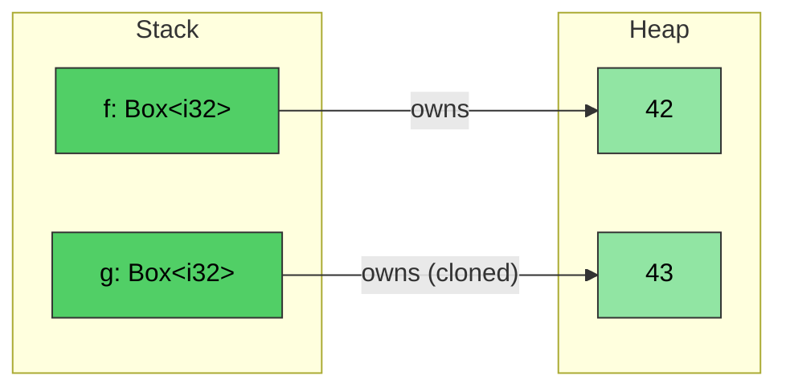
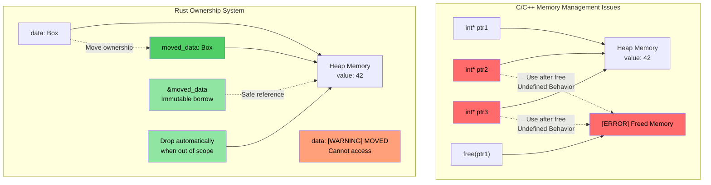
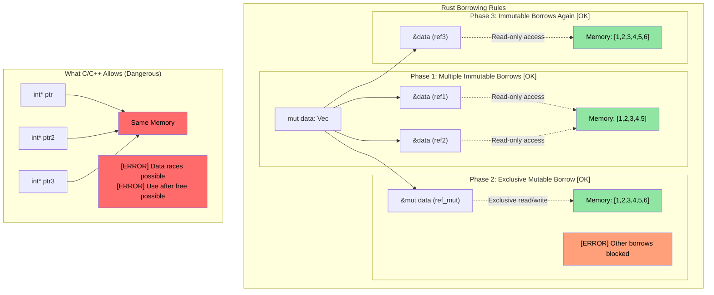

# Rust `Box<T>` {#rust-boxt}

> **你将学到：** Rust 智能指针类型——堆分配的 `Box<T>`、共享所有权的 `Rc<T>`，以及内部可变性的 `Cell<T>`/`RefCell<T>`。这些建立在前几节所有权与生命周期之上。还会简要介绍用 `Weak<T>` 打破引用循环。

**为何用 `Box<T>`？** C 中用 `malloc`/`free` 做堆分配。C++ 中 `std::unique_ptr<T>` 包装 `new`/`delete`。Rust 的 `Box<T>` 等价——堆分配、单一所有者指针，离开作用域自动释放。与 `malloc` 不同，没有配对的 `free` 可忘。与 `unique_ptr` 不同，不可能移动后使用——编译器完全阻止。

**何时用 `Box` vs 栈分配：**
- 内含类型很大，不想在栈上拷贝
- 需要递归类型（如包含自身的链表节点）
- 需要 Trait 对象（`Box<dyn Trait>`）

- ```Box<T>``` 可创建指向堆分配类型的指针。指针大小固定，与 ```<T>``` 类型无关
```rust
fn main() {
    // Creates a pointer to an integer (with value 42) created on the heap
    let f = Box::new(42);
    println!("{} {}", *f, f);
    // Cloning a box creates a new heap allocation
    let mut g = f.clone();
    *g = 43;
    println!("{f} {g}");
    // g and f go out of scope here and are automatically deallocated
}
```


## 所有权与借用可视化

### C/C++ vs Rust：指针与所有权管理

```c
// C - Manual memory management, potential issues
void c_pointer_problems() {
    int* ptr1 = malloc(sizeof(int));
    *ptr1 = 42;
    
    int* ptr2 = ptr1;  // Both point to same memory
    int* ptr3 = ptr1;  // Three pointers to same memory
    
    free(ptr1);        // Frees the memory
    
    *ptr2 = 43;        // Use after free - undefined behavior!
    *ptr3 = 44;        // Use after free - undefined behavior!
}
```

> **面向 C++ 开发者：** 智能指针有帮助，但不能防止所有问题：
>
> ```cpp
> // C++ - Smart pointers help, but don't prevent all issues
> void cpp_pointer_issues() {
>     auto ptr1 = std::make_unique<int>(42);
>     
>     // auto ptr2 = ptr1;  // Compile error: unique_ptr not copyable
>     auto ptr2 = std::move(ptr1);  // OK: ownership transferred
>     
>     // But C++ still allows use-after-move:
>     // std::cout << *ptr1;  // Compiles! But undefined behavior!
>     
>     // shared_ptr aliasing:
>     auto shared1 = std::make_shared<int>(42);
>     auto shared2 = shared1;  // Both own the data
>     // Who "really" owns it? Neither. Ref count overhead everywhere.
> }
> ```

```rust
// Rust - Ownership system prevents these issues
fn rust_ownership_safety() {
    let data = Box::new(42);  // data owns the heap allocation
    
    let moved_data = data;    // Ownership transferred to moved_data
    // data is no longer accessible - compile error if used
    
    let borrowed = &moved_data;  // Immutable borrow
    println!("{}", borrowed);    // Safe to use
    
    // moved_data automatically freed when it goes out of scope
}
```



### 借用规则可视化

```rust
fn borrowing_rules_example() {
    let mut data = vec![1, 2, 3, 4, 5];
    
    // Multiple immutable borrows - OK
    let ref1 = &data;
    let ref2 = &data;
    println!("{:?} {:?}", ref1, ref2);  // Both can be used
    
    // Mutable borrow - exclusive access
    let ref_mut = &mut data;
    ref_mut.push(6);
    // ref1 and ref2 can't be used while ref_mut is active
    
    // After ref_mut is done, immutable borrows work again
    let ref3 = &data;
    println!("{:?}", ref3);
}
```



---

## 内部可变性：`Cell<T>` 与 `RefCell<T>` {#interior-mutability-cellt-and-refcellt}

回顾：Rust 中变量默认可变。有时希望类型大部分只读，但允许单个字段可写。

```rust
struct Employee {
    employee_id : u64,   // This must be immutable
    on_vacation: bool,   // What if we wanted to permit write-access to this field, but make employee_id immutable?
}
```

- 回顾：Rust 允许对变量*一个可变*引用与任意数量*不可变*引用——在*编译期*强制
- 若希望传递*不可变*的员工向量，但允许更新 `on_vacation` 字段，同时确保 `employee_id` 不可变，怎么办？

### `Cell<T>` — 适用于 `Copy` 类型的内部可变性

- `Cell<T>` 提供**内部可变性**，即在否则只读的引用上对某些元素可写
- 通过拷贝值进出实现（`.get()` 要求 `T: Copy`）

### `RefCell<T>` — 运行时借用检查的内部可变性

- `RefCell<T>` 提供基于引用的变体
    - 在**运行时**而非编译期执行 Rust 借用检查
    - 允许单个*可变*借用，但若仍有其他引用活跃会** panic**
    - 用 `.borrow()` 不可变访问，`.borrow_mut()` 可变访问

### 何时选 `Cell` vs `RefCell`

| 标准 | `Cell<T>` | `RefCell<T>` |
|-----------|-----------|-------------|
| 适用类型 | `Copy` 类型（整数、bool、浮点） | 任意类型（`String`、`Vec`、结构体） |
| 访问模式 | 拷贝进出（`.get()`、`.set()`） | 原地借用（`.borrow()`、`.borrow_mut()`） |
| 失败模式 | 不会失败——无运行时检查 | 可变借用时若另有活跃借用会** panic** |
| 开销 | 零——仅拷贝字节 | 小——运行时跟踪借用状态 |
| 使用场景 | 不可变结构体内需要可变标志、计数器或小值 | 不可变结构体内需修改 `String`、`Vec` 或复杂类型 |

---

## 共享所有权：`Rc<T>` {#shared-ownership-rct}

`Rc<T>` 允许对*不可变*数据进行引用计数共享所有权。若希望同一 `Employee` 存于多处而不拷贝，怎么办？

```rust
#[derive(Debug)]
struct Employee {
    employee_id: u64,
}
fn main() {
    let mut us_employees = vec![];
    let mut all_global_employees = Vec::<Employee>::new();
    let employee = Employee { employee_id: 42 };
    us_employees.push(employee);
    // Won't compile — employee was already moved
    //all_global_employees.push(employee);
}
```

`Rc<T>` 通过共享*不可变*访问解决该问题：
- 内含类型自动解引用
- 引用计数为 0 时类型被 drop

```rust
use std::rc::Rc;
#[derive(Debug)]
struct Employee {employee_id: u64}
fn main() {
    let mut us_employees = vec![];
    let mut all_global_employees = vec![];
    let employee = Employee { employee_id: 42 };
    let employee_rc = Rc::new(employee);
    us_employees.push(employee_rc.clone());
    all_global_employees.push(employee_rc.clone());
    let employee_one = all_global_employees.get(0); // Shared immutable reference
    for e in us_employees {
        println!("{}", e.employee_id);  // Shared immutable reference
    }
    println!("{employee_one:?}");
}
```

> **面向 C++ 开发者：智能指针对照**
>
> | C++ 智能指针 | Rust 等价 | 关键差异 |
> |---|---|---|
> | `std::unique_ptr<T>` | `Box<T>` | Rust 版本是默认——移动是语言级，非可选 |
> | `std::shared_ptr<T>` | `Rc<T>`（单线程）/ `Arc<T>`（多线程） | `Rc` 无原子开销；跨线程共享才用 `Arc` |
> | `std::weak_ptr<T>` | `Weak<T>`（来自 `Rc::downgrade()` 或 `Arc::downgrade()`） | 相同用途：打破引用循环 |
>
> **关键区别**：C++ 中你*选择*用智能指针。Rust 中拥有值（`T`）与借用（`&T`）覆盖多数场景——仅在需要堆分配或共享所有权时用 `Box`/`Rc`/`Arc`。

### 用 `Weak<T>` 打破引用循环

`Rc<T>` 使用引用计数——若两个 `Rc` 互相指向，两者都不会被 drop（形成循环）。`Weak<T>` 解决此问题：

```rust
use std::rc::{Rc, Weak};

struct Node {
    value: i32,
    parent: Option<Weak<Node>>,  // Weak reference — doesn't prevent drop
}

fn main() {
    let parent = Rc::new(Node { value: 1, parent: None });
    let child = Rc::new(Node {
        value: 2,
        parent: Some(Rc::downgrade(&parent)),  // Weak ref to parent
    });

    // To use a Weak, try to upgrade it — returns Option<Rc<T>>
    if let Some(parent_rc) = child.parent.as_ref().unwrap().upgrade() {
        println!("Parent value: {}", parent_rc.value);
    }
    println!("Parent strong count: {}", Rc::strong_count(&parent)); // 1, not 2
}
```

> `Weak<T>` 在 [避免过多 clone()](ch17-1-avoiding-excessive-clone.md) 中有更详细讲解。目前要点：**在树/图结构的「反向引用」中使用 `Weak`，避免内存泄漏。**

---

## 将 `Rc` 与内部可变性结合

`Rc<T>`（共享所有权）与 `Cell<T>` 或 `RefCell<T>`（内部可变性）结合时威力更大。多个所有者可**读写**共享数据：

| 模式 | 使用场景 |
|---------|----------|
| `Rc<RefCell<T>>` | 共享可变数据（单线程） |
| `Arc<Mutex<T>>` | 共享可变数据（多线程——见 [ch13](ch13-concurrency.md)） |
| `Rc<Cell<T>>` | 共享可变 `Copy` 类型（简单标志、计数器） |

---

# 练习：共享所有权与内部可变性 {#exercise-shared-ownership-and-interior-mutability}

🟡 **中级**

- **Part 1（Rc）**：创建含 `employee_id: u64` 与 `name: String` 的 `Employee` 结构体。放入 `Rc<Employee>` 并 clone 到两个 `Vec`（`us_employees` 与 `global_employees`）。从两个向量打印以展示共享同一数据。
- **Part 2（Cell）**：为 `Employee` 添加 `on_vacation: Cell<bool>` 字段。将不可变 `&Employee` 引用传给函数，在函数内切换 `on_vacation`——无需使引用可变。
- **Part 3（RefCell）**：将 `name: String` 换为 `name: RefCell<String>`，编写函数通过 `&Employee`（不可变引用）向员工姓名追加后缀。

**Starter code:**
```rust
use std::cell::{Cell, RefCell};
use std::rc::Rc;

#[derive(Debug)]
struct Employee {
    employee_id: u64,
    name: RefCell<String>,
    on_vacation: Cell<bool>,
}

fn toggle_vacation(emp: &Employee) {
    // TODO: Flip on_vacation using Cell::set()
}

fn append_title(emp: &Employee, title: &str) {
    // TODO: Borrow name mutably via RefCell and push_str the title
}

fn main() {
    // TODO: Create an employee, wrap in Rc, clone into two Vecs,
    // call toggle_vacation and append_title, print results
}
```

<details><summary>Solution (click to expand)</summary>

```rust
use std::cell::{Cell, RefCell};
use std::rc::Rc;

#[derive(Debug)]
struct Employee {
    employee_id: u64,
    name: RefCell<String>,
    on_vacation: Cell<bool>,
}

fn toggle_vacation(emp: &Employee) {
    emp.on_vacation.set(!emp.on_vacation.get());
}

fn append_title(emp: &Employee, title: &str) {
    emp.name.borrow_mut().push_str(title);
}

fn main() {
    let emp = Rc::new(Employee {
        employee_id: 42,
        name: RefCell::new("Alice".to_string()),
        on_vacation: Cell::new(false),
    });

    let mut us_employees = vec![];
    let mut global_employees = vec![];
    us_employees.push(Rc::clone(&emp));
    global_employees.push(Rc::clone(&emp));

    // Toggle vacation through an immutable reference
    toggle_vacation(&emp);
    println!("On vacation: {}", emp.on_vacation.get()); // true

    // Append title through an immutable reference
    append_title(&emp, ", Sr. Engineer");
    println!("Name: {}", emp.name.borrow()); // "Alice, Sr. Engineer"

    // Both Vecs see the same data (Rc shares ownership)
    println!("US: {:?}", us_employees[0].name.borrow());
    println!("Global: {:?}", global_employees[0].name.borrow());
    println!("Rc strong count: {}", Rc::strong_count(&emp));
}
// Output:
// On vacation: true
// Name: Alice, Sr. Engineer
// US: "Alice, Sr. Engineer"
// Global: "Alice, Sr. Engineer"
// Rc strong count: 3
```

</details>
