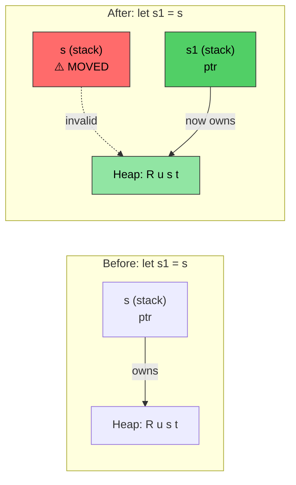
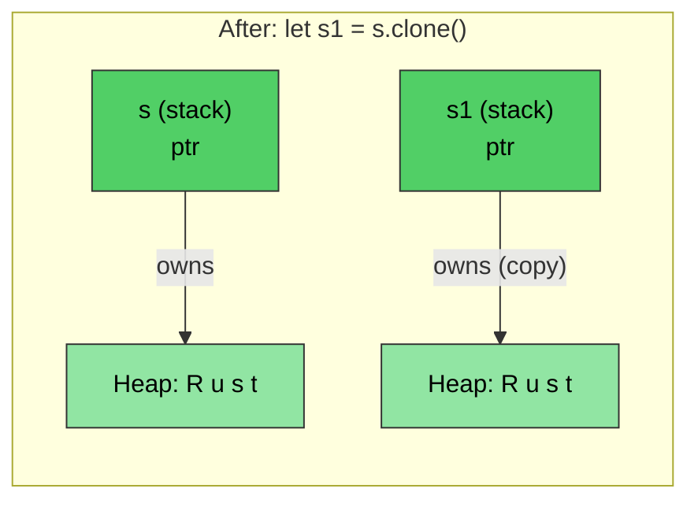

# Rust 内存管理 {#rust-memory-management}

> **你将学到：** Rust 的所有权系统——语言中最重要的概念。读完本章你将理解移动语义、借用规则与 `Drop` Trait。掌握本章，Rust 其余部分会自然跟上。若感到吃力，请重读——多数 C/C++ 开发者在第二遍阅读时才会豁然开朗。

- C/C++ 的内存管理是 bug 来源：
    - C：用 `malloc()` 分配、`free()` 释放。无悬垂指针、释放后使用、双重释放等检查
    - C++：RAII（Resource Acquisition Is Initialization，资源获取即初始化）与智能指针有帮助，但 `std::move(ptr)` 在移动后仍可编译——移动后使用是 UB
- Rust 让 RAII **防呆**：
    - 移动是**破坏性的**——编译器拒绝让你再碰已移动变量
    - 无需 Rule of Five（无拷贝构造、移动构造、拷贝赋值、移动赋值、析构）
    - Rust 完全控制内存分配，但在**编译期**强制安全
    - 通过所有权、借用、可变性与生命周期等机制组合实现
    - Rust 运行时分配可在栈与堆上进行

> **面向 C++ 开发者——智能指针对照：**
>
> | **C++** | **Rust** | **安全改进** |
> |---------|----------|----------------------|
> | `std::unique_ptr<T>` | `Box<T>` | 不可能移动后使用 |
> | `std::shared_ptr<T>` | `Rc<T>`（单线程） | 默认无引用循环 |
> | `std::shared_ptr<T>`（线程安全） | `Arc<T>` | 显式线程安全 |
> | `std::weak_ptr<T>` | `Weak<T>` | 必须检查有效性 |
> | 裸指针 | `*const T` / `*mut T` | 仅在 `unsafe` 代码块中 |
>
> 面向 C 开发者：`Box<T>` 替代 `malloc`/`free` 配对。`Rc<T>` 替代手动引用计数。裸指针存在，但限于 `unsafe` 代码块。

# Rust 所有权、借用与生命周期 {#rust-ownership-borrowing-and-lifetimes}
- 回顾：Rust 只允许一个可变引用与多个只读引用
    - 变量初始声明建立 ```ownership```（所有权）
    - 后续引用从原所有者 ```borrow```（借用）。规则是借用作用域不得超过拥有者作用域。即借用的 ```lifetime```（生命周期）不得超过拥有者的生命周期
```rust
fn main() {
    let a = 42; // Owner
    let b = &a; // First borrow
    {
        let aa = 42;
        let c = &a; // Second borrow; a is still in scope
        // Ok: c goes out of scope here
        // aa goes out of scope here
    }
    // let d = &aa; // Will not compile unless aa is moved to outside scope
    // b implicitly goes out of scope before a
    // a goes out of scope last
}
```

- Rust 可用多种机制向方法传参
    - 按值（拷贝）：通常是可 trivial 拷贝的类型（如 u8、u32、i8、i32）
    - 按引用：相当于传指向实际值的指针，亦称借用；引用可为不可变（```&```）或可变（```&mut```）
    - 按移动：将值的「所有权」转移给函数，调用方不能再引用原值
```rust
fn foo(x: &u32) {
    println!("{x}");
}
fn bar(x: u32) {
    println!("{x}");
}
fn main() {
    let a = 42;
    foo(&a);    // By reference
    bar(a);     // By value (copy)
}
```

- Rust 禁止方法返回悬垂引用
    - 方法返回的引用必须仍在作用域内
    - 引用离开作用域时 Rust 会自动 ```drop```
```rust
fn no_dangling() -> &u32 {
    // lifetime of a begins here
    let a = 42;
    // Won't compile. lifetime of a ends here
    &a
}

fn ok_reference(a: &u32) -> &u32 {
    // Ok because the lifetime of a always exceeds ok_reference()
    a
}
fn main() {
    let a = 42;     // lifetime of a begins here
    let b = ok_reference(&a);
    // lifetime of b ends here
    // lifetime of a ends here
}
```

# Rust 移动语义 {#rust-move-semantics}
- 默认情况下，Rust 赋值转移所有权
```rust
fn main() {
    let s = String::from("Rust");    // Allocate a string from the heap
    let s1 = s; // Transfer ownership to s1. s is invalid at this point
    println!("{s1}");
    // This will not compile
    //println!("{s}");
    // s1 goes out of scope here and the memory is deallocated
    // s goes out of scope here, but nothing happens because it doesn't own anything
}
```

*`let s1 = s` 后，所有权转移到 `s1`。堆数据不动——仅栈上指针移动。`s` 现已无效。*

----
# Rust 移动语义与借用
```rust
fn foo(s : String) {
    println!("{s}");
    // The heap memory pointed to by s will be deallocated here
}
fn bar(s : &String) {
    println!("{s}");
    // Nothing happens -- s is borrowed
}
fn main() {
    let s = String::from("Rust string move example");    // Allocate a string from the heap
    foo(s); // Transfers ownership; s is invalid now
    // println!("{s}");  // will not compile
    let t = String::from("Rust string borrow example");
    bar(&t);    // t continues to hold ownership
    println!("{t}"); 
}
```

# Rust 移动语义与所有权
- 可通过移动转移所有权
    - 移动完成后，再引用仍存在的引用是非法的
    - 若不希望移动，考虑借用
```rust
struct Point {
    x: u32,
    y: u32,
}
fn consume_point(p: Point) {
    println!("{} {}", p.x, p.y);
}
fn borrow_point(p: &Point) {
    println!("{} {}", p.x, p.y);
}
fn main() {
    let p = Point {x: 10, y: 20};
    // Try flipping the two lines
    borrow_point(&p);
    consume_point(p);
}
```

# Rust Clone {#rust-clone}
- ```clone()``` 方法可复制原内存，原引用仍有效（代价是双倍分配）
```rust
fn main() {
    let s = String::from("Rust");    // Allocate a string from the heap
    let s1 = s.clone(); // Copy the string; creates a new allocation on the heap
    println!("{s1}");  
    println!("{s}");
    // s1 goes out of scope here and the memory is deallocated
    // s goes out of scope here, and the memory is deallocated
}
```

*`clone()` 创建**独立**堆分配。`s` 与 `s1` 均有效——各自拥有自己的副本。*

# Rust `Copy` Trait {#rust-copy-trait}
- Rust 通过 ```Copy``` Trait 为内置类型实现拷贝语义
    - 例如 u8、u32、i8、i32 等。拷贝语义使用「按值传递」
    - 用户定义类型可选用 ```derive``` 宏自动实现 ```Copy``` Trait
    - 新赋值后编译器会为拷贝分配空间
```rust
// Try commenting this out to see the change in let p1 = p; below
#[derive(Copy, Clone, Debug)]   // We'll discuss this more later
struct Point{x: u32, y:u32}
fn main() {
    let p = Point {x: 42, y: 40};
    let p1 = p;     // This will perform a copy now instead of move
    println!("p: {p:?}");
    println!("p1: {p:?}");
    let p2 = p1.clone();    // Semantically the same as copy
}
```

# Rust `Drop` Trait {#rust-drop-trait}

- Rust 在作用域结束时自动调用 `drop()` 方法
    - `drop` 属于名为 `Drop` 的泛型 Trait。编译器为所有类型提供默认空实现，类型可覆盖。例如 `String` 覆盖它以释放堆内存
    - 面向 C 开发者：替代手动 `free()`——资源在离开作用域时自动释放（RAII）
- **关键安全：** 不能直接调用 `.drop()`（编译器禁止）。应使用 `drop(obj)`，将值移入函数、运行析构并阻止进一步使用——消除双重释放 bug

> **面向 C++ 开发者：** `Drop` 直接对应 C++ 析构函数（`~ClassName()`）：
>
> | | **C++ 析构** | **Rust `Drop`** |
> |---|---|---|
> | **语法** | `~MyClass() { ... }` | `impl Drop for MyType { fn drop(&mut self) { ... } }` |
> | **调用时机** | 作用域结束（RAII） | 作用域结束（相同） |
> | **移动时** | 源处于「有效但未指定」状态——仍对移动源对象调用析构 | 源**已消失**——不对移动源值调用析构 |
> | **手动调用** | `obj.~MyClass()`（危险，少用） | `drop(obj)`（安全——取得所有权、调用 `drop`、阻止再用） |
> | **顺序** | 与声明相反 | 与声明相反（相同） |
> | **Rule of Five** | 须管理拷贝构造、移动构造、拷贝赋值、移动赋值、析构 | 只需 `Drop`——编译器处理移动语义，`Clone` 可选 |
> | **需要虚析构？** | 通过基指针删除时需要 | 否——无继承，无切片问题 |

```rust
struct Point {x: u32, y:u32}

// Equivalent to: ~Point() { printf("Goodbye point x:%u, y:%u\n", x, y); }
impl Drop for Point {
    fn drop(&mut self) {
        println!("Goodbye point x:{}, y:{}", self.x, self.y);
    }
}
fn main() {
    let p = Point{x: 42, y: 42};
    {
        let p1 = Point{x:43, y: 43};
        println!("Exiting inner block");
        // p1.drop() called here — like C++ end-of-scope destructor
    }
    println!("Exiting main");
    // p.drop() called here
}
```

# 练习：Move、Copy 与 Drop {#exercise-move-copy-and-drop}

🟡 **中级** — 自由实验；编译器会引导你
- 用 ```Point``` 自行实验，在 ```#[derive(Debug)]``` 中有无 ```Copy``` 的区别，确保理解移动 vs 拷贝。若有疑问请提问
- 为 ```Point``` 实现自定义 ```Drop```，在 ```drop``` 中将 x、y 置 0。此模式可用于释放锁等资源
```rust
struct Point{x: u32, y: u32}
fn main() {
    // Create Point, assign it to a different variable, create a new scope,
    // pass point to a function, etc.
}
```

<details><summary>Solution (click to expand)</summary>

```rust
#[derive(Debug)]
struct Point { x: u32, y: u32 }

impl Drop for Point {
    fn drop(&mut self) {
        println!("Dropping Point({}, {})", self.x, self.y);
        self.x = 0;
        self.y = 0;
        // Note: setting to 0 in drop demonstrates the pattern,
        // but you can't observe these values after drop completes
    }
}

fn consume(p: Point) {
    println!("Consuming: {:?}", p);
    // p is dropped here
}

fn main() {
    let p1 = Point { x: 10, y: 20 };
    let p2 = p1;  // Move — p1 is no longer valid
    // println!("{:?}", p1);  // Won't compile: p1 was moved

    {
        let p3 = Point { x: 30, y: 40 };
        println!("p3 in inner scope: {:?}", p3);
        // p3 is dropped here (end of scope)
    }

    consume(p2);  // p2 is moved into consume and dropped there
    // println!("{:?}", p2);  // Won't compile: p2 was moved

    // Now try: add #[derive(Copy, Clone)] to Point (and remove the Drop impl)
    // and observe how p1 remains valid after let p2 = p1;
}
// Output:
// p3 in inner scope: Point { x: 30, y: 40 }
// Dropping Point(30, 40)
// Consuming: Point { x: 10, y: 20 }
// Dropping Point(10, 20)
```

</details>


