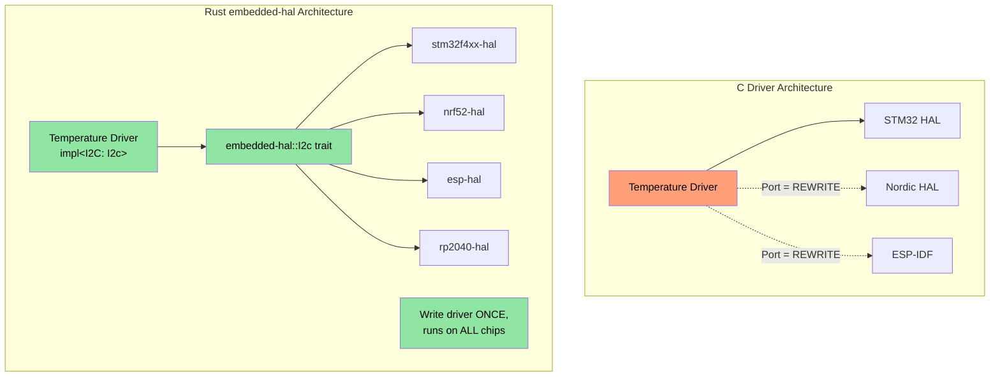
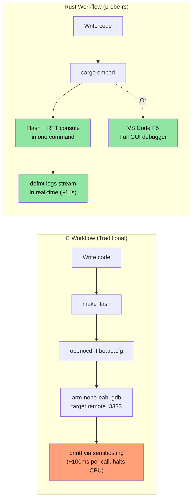

## MMIO 与 volatile 寄存器访问 {#mmio-and-volatile-register-access}

> **你将学到：** 嵌入式 Rust 中类型安全的硬件寄存器访问 — volatile MMIO 模式、寄存器抽象 crate，以及 Rust 类型系统如何表达 C 的 `volatile` 关键字无法编码的寄存器权限。

在 C 固件中，你通过指向特定内存地址的 `volatile` 指针访问硬件寄存器。Rust 有等价机制 — 但具备类型安全。

### C volatile 与 Rust volatile {#c-volatile-vs-rust-volatile}

```c
// C — typical MMIO register access
#define GPIO_BASE     0x40020000
#define GPIO_MODER    (*(volatile uint32_t*)(GPIO_BASE + 0x00))
#define GPIO_ODR      (*(volatile uint32_t*)(GPIO_BASE + 0x14))

void toggle_led(void) {
    GPIO_ODR ^= (1 << 5);  // Toggle pin 5
}
```

```rust
// Rust — raw volatile (low-level, rarely used directly)
use core::ptr;

const GPIO_BASE: usize = 0x4002_0000;
const GPIO_ODR: *mut u32 = (GPIO_BASE + 0x14) as *mut u32;

/// # Safety
/// Caller must ensure GPIO_BASE is a valid mapped peripheral address.
unsafe fn toggle_led() {
    // SAFETY: GPIO_ODR is a valid memory-mapped register address.
    let current = unsafe { ptr::read_volatile(GPIO_ODR) };
    unsafe { ptr::write_volatile(GPIO_ODR, current ^ (1 << 5)) };
}
```

### svd2rust — 类型安全的寄存器访问（Rust 方式） {#svd2rust--type-safe-register-access-the-rust-way}

实践中，你**从不**手写 raw volatile 指针。相反，`svd2rust` 从芯片的 SVD 文件（与 IDE 调试视图使用的同一 XML 文件）生成 **Peripheral Access Crate（PAC）**：

```rust
// Generated PAC code (you don't write this — svd2rust does)
// The PAC makes invalid register access a compile error

// Usage with PAC:
use stm32f4::stm32f401;  // PAC crate for your chip

fn configure_gpio(dp: stm32f401::Peripherals) {
    // Enable GPIOA clock — type-safe, no magic numbers
    dp.RCC.ahb1enr.modify(|_, w| w.gpioaen().enabled());

    // Set pin 5 to output — can't accidentally write to a read-only field
    dp.GPIOA.moder.modify(|_, w| w.moder5().output());

    // Toggle pin 5 — type-checked field access
    dp.GPIOA.odr.modify(|r, w| {
        // SAFETY: toggling a single bit in a valid register field.
        unsafe { w.bits(r.bits() ^ (1 << 5)) }
    });
}
```

| C 寄存器访问 | Rust PAC 等价 |
|-------------------|---------------------|
| `#define REG (*(volatile uint32_t*)ADDR)` | `svd2rust` 生成的 PAC crate |
| `REG |= BITMASK;` | `periph.reg.modify(\|_, w\| w.field().variant())` |
| `value = REG;` | `let val = periph.reg.read().field().bits()` |
| 错误寄存器字段 → 静默 UB | 编译错误 — 字段不存在 |
| 错误寄存器位宽 → 静默 UB | 类型检查 — u8 vs u16 vs u32 |

## 中断处理与临界区 {#interrupt-handling-and-critical-sections}

C 固件使用 `__disable_irq()` / `__enable_irq()` 以及 `void` 签名的 ISR 函数。Rust 提供类型安全的等价物。

### C 与 Rust 中断模式 {#c-vs-rust-interrupt-patterns}

```c
// C — traditional interrupt handler
volatile uint32_t tick_count = 0;

void SysTick_Handler(void) {   // Naming convention is critical — get it wrong → HardFault
    tick_count++;
}

uint32_t get_ticks(void) {
    __disable_irq();
    uint32_t t = tick_count;   // Read inside critical section
    __enable_irq();
    return t;
}
```

```rust
// Rust — using cortex-m and critical sections
use core::cell::Cell;
use cortex_m::interrupt::{self, Mutex};

// Shared state protected by a critical-section Mutex
static TICK_COUNT: Mutex<Cell<u32>> = Mutex::new(Cell::new(0));

#[cortex_m_rt::exception]     // Attribute ensures correct vector table placement
fn SysTick() {                // Compile error if name doesn't match a valid exception
    interrupt::free(|cs| {    // cs = critical section token (proof IRQs disabled)
        let count = TICK_COUNT.borrow(cs).get();
        TICK_COUNT.borrow(cs).set(count + 1);
    });
}

fn get_ticks() -> u32 {
    interrupt::free(|cs| TICK_COUNT.borrow(cs).get())
}
```

### RTIC — 实时中断驱动并发 {#rtic--real-time-interrupt-driven-concurrency}

对于具有多个中断优先级的复杂固件，RTIC（前身为 RTFM）提供**编译期任务调度、零开销**：

```rust
#[rtic::app(device = stm32f4xx_hal::pac, dispatchers = [USART1])]
mod app {
    use stm32f4xx_hal::prelude::*;

    #[shared]
    struct Shared {
        temperature: f32,   // Shared between tasks — RTIC manages locking
    }

    #[local]
    struct Local {
        led: stm32f4xx_hal::gpio::Pin<'A', 5, stm32f4xx_hal::gpio::Output>,
    }

    #[init]
    fn init(cx: init::Context) -> (Shared, Local) {
        let dp = cx.device;
        let gpioa = dp.GPIOA.split();
        let led = gpioa.pa5.into_push_pull_output();
        (Shared { temperature: 25.0 }, Local { led })
    }

    // Hardware task: runs on SysTick interrupt
    #[task(binds = SysTick, shared = [temperature], local = [led])]
    fn tick(mut cx: tick::Context) {
        cx.local.led.toggle();
        cx.shared.temperature.lock(|temp| {
            // RTIC guarantees exclusive access here — no manual locking needed
            *temp += 0.1;
        });
    }
}
```

**RTIC 对 C 固件开发者的意义：**
- `#[shared]` 注解替代手动互斥锁管理
- 基于优先级的抢占在编译期配置 — 无运行时开销
- 结构上无死锁（框架在编译期证明）
- ISR 命名错误是编译错误，而非运行时 HardFault

## Panic Handler 策略 {#panic-handler-strategies}

在 C 中，固件出错时通常复位或闪烁 LED。Rust 的 panic handler 提供结构化控制：

```rust
// Strategy 1: Halt (for debugging — attach debugger, inspect state)
use panic_halt as _;  // Infinite loop on panic

// Strategy 2: Reset the MCU
use panic_reset as _;  // Triggers system reset

// Strategy 3: Log via probe (development)
use panic_probe as _;  // Sends panic info over debug probe (with defmt)

// Strategy 4: Log over defmt then halt
use defmt_panic as _;  // Rich panic messages over ITM/RTT

// Strategy 5: Custom handler (production firmware)
use core::panic::PanicInfo;

#[panic_handler]
fn panic(info: &PanicInfo) -> ! {
    // 1. Disable interrupts to prevent further damage
    cortex_m::interrupt::disable();

    // 2. Write panic info to a reserved RAM region (survives reset)
    // SAFETY: PANIC_LOG is a reserved memory region defined in linker script.
    unsafe {
        let log = 0x2000_0000 as *mut [u8; 256];
        // Write truncated panic message
        use core::fmt::Write;
        let mut writer = FixedWriter::new(&mut *log);
        let _ = write!(writer, "{}", info);
    }

    // 3. Trigger watchdog reset (or blink error LED)
    loop {
        cortex_m::asm::wfi();  // Wait for interrupt (low power while halted)
    }
}
```

## 链接脚本与内存布局 {#linker-scripts-and-memory-layout}

C 固件开发者编写链接脚本定义 FLASH/RAM 区域。Rust 嵌入式通过 `memory.x` 使用相同概念：

```ld
/* memory.x — placed at crate root, consumed by cortex-m-rt */
MEMORY
{
  /* Adjust for your MCU — these are STM32F401 values */
  FLASH : ORIGIN = 0x08000000, LENGTH = 512K
  RAM   : ORIGIN = 0x20000000, LENGTH = 96K
}

/* Optional: reserve space for panic log (see panic handler above) */
_panic_log_start = ORIGIN(RAM);
_panic_log_size  = 256;
```

```toml
# .cargo/config.toml — set the target and linker flags
[target.thumbv7em-none-eabihf]
runner = "probe-rs run --chip STM32F401RE"  # flash and run via debug probe
rustflags = [
    "-C", "link-arg=-Tlink.x",              # cortex-m-rt linker script
]

[build]
target = "thumbv7em-none-eabihf"            # Cortex-M4F with hardware FPU
```

| C 链接脚本 | Rust 等价 |
|-----------------|-----------------|
| `MEMORY { FLASH ..., RAM ... }` | crate 根目录的 `memory.x` |
| `__attribute__((section(".data")))` | `#[link_section = ".data"]` |
| Makefile 中的 `-T linker.ld` | `.cargo/config.toml` 中的 `-C link-arg=-Tlink.x` |
| `__bss_start__`、`__bss_end__` | 由 `cortex-m-rt` 自动处理 |
| 启动汇编（`startup.s`） | `cortex-m-rt` 的 `#[entry]` 宏 |

## 编写 `embedded-hal` 驱动 {#writing-embedded-hal-drivers}

`embedded-hal` crate 为 SPI、I2C、GPIO、UART 等定义 Trait。针对这些 Trait 编写的驱动可在**任意 MCU** 上工作 — 这是 Rust 在嵌入式复用上的杀手级特性。

### C 与 Rust：温度传感器驱动 {#c-vs-rust-a-temperature-sensor-driver}

```c
// C — driver tightly coupled to STM32 HAL
#include "stm32f4xx_hal.h"

float read_temperature(I2C_HandleTypeDef* hi2c, uint8_t addr) {
    uint8_t buf[2];
    HAL_I2C_Mem_Read(hi2c, addr << 1, 0x00, I2C_MEMADD_SIZE_8BIT,
                     buf, 2, HAL_MAX_DELAY);
    int16_t raw = ((int16_t)buf[0] << 4) | (buf[1] >> 4);
    return raw * 0.0625;
}
// Problem: This driver ONLY works with STM32 HAL. Porting to Nordic = rewrite.
```

```rust
// Rust — driver works on ANY MCU that implements embedded-hal
use embedded_hal::i2c::I2c;

pub struct Tmp102<I2C> {
    i2c: I2C,
    address: u8,
}

impl<I2C: I2c> Tmp102<I2C> {
    pub fn new(i2c: I2C, address: u8) -> Self {
        Self { i2c, address }
    }

    pub fn read_temperature(&mut self) -> Result<f32, I2C::Error> {
        let mut buf = [0u8; 2];
        self.i2c.write_read(self.address, &[0x00], &mut buf)?;
        let raw = ((buf[0] as i16) << 4) | ((buf[1] as i16) >> 4);
        Ok(raw as f32 * 0.0625)
    }
}

// Works on STM32, Nordic nRF, ESP32, RP2040 — any chip with an embedded-hal I2C impl
```



## 全局分配器设置 {#global-allocator-setup}

`alloc` crate 提供 `Vec`、`String`、`Box` — 但你需要告诉 Rust 堆内存从何而来。这相当于为你的平台实现 `malloc()`：

```rust
#![no_std]
extern crate alloc;

use alloc::vec::Vec;
use alloc::string::String;
use embedded_alloc::LlffHeap as Heap;

#[global_allocator]
static HEAP: Heap = Heap::empty();

#[cortex_m_rt::entry]
fn main() -> ! {
    // Initialize the allocator with a memory region
    // (typically a portion of RAM not used by stack or static data)
    {
        const HEAP_SIZE: usize = 4096;
        static mut HEAP_MEM: [u8; HEAP_SIZE] = [0; HEAP_SIZE];
        // SAFETY: HEAP_MEM is only accessed here during init, before any allocation.
        unsafe { HEAP.init(HEAP_MEM.as_ptr() as usize, HEAP_SIZE) }
    }

    // Now you can use heap types!
    let mut log_buffer: Vec<u8> = Vec::with_capacity(256);
    let name: String = String::from("sensor_01");
    // ...

    loop {}
}
```

| C 堆设置 | Rust 等价 |
|-------------|-----------------|
| `_sbrk()` / 自定义 `malloc()` | `#[global_allocator]` + `Heap::init()` |
| `configTOTAL_HEAP_SIZE`（FreeRTOS） | `HEAP_SIZE` 常量 |
| `pvPortMalloc()` | `alloc::vec::Vec::new()` — 自动 |
| 堆耗尽 → 未定义行为 | `alloc_error_handler` → 可控 panic |

## 混合 `no_std` + `std` 工作区 {#mixed-no_std--std-workspaces}

真实项目（如大型 Rust 工作区）通常包含：
- `no_std` 库 crate，用于硬件无关逻辑
- `std` 二进制 crate，用于 Linux 应用层

```text
workspace_root/
├── Cargo.toml              # [workspace] members = [...]
├── protocol/               # no_std — wire protocol, parsing
│   ├── Cargo.toml          # no default-features, no std
│   └── src/lib.rs          # #![no_std]
├── driver/                 # no_std — hardware abstraction
│   ├── Cargo.toml
│   └── src/lib.rs          # #![no_std], uses embedded-hal traits
├── firmware/               # no_std — MCU binary
│   ├── Cargo.toml          # depends on protocol, driver
│   └── src/main.rs         # #![no_std] #![no_main]
└── host_tool/              # std — Linux CLI tool
    ├── Cargo.toml          # depends on protocol (same crate!)
    └── src/main.rs         # Uses std::fs, std::net, etc.
```

关键模式：`protocol` crate 使用 `#![no_std]`，因此可同时为 MCU 固件和 Linux 主机工具编译。共享代码，零重复。

```toml
# protocol/Cargo.toml
[package]
name = "protocol"

[features]
default = []
std = []  # Optional: enable std-specific features when building for host

[dependencies]
serde = { version = "1", default-features = false, features = ["derive"] }
# Note: default-features = false drops serde's std dependency
```

```rust
// protocol/src/lib.rs
#![cfg_attr(not(feature = "std"), no_std)]

#[cfg(feature = "std")]
extern crate std;

extern crate alloc;
use alloc::vec::Vec;
use serde::{Serialize, Deserialize};

#[derive(Debug, Serialize, Deserialize)]
pub struct DiagPacket {
    pub sensor_id: u16,
    pub value: i32,
    pub fault_code: u16,
}

// This function works in both no_std and std contexts
pub fn parse_packet(data: &[u8]) -> Result<DiagPacket, &'static str> {
    if data.len() < 8 {
        return Err("packet too short");
    }
    Ok(DiagPacket {
        sensor_id: u16::from_le_bytes([data[0], data[1]]),
        value: i32::from_le_bytes([data[2], data[3], data[4], data[5]]),
        fault_code: u16::from_le_bytes([data[6], data[7]]),
    })
}
```

## 练习：硬件抽象层驱动 {#exercise-hardware-abstraction-layer-driver}

为通过 SPI 通信的假想 LED 控制器编写 `no_std` 驱动。驱动应泛型化于任意使用 `embedded-hal` 的 SPI 实现。

**要求：**
1. 定义 `LedController<SPI>` 结构体
2. 实现 `new()`、`set_brightness(led: u8, brightness: u8)` 和 `all_off()`
3. SPI 协议：发送 2 字节事务 `[led_index, brightness_value]`
4. 使用 mock SPI 实现编写测试

```rust
// Starter code
#![no_std]
use embedded_hal::spi::SpiDevice;

pub struct LedController<SPI> {
    spi: SPI,
    num_leds: u8,
}

// TODO: Implement new(), set_brightness(), all_off()
// TODO: Create MockSpi for testing
```

<details><summary>解答（点击展开）</summary>

```rust
#![no_std]
use embedded_hal::spi::SpiDevice;

pub struct LedController<SPI> {
    spi: SPI,
    num_leds: u8,
}

impl<SPI: SpiDevice> LedController<SPI> {
    pub fn new(spi: SPI, num_leds: u8) -> Self {
        Self { spi, num_leds }
    }

    pub fn set_brightness(&mut self, led: u8, brightness: u8) -> Result<(), SPI::Error> {
        if led >= self.num_leds {
            return Ok(()); // Silently ignore out-of-range LEDs
        }
        self.spi.write(&[led, brightness])
    }

    pub fn all_off(&mut self) -> Result<(), SPI::Error> {
        for led in 0..self.num_leds {
            self.spi.write(&[led, 0])?;
        }
        Ok(())
    }
}

#[cfg(test)]
mod tests {
    use super::*;

    // Mock SPI that records all transactions
    struct MockSpi {
        transactions: Vec<Vec<u8>>,
    }

    // Minimal error type for mock
    #[derive(Debug)]
    struct MockError;
    impl embedded_hal::spi::Error for MockError {
        fn kind(&self) -> embedded_hal::spi::ErrorKind {
            embedded_hal::spi::ErrorKind::Other
        }
    }

    impl embedded_hal::spi::ErrorType for MockSpi {
        type Error = MockError;
    }

    impl SpiDevice for MockSpi {
        fn write(&mut self, buf: &[u8]) -> Result<(), Self::Error> {
            self.transactions.push(buf.to_vec());
            Ok(())
        }
        fn read(&mut self, _buf: &mut [u8]) -> Result<(), Self::Error> { Ok(()) }
        fn transfer(&mut self, _r: &mut [u8], _w: &[u8]) -> Result<(), Self::Error> { Ok(()) }
        fn transfer_in_place(&mut self, _buf: &mut [u8]) -> Result<(), Self::Error> { Ok(()) }
        fn transaction(&mut self, _ops: &mut [embedded_hal::spi::Operation<'_, u8>]) -> Result<(), Self::Error> { Ok(()) }
    }

    #[test]
    fn test_set_brightness() {
        let mock = MockSpi { transactions: vec![] };
        let mut ctrl = LedController::new(mock, 4);
        ctrl.set_brightness(2, 128).unwrap();
        assert_eq!(ctrl.spi.transactions, vec![vec![2, 128]]);
    }

    #[test]
    fn test_all_off() {
        let mock = MockSpi { transactions: vec![] };
        let mut ctrl = LedController::new(mock, 3);
        ctrl.all_off().unwrap();
        assert_eq!(ctrl.spi.transactions, vec![
            vec![0, 0], vec![1, 0], vec![2, 0],
        ]);
    }

    #[test]
    fn test_out_of_range_led() {
        let mock = MockSpi { transactions: vec![] };
        let mut ctrl = LedController::new(mock, 2);
        ctrl.set_brightness(5, 255).unwrap(); // Out of range — ignored
        assert!(ctrl.spi.transactions.is_empty());
    }
}
```

</details>

## 嵌入式 Rust 调试 — probe-rs、defmt 与 VS Code {#debugging-embedded-rust--probe-rs-defmt-and-vs-code}

C 固件开发者通常用 OpenOCD + GDB 或厂商 IDE（Keil、IAR、Segger Ozone）调试。Rust 嵌入式生态已收敛到 **probe-rs** 作为统一调试探针接口，用单一 Rust 原生工具替代 OpenOCD + GDB 栈。

### probe-rs — 一体化调试探针工具 {#probe-rs--the-all-in-one-debug-probe-tool}

`probe-rs` 替代 OpenOCD + GDB 组合。开箱即支持 CMSIS-DAP、ST-Link、J-Link 等调试探针：

```bash
# Install probe-rs (includes cargo-flash and cargo-embed)
cargo install probe-rs-tools

# Flash and run your firmware
cargo flash --chip STM32F401RE --release

# Flash, run, and open RTT (Real-Time Transfer) console
cargo embed --chip STM32F401RE
```

**probe-rs 与 OpenOCD + GDB**：

| 方面 | OpenOCD + GDB | probe-rs |
|--------|--------------|----------|
| 安装 | 2 个独立包 + 脚本 | `cargo install probe-rs-tools` |
| 配置 | 每板/探针的 `.cfg` 文件 | `--chip` 标志或 `Embed.toml` |
| 控制台输出 | Semihosting（很慢） | RTT（约快 10 倍） |
| 日志框架 | `printf` | `defmt`（结构化、零成本） |
| 烧录算法 | XML pack 文件 | 内置 1000+ 芯片 |
| GDB 支持 | 原生 | `probe-rs gdb` 适配器 |

### `Embed.toml` — 项目配置 {#embedtoml--project-configuration}

probe-rs 使用单一配置文件，替代 `.cfg` 与 `.gdbinit`：

```toml
# Embed.toml — placed in your project root
[default.general]
chip = "STM32F401RETx"

[default.rtt]
enabled = true           # Enable Real-Time Transfer console
channels = [
    { up = 0, mode = "BlockIfFull", name = "Terminal" },
]

[default.flashing]
enabled = true           # Flash before running
restore_unwritten_bytes = false

[default.reset]
halt_afterwards = false  # Start running after flash + reset

[default.gdb]
enabled = false          # Set true to expose GDB server on :1337
gdb_connection_string = "127.0.0.1:1337"
```

```bash
# With Embed.toml, just run:
cargo embed              # Flash + RTT console — zero flags needed
cargo embed --release    # Release build
```

### defmt — 嵌入式日志的延迟格式化 {#defmt--deferred-formatting-for-embedded-logging}

`defmt`（deferred formatting）替代 `printf` 调试。格式字符串存放在 ELF 文件中，而非 flash — 目标端日志调用仅发送索引 + 参数字节。这使日志比 `printf` **快 10–100 倍**，且占用 flash 空间极少：

```rust
#![no_std]
#![no_main]

use defmt::{info, warn, error, debug, trace};
use defmt_rtt as _; // RTT transport — links the defmt output to probe-rs

#[cortex_m_rt::entry]
fn main() -> ! {
    info!("Boot complete, firmware v{}", env!("CARGO_PKG_VERSION"));

    let sensor_id: u16 = 0x4A;
    let temperature: f32 = 23.5;

    // Format strings stay in ELF, not flash — near-zero overhead
    debug!("Sensor {:#06X}: {:.1}°C", sensor_id, temperature);

    if temperature > 80.0 {
        warn!("Overtemp on sensor {:#06X}: {:.1}°C", sensor_id, temperature);
    }

    loop {
        cortex_m::asm::wfi(); // Wait for interrupt
    }
}

// Custom types — derive defmt::Format instead of Debug
#[derive(defmt::Format)]
struct SensorReading {
    id: u16,
    value: i32,
    status: SensorStatus,
}

#[derive(defmt::Format)]
enum SensorStatus {
    Ok,
    Warning,
    Fault(u8),
}

// Usage:
// info!("Reading: {:?}", reading);  // <-- uses defmt::Format, NOT std Debug
```

**defmt 与 `printf`、`log`**：

| 特性 | C `printf`（semihosting） | Rust `log` crate | `defmt` |
|---------|-------------------------|-------------------|---------|
| 速度 | 每次调用约 100ms | N/A（需要 `std`） | 每次调用约 1μs |
| Flash 占用 | 完整格式字符串 | 完整格式字符串 | 仅索引（字节） |
| 传输 | Semihosting（暂停 CPU） | 串口/UART | RTT（非阻塞） |
| 结构化输出 | 否 | 仅文本 | 类型化、二进制编码 |
| `no_std` | 通过 semihosting | 仅门面（后端需要 `std`） | ✅ 原生 |
| 过滤级别 | 手动 `#ifdef` | `RUST_LOG=debug` | `defmt::println` + features |

### VS Code 调试配置 {#vs-code-debug-configuration}

配合 `probe-rs` VS Code 扩展，可获得完整图形化调试 — 断点、变量检查、调用栈与寄存器视图：

```jsonc
// .vscode/launch.json
{
    "version": "0.2.0",
    "configurations": [
        {
            "type": "probe-rs-debug",
            "request": "launch",
            "name": "Flash & Debug (probe-rs)",
            "chip": "STM32F401RETx",
            "coreConfigs": [
                {
                    "programBinary": "target/thumbv7em-none-eabihf/debug/${workspaceFolderBasename}",
                    "rttEnabled": true,
                    "rttChannelFormats": [
                        {
                            "channelNumber": 0,
                            "dataFormat": "Defmt",
                            "showTimestamps": true
                        }
                    ]
                }
            ],
            "connectUnderReset": true,
            "speed": 4000
        }
    ]
}
```

安装扩展：
```rust
ext install probe-rs.probe-rs-debugger
```

### C 调试工作流与 Rust 嵌入式调试 {#c-debugger-workflow-vs-rust-embedded-debugging}



| C 调试操作 | Rust 等价 |
|---------------|-----------------|
| `openocd -f board/st_nucleo_f4.cfg` | `probe-rs info`（自动检测探针 + 芯片） |
| `arm-none-eabi-gdb -x .gdbinit` | `probe-rs gdb --chip STM32F401RE` |
| `target remote :3333` | GDB 连接 `localhost:1337` |
| `monitor reset halt` | `probe-rs reset --chip ...` |
| `load firmware.elf` | `cargo flash --chip ...` |
| `printf("debug: %d\n", val)`（semihosting） | `defmt::info!("debug: {}", val)`（RTT） |
| Keil/IAR GUI 调试器 | VS Code + `probe-rs-debugger` 扩展 |
| Segger SystemView | `defmt` + `probe-rs` RTT 查看器 |

> **交叉引用**：嵌入式驱动中使用的进阶 unsafe 模式（pin projection、自定义 arena/slab 分配器），请参阅配套 *Rust Patterns* 指南中的 “Pin Projections — Structural Pinning” 与 “Custom Allocators — Arena and Slab Patterns” 章节。

---

