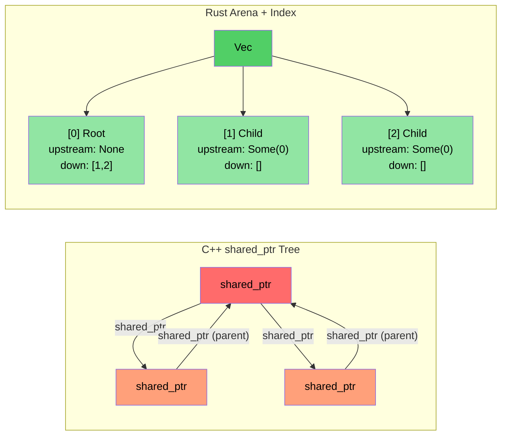

# 案例研究概览：C++ 到 Rust 的翻译 {#case-study-overview-c-to-rust-translation}

> **你将学到：** 将约 10 万行 C++ 翻译为约 20 个 crate、约 9 万行 Rust 的真实项目经验。五个关键转换模式及其背后的架构决策。

- 我们将大型 C++ 诊断系统（约 10 万行 C++）翻译为 Rust 实现（约 20 个 Rust crate、约 9 万行）
- 本节展示**实际使用的模式** — 不是玩具示例，而是真实生产代码
- 五个关键转换：

| **#** | **C++ 模式** | **Rust 模式** | **影响** |
|-------|----------------|-----------------|-----------|
| 1 | 类层次 + `dynamic_cast` | 枚举分发 + `match` | 约 400 → 0 次 `dynamic_cast` |
| 2 | `shared_ptr` / `enable_shared_from_this` 树 | Arena + 索引链接 | 无引用循环 |
| 3 | 每个模块中的 `Framework*` 裸指针 | 带生命周期借用的 `DiagContext<'a>` | 编译期有效性 |
| 4 | God object | 可组合状态结构体 | 可测试、模块化 |
| 5 | 处处 `vector<unique_ptr<Base>>` | 仅在需要处使用 Trait 对象（约 25 处） | 默认静态分发 |

### 前后指标 {#before-and-after-metrics}

| **指标** | **C++（原始）** | **Rust（重写）** |
|------------|---------------------|------------------------|
| `dynamic_cast` / 类型向下转型 | 约 400 | 0 |
| `virtual` / `override` 方法 | 约 900 | 约 25（`Box<dyn Trait>`） |
| 裸 `new` 分配 | 约 200 | 0（全部为 owned 类型） |
| `shared_ptr` / 引用计数 | 约 10（拓扑库） | 0（仅在 FFI 边界使用 `Arc`） |
| `enum class` 定义 | 约 60 | 约 190 个 `pub enum` |
| 模式匹配表达式 | N/A | 约 750 个 `match` |
| God object（>5K 行） | 2 | 0 |

----

# 案例研究 1：继承层次 → 枚举分发 {#case-study-1-inheritance-hierarchy--enum-dispatch}

## C++ 模式：事件类层次 {#the-c-pattern-event-class-hierarchy}
```cpp
// C++ original: Every GPU event type is a class inheriting from GpuEventBase
class GpuEventBase {
public:
    virtual ~GpuEventBase() = default;
    virtual void Process(DiagFramework* fw) = 0;
    uint16_t m_recordId;
    uint8_t  m_sensorType;
    // ... common fields
};

class GpuPcieDegradeEvent : public GpuEventBase {
public:
    void Process(DiagFramework* fw) override;
    uint8_t m_linkSpeed;
    uint8_t m_linkWidth;
};

class GpuPcieFatalEvent : public GpuEventBase { /* ... */ };
class GpuBootEvent : public GpuEventBase { /* ... */ };
// ... 10+ event classes inheriting from GpuEventBase

// Processing requires dynamic_cast:
void ProcessEvents(std::vector<std::unique_ptr<GpuEventBase>>& events,
                   DiagFramework* fw) {
    for (auto& event : events) {
        if (auto* degrade = dynamic_cast<GpuPcieDegradeEvent*>(event.get())) {
            // handle degrade...
        } else if (auto* fatal = dynamic_cast<GpuPcieFatalEvent*>(event.get())) {
            // handle fatal...
        }
        // ... 10 more branches
    }
}
```

## Rust 方案：枚举分发 {#the-rust-solution-enum-dispatch}
```rust
// Example: types.rs — No inheritance, no vtable, no dynamic_cast
#[derive(Debug, Clone, PartialEq, Eq, Serialize, Deserialize)]
pub enum GpuEventKind {
    PcieDegrade,
    PcieFatal,
    PcieUncorr,
    Boot,
    BaseboardState,
    EccError,
    OverTemp,
    PowerRail,
    ErotStatus,
    Unknown,
}
```

```rust
// Example: manager.rs — Separate typed Vecs, no downcasting needed
pub struct GpuEventManager {
    sku: SkuVariant,
    degrade_events: Vec<GpuPcieDegradeEvent>,   // Concrete type, not Box<dyn>
    fatal_events: Vec<GpuPcieFatalEvent>,
    uncorr_events: Vec<GpuPcieUncorrEvent>,
    boot_events: Vec<GpuBootEvent>,
    baseboard_events: Vec<GpuBaseboardEvent>,
    ecc_events: Vec<GpuEccEvent>,
    // ... each event type gets its own Vec
}

// Accessors return typed slices — zero ambiguity
impl GpuEventManager {
    pub fn degrade_events(&self) -> &[GpuPcieDegradeEvent] {
        &self.degrade_events
    }
    pub fn fatal_events(&self) -> &[GpuPcieFatalEvent] {
        &self.fatal_events
    }
}
```

### 为何不用 `Vec<Box<dyn GpuEvent>>`？ {#why-not-vecboxdyn-gpuevent}
- **错误做法**（字面翻译）：把所有事件放进一个异构集合再向下转型 — 这正是 C++ 用 `vector<unique_ptr<Base>>` 做的事
- **正确做法**：分离的类型化 `Vec` 消除**所有**向下转型。每个消费者只索取它需要的事件类型
- **性能**：分离的 `Vec` 缓存局部性更好（所有 degrade 事件在内存中连续）

----

# 案例研究 2：`shared_ptr` 树 → Arena/索引模式 {#case-study-2-shared_ptr-tree--arenaindex-pattern}

## C++ 模式：引用计数树 {#the-c-pattern-reference-counted-tree}
```cpp
// C++ topology library: PcieDevice uses enable_shared_from_this 
// because parent and child nodes both need to reference each other
class PcieDevice : public std::enable_shared_from_this<PcieDevice> {
public:
    std::shared_ptr<PcieDevice> m_upstream;
    std::vector<std::shared_ptr<PcieDevice>> m_downstream;
    // ... device data
    
    void AddChild(std::shared_ptr<PcieDevice> child) {
        child->m_upstream = shared_from_this();  // Parent ↔ child cycle!
        m_downstream.push_back(child);
    }
};
// Problem: parent→child and child→parent create reference cycles
// Need weak_ptr to break cycles, but easy to forget
```

## Rust 方案：Arena 与索引链接 {#the-rust-solution-arena-with-index-linkage}
```rust
// Example: components.rs — Flat Vec owns all devices
pub struct PcieDevice {
    pub base: PcieDeviceBase,
    pub kind: PcieDeviceKind,

    // Tree linkage via indices — no reference counting, no cycles
    pub upstream_idx: Option<usize>,      // Index into the arena Vec
    pub downstream_idxs: Vec<usize>,      // Indices into the arena Vec
}

// The "arena" is simply a Vec<PcieDevice> owned by the tree:
pub struct DeviceTree {
    devices: Vec<PcieDevice>,  // Flat ownership — one Vec owns everything
}

impl DeviceTree {
    pub fn parent(&self, device_idx: usize) -> Option<&PcieDevice> {
        self.devices[device_idx].upstream_idx
            .map(|idx| &self.devices[idx])
    }
    
    pub fn children(&self, device_idx: usize) -> Vec<&PcieDevice> {
        self.devices[device_idx].downstream_idxs
            .iter()
            .map(|&idx| &self.devices[idx])
            .collect()
    }
}
```

### 关键洞察 {#key-insight}
- **无 `shared_ptr`、无 `weak_ptr`、无 `enable_shared_from_this`**
- **不可能出现引用循环** — 索引只是 `usize` 值
- **更好的缓存性能** — 所有设备在连续内存中
- **更简单的推理** — 单一所有者（`Vec`），多个观察者（索引）



----

